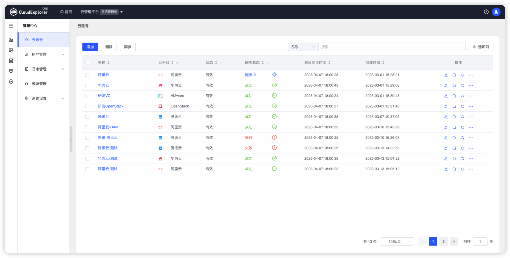
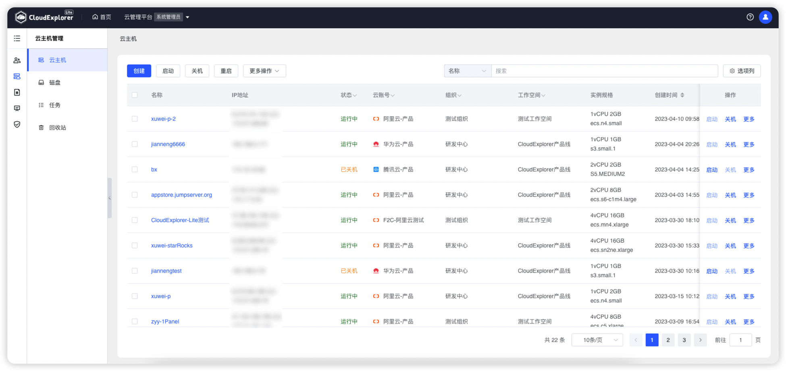
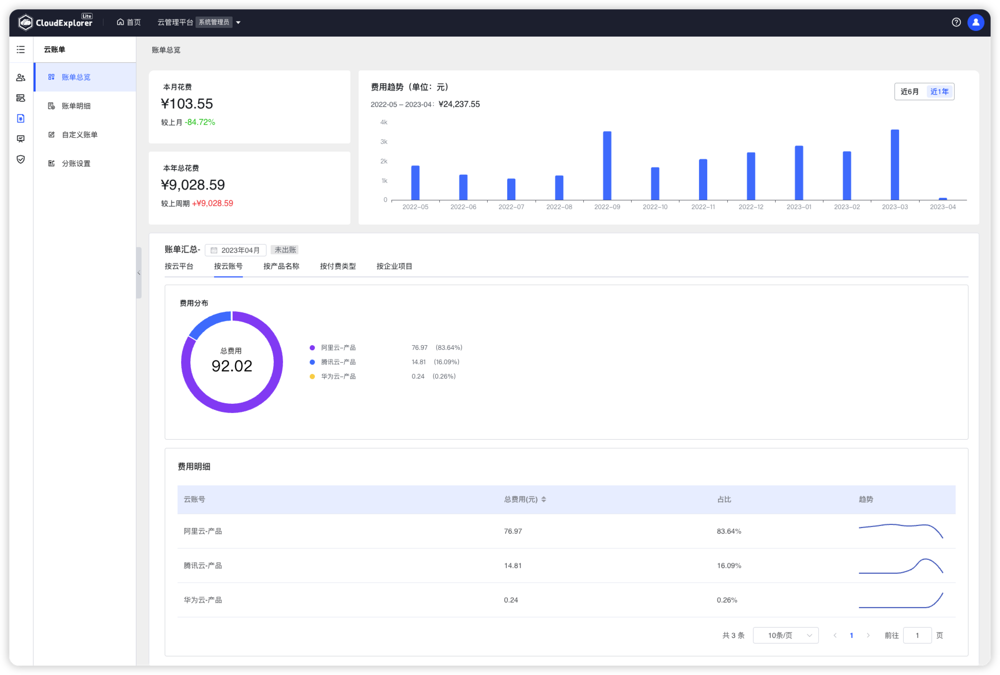
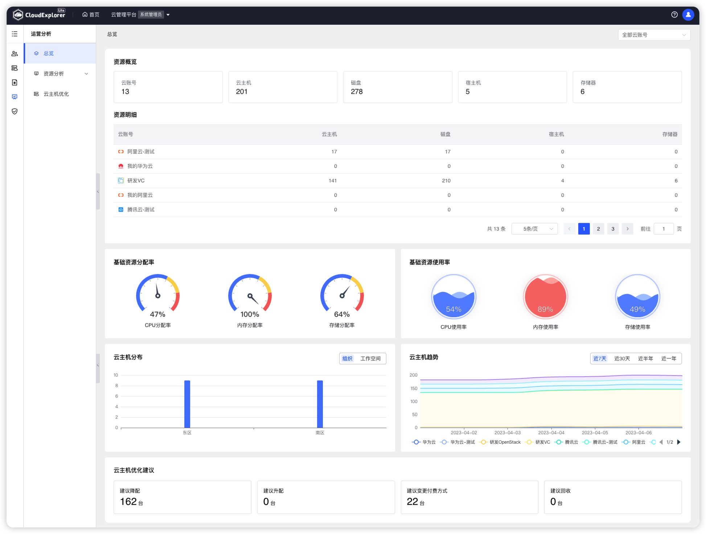
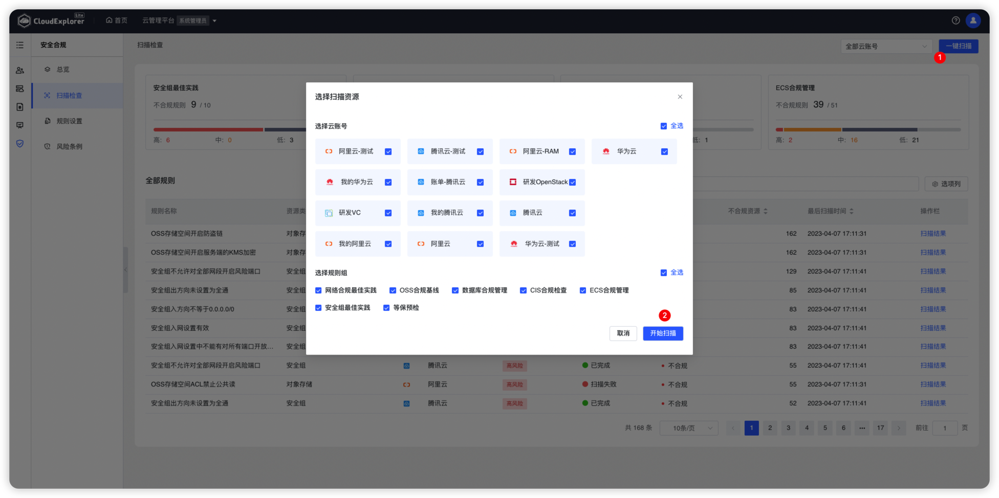
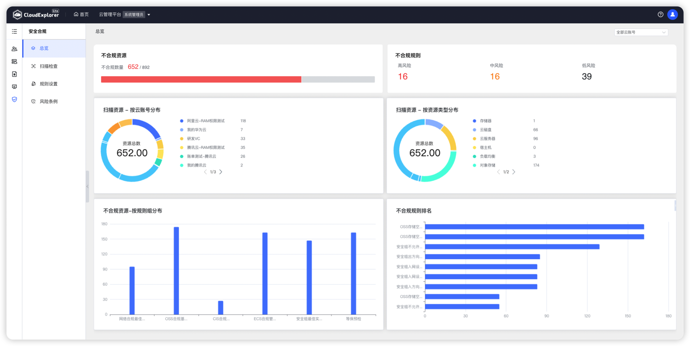
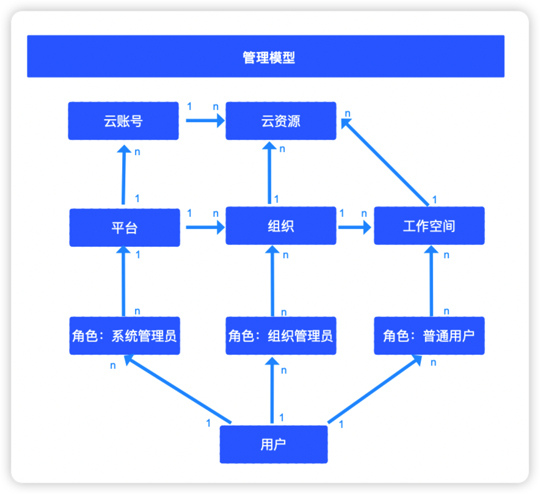
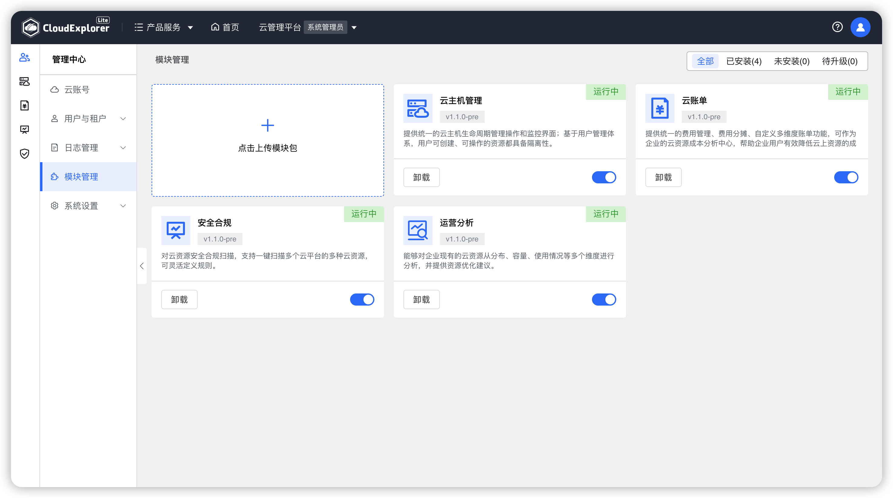

# 产品介绍

!!! Abstract ""
    CloudExplorer Lite 是开源的轻量级云管平台；   
    CloudExplorer Lite 脱胎于飞致云创始软件产品 CloudExplorer 多云管理平台，支持对接纳管主流的公有云和私有云基础设施，提供开箱即用的云主机管理、云账单、运营分析和安全合规等基本功能，同时还可提供强大的扩展能力以满足企业的定制化需求。 
{ width="1235px" }

## 1 产品优势

!!! Abstract ""
    - 多云对接：CloudExplorer Lite 支持对接纳管市场上主流的公有云和私有云，包括阿里云、华为云、腾讯云、VMware、OpenStack 等；
    - 开箱即用：作为一款轻量版云管平台，CloudExplorer Lite 提供诸多开箱即用的功能满足大部分企业的基本需求；
    - 扩展能力：CloudExplorer Lite 提供了强大的多租户体系和模块化能力，可以满足企业的定制化需求。

## 2 多云对接能力

!!! Abstract ""
    CloudExplorer Lite 支持对接纳管市场上主流的公有云和私有云基础设施，包括阿里云、腾讯云、华为云、VMware、OpenStack等。
{ width="1235px" }

## 3 开箱即用的功能

!!! Abstract "" 
    CloudExplorer Lite 提供了诸多开箱即用的功能，比如云主机管理、云账单、运营分析和安全合规等，能够满足大部分企业在云基础设施管理方面的基本需求。

- 3.1 云主机管理
  
!!! Abstract "" 
    CloudExplorer Lite 提供统一的云主机的生命周期管理操作界面；基于用户管理体系，用户可创建、可操作的资源都具备隔离性。
{ width="1235px" }

- 3.2 云账单
  
!!! Abstract "" 
    CloudExplorer Lite 提供统一的费用管理、费用分摊、自定义多维度账单功能，可以作为企业的云资源成本分析中心，帮助企业用户有效降低云上资源的成本管理难度。    
{ width="1235px" }

- 3.3 运营分析
  
!!! Abstract "" 
    CloudExplorer Lite 能够对企业现有的云资源从分布、容量、使用情况等多个维度进行分析，并提供资源优化建议。   
{ width="1235px" }

- 3.4 安全合规
  
!!! Abstract "" 
    CloudExplorer Lite 支持一键扫描多个云平台的多种云资源，可灵活定义规则。 
      
{ width="1235px" }
{ width="1235px" }

## 4 扩展能力

!!! Abstract "" 
    CloudExplorer Lite提供了强大的多租户体系和模块化能力，可以满足企业的定制化需求。

- 4.1 多租户体系
  
!!! Abstract "" 
    作为云管平台的核心能力之一，CloudExplorer Lite 为用户提供多租户、多角色的管理模型。系统初始化了三种内置角色，分别为系统管理员、组织管理员和普通用户，用户可以根据企业的实际情况进行灵活的租户体系映射。  
{ width="600px" }

- 4.2 模块设计
  
!!! Abstract "" 
    CloudExplorer Lite 采用模块化设计，即插即用，企业可以轻松部署不同模块，从而扩大对云基础设施的管理范围。
{ width="1235px" }