# 快速入门

## 1 一键部署

!!! Abstract ""

    按照部署服务器要求准备好部署环境后，可通过 CloudExplorer-Lite 快速安装脚本一键快速部署。  
    **注意：** 一键安装采用默认参数，更多有关离线部署方式可查看本文档的【安装部署】。 

    **部署服务器要求:** 
    ```
    - 操作系统：CentOS7.X
    - CPU/内存：8核16GB
    - 磁盘空间：200GB
    - 网络要求：可访问互联网
    ```
    执行以下脚本进行一键安装： 
    ```
    /bin/bash -c "$(curl -fsSL https://resource.fit2cloud.com/cloudexplorer-lite/installer/releases/latest/quick_start.sh)"
    ```
    CloudExplorer-Lite 是一款 B/S 架构的产品，即浏览器/服务器结构，在服务器安装完成后，客户端通过浏览器访问以下地址，即可开始使用。
    ```
    http://目标服务器IP地址：服务运行端口
    默认用户名：admin，默认密码：cloudexplorer
    ```


## 2 功能界面介绍

- 主页

!!! Abstract ""
    登录 CloudExplorer-Lite 系统后默认进入主页，分为顶部导航、左侧导航栏和工作区域三部分。  
    **顶部导航栏：** 顶部显示系统logo、用户登录身份（组织和角色）、帮助文档、个人信息。  
    **左侧导航栏：** 左侧固定模块菜单，包含管理中心、云主机服务、云账单、运营分析、安全合规五个服务模块，点击图标便可切换到相应的模块中。  
    **工作区域：** 右侧为工作区域，显示主页的内容包含个人信息、快捷服务、我的资源、不合规规则/资源统计、费用概览、费用趋势、云主机优化建议、云主机趋势、云主机状态分布。
 
{ width="1235px" }

- 管理中心 

!!! Abstract ""
    管理员在此模块可以纳管云账号和同步资源数据、企业组织架构和用户权限的管理，是后续各模块查看、管理和分析资源的数据来源，具体可参考本文档的功能手册【管理中心】。

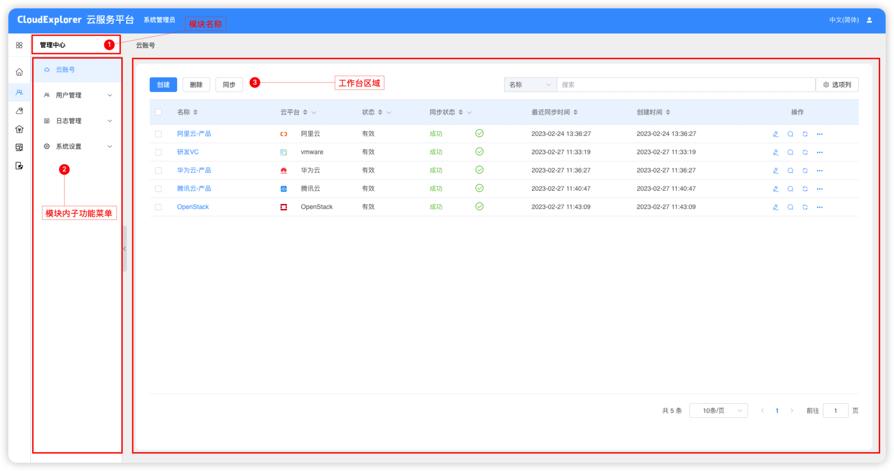{ width="1235px" }

- 云主机管理 

!!! Abstract ""
    提供统一的云主机生命周期管理操作和监控界面，基于既有的用户管理体系，用户可创建、可操作的资源都具有租户隔离属性。具体可参考本文档的功能手册【云主机管理】。

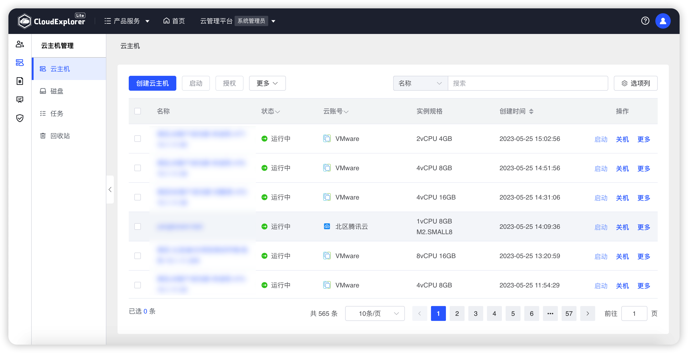{ width="1235px" }

- 云账单  

!!! Abstract ""
    提供统一的费用管理、费用分摊、自定义多维度账单功能，可作为企业的云资源成本分析中心，能够帮助企业用户有效降低云上资源的成本管理难度。具体可参考本文档的功能手册【云账单】。

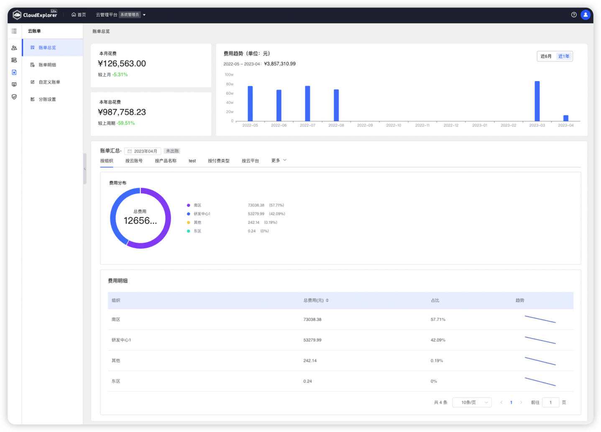{ width="1235px" }

- 运营分析

!!! Abstract ""
    用户可在此模块查看 IT 资源的容量、使用情况、资源分布、趋势分析、资源优化建议，具体可参考本文档的功能手册【运营分析】。

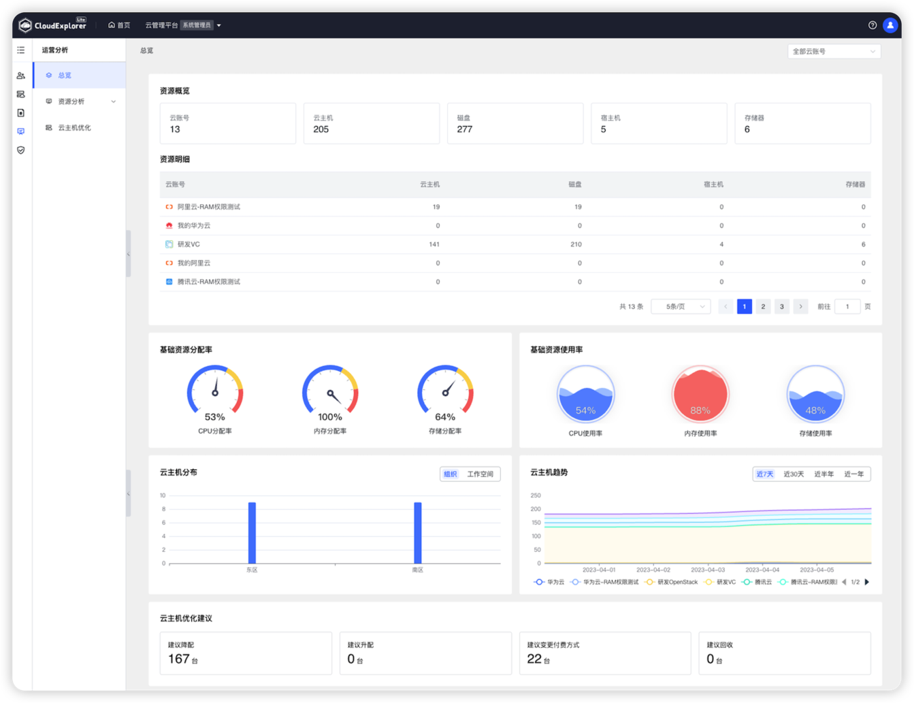{ width="1235px" }

- 安全合规

!!! Abstract ""
    系统管理员可在此模块对云资源的配置从安全审计、访问控制、入侵防范、网络架构等进行合规性检查，具体可参考本文档的功能手册【安全合规】。

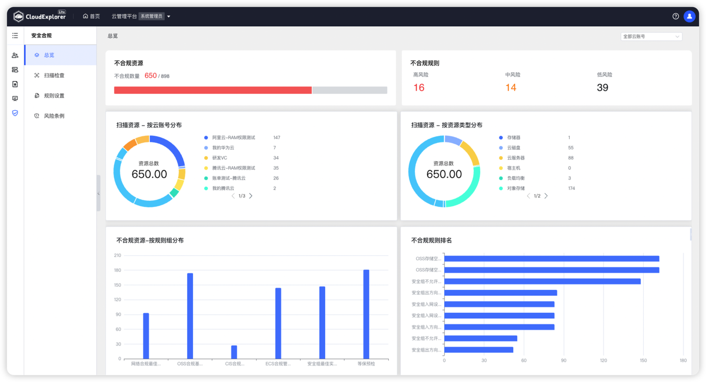{ width="1235px" }

## 3 快速上手

### 3.1 使用场景

!!! Abstract ""
    本章主要介绍系统管理员如何使用 CloudExplorer-Lite 快速管理一个云账号，帮助大家快速掌握使用方法。  
    初始化配置步骤：添加云账号 -> 管理云主机 -> 查看云账单 -> 查看运营分析 -> 查看安全合规；  

### 3.2 创建云账号
!!! Abstract ""
    首次登录 CloudExplorer-Lite 平台时，会自动弹出添加云账号的向导，用户需要根据向导将云账号添加到云管平台中进行管理。
   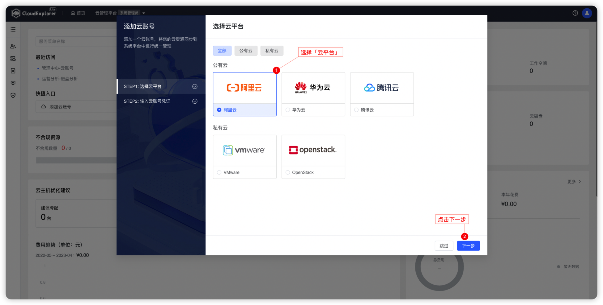{ width="1235px" } 

!!! Abstract ""
    输入名称为“阿里云-产品”，输入云账号的 AccessKey ID、AccessKey Secret，点击“确认”。
    说明：AccessKey权限要求：ECS的管理权限和所有资源的只读权限。

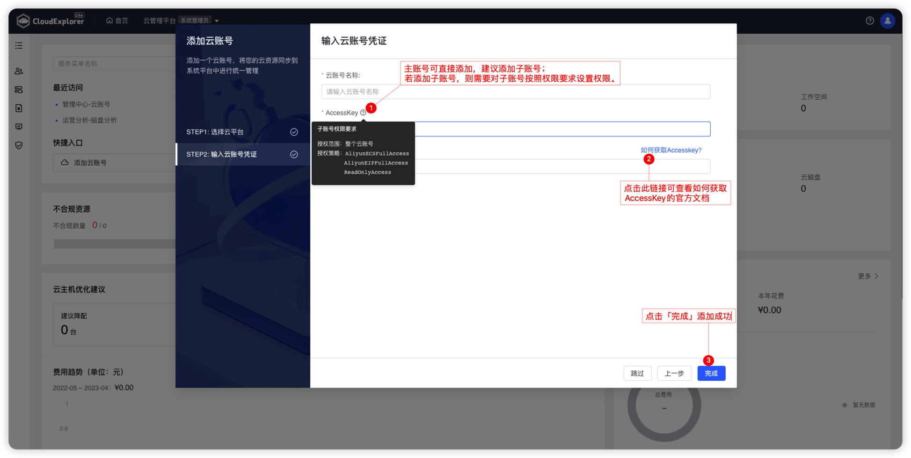
!!! Abstract ""
    非首次登录可打开【管理中心】-【云账号】菜单，创建一个阿里云的云账号，名称为“阿里云-产品”。

{ width="1235px" }

!!! Abstract ""
    云平台选择“阿里云”(若是其他云平台的可选择对应的云平台)  ，当前以“阿里云”为例。

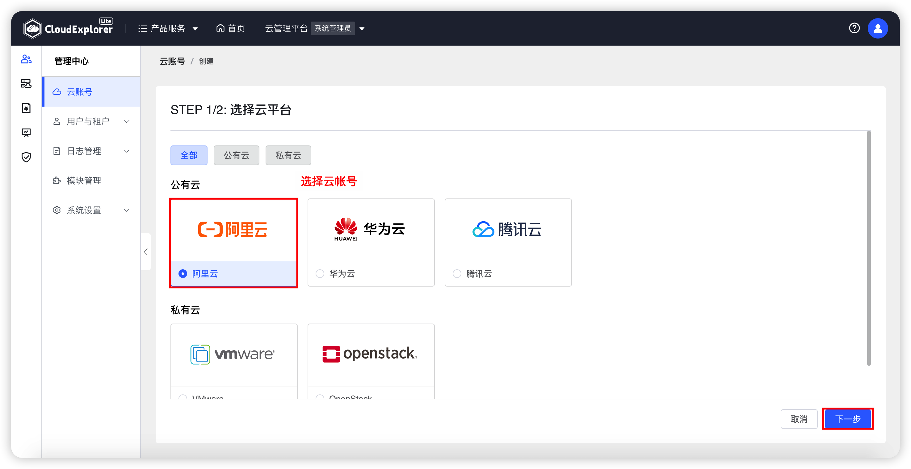

!!! Abstract ""
    输入名称为“阿里云-产品”，输入云账号的 AccessKey ID、AccessKey Secret，点击“确认”。
    说明：AccessKey权限要求：ECS的管理权限和所有资源的只读权限。

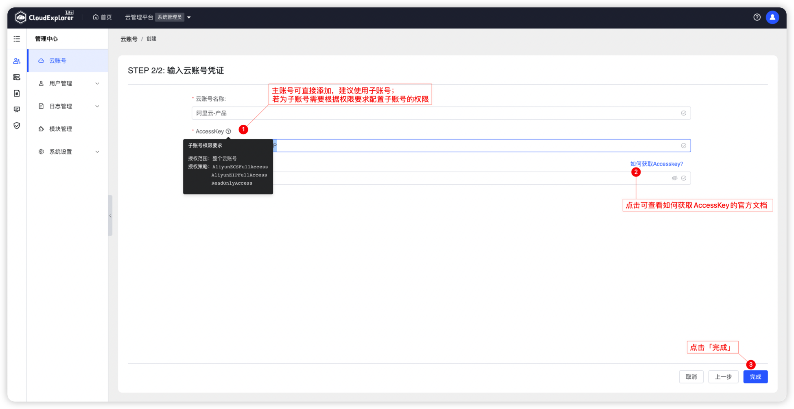

!!! Abstract ""
    系统会自动同步该云账号下的云主机、磁盘、镜像等资源数据，过去一年的账单数据和安全合规扫描的资源数据；  
    系统会定时同步数据，用户也可以手动同步；
    资源同步完成后便可使用各服务模块进行查看和管理，否则各服务模块将没有数据。

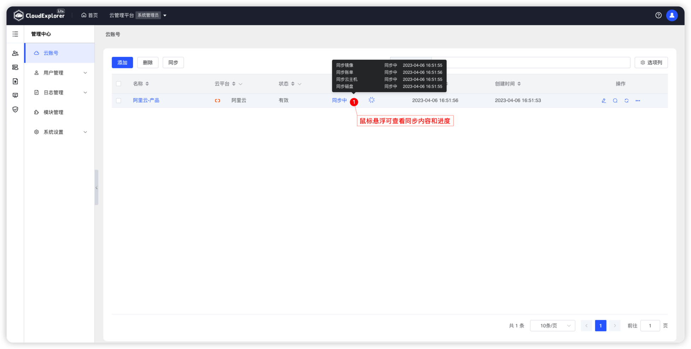
!!! Abstract ""
    点击“云账号名称”或 “同步状态” 可以查看具体的同步记录和同步详情
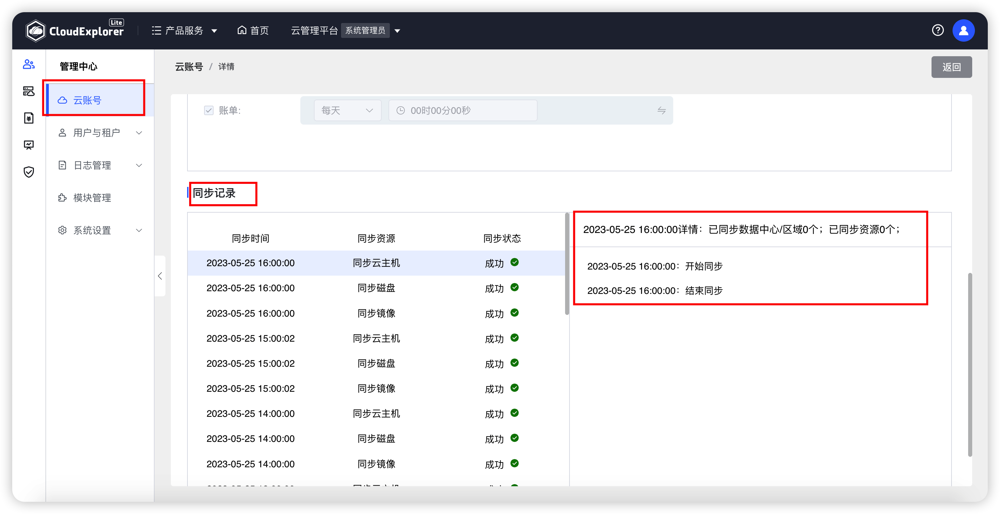

### 3.3 管理云主机

!!! Abstract ""
    【云主机管理】模块提供了云主机的创建、启/停机、回收、配置变更、扩容、授权等。同时基于用户管理体系，用户可创建、可操作的资源都具备隔离性。在多云环境下提供统一的操作界面，为用户带来极大便利。

- 创建阿里云云主机

!!! Abstract ""
    当用户需要新增云主机资源时，无需提前操作任何配置，可以直接在云主机列表上方点击【创建】。

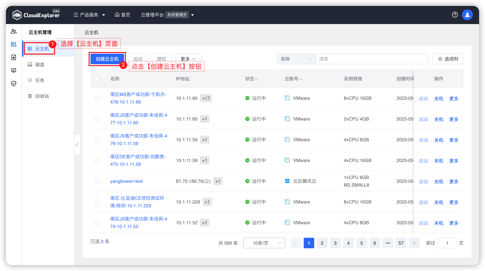

!!! Abstract ""
    需要用户选择在哪个云账号下创建云主机，选择云账号：阿里云，以下以创建阿里云云主机为例

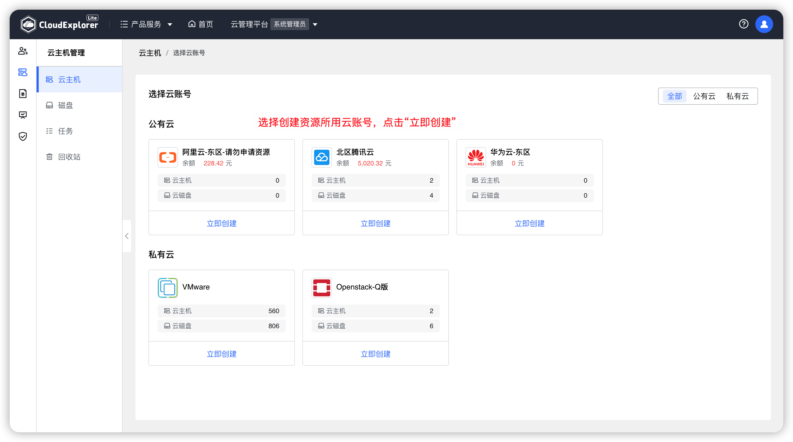

!!! Abstract ""
    在基础配置页面需要选择：付费方式、区域、可用区、实例规格、操作系统、系统盘喝数据盘大小。
    下方会根据所选的配置信息显示预估费用。

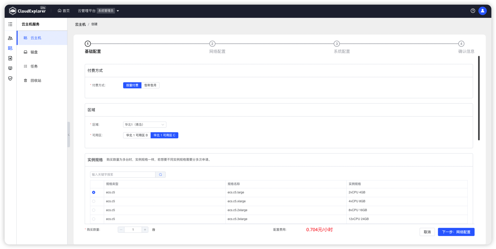


!!! Abstract ""
    在网络配置页面需要选择：子网、安全组、是否分配公网IP及公网IP的带宽设置。

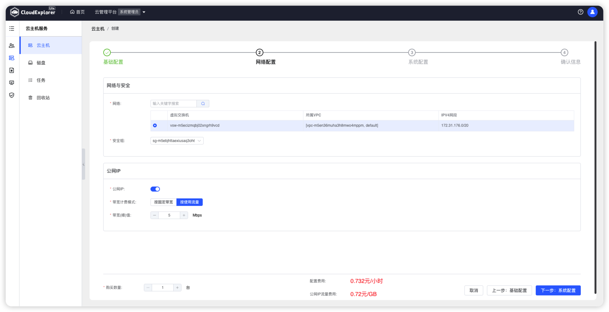


!!! Abstract ""
    在系统配置中设置云主机的登录凭证、 主机名和Hostname;
    若同时创建多台资源则每台资源都需要设置主机名和Hostname；

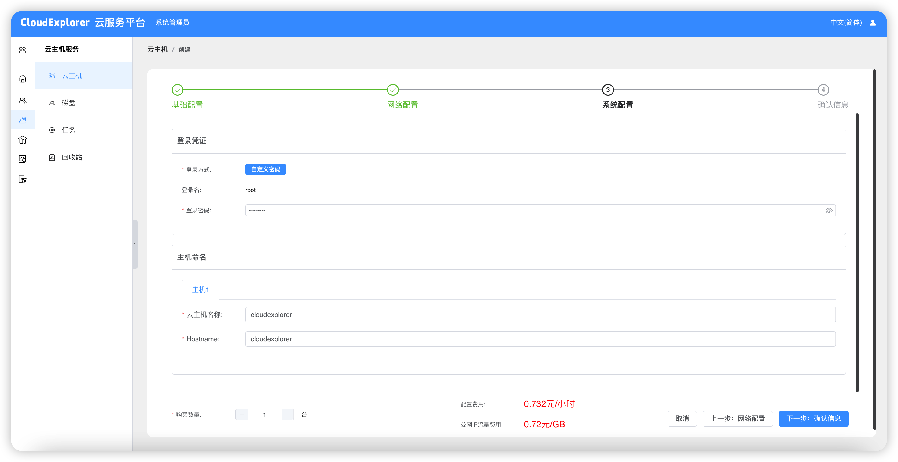

!!! Abstract ""
    最后一步是确认之前几步所选的信息，如果确认正确，提交申请后便会执行任务创建云主机。

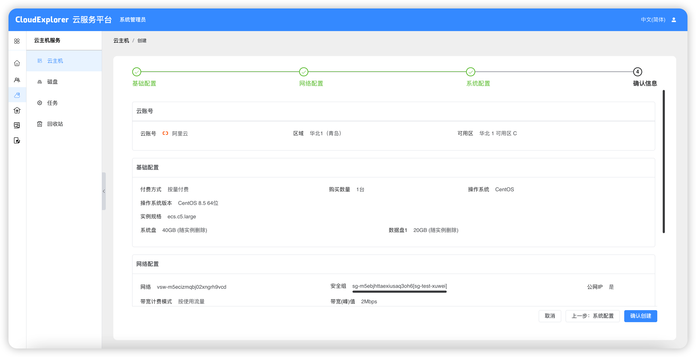


!!! Abstract ""
    提交创建任务后，在云主机列表新增一条创建中的记录，并在任务列表生成创建云主机的任务。

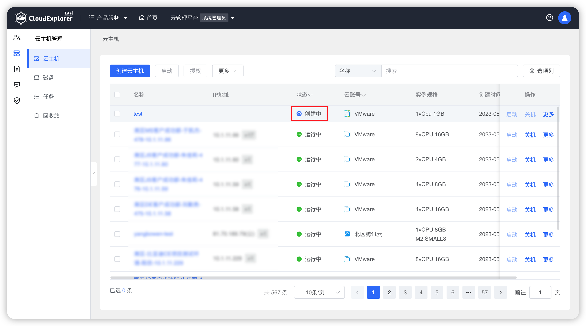
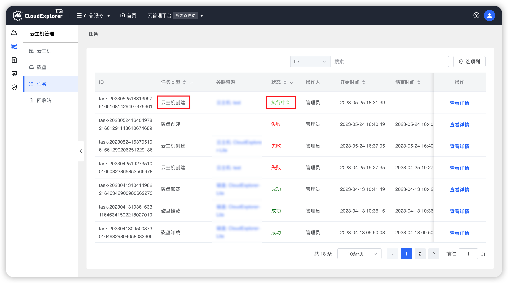
!!! Abstract ""
    任务完成后，云主机状态变为“运行中”。

- 云主机管理操作

!!! Abstract ""
    当前支持对云主机进行启动、停用、重启、删除、配置变更、添加磁盘等管理操作。

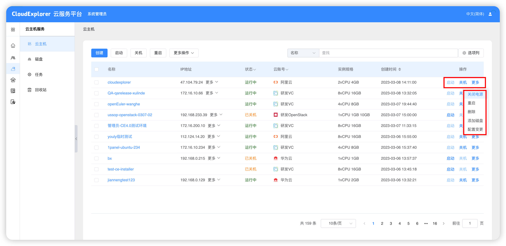

### 3.4 查看云账单

!!! Abstract ""
    提供了多云多账号的费用汇总、费用分摊、自定义多维度月账单功能，可作为企业的云资源成本分析。显著降低云上资源成本管理的难度，提升成本管理效率。

- 账单总览

!!! Abstract ""
    系统管理员可以看到所有纳管云账号的当月总花费、今年总花费、与上月或上个周期费用对比增加还是减少、近半年/近一年的总费用趋势，下方的月账单中可以查看用户自定义不同维度的月账单。
    组织管理员和普通用户可以查看已被分账授权的当月总花费、今年总花费和近半年/近一年的总费用趋势，下方的月账单中可以查看已被分账授权的不同维度的月账单。


- 账单明细

!!! Abstract ""
    系统管理员可以查看所有公有云账号的账单明细，默认显示当月的明细，可以按照账期查看明细。
    组织管理员和普通用户可以查看已被分账授权的账单明细，默认显示当月的明细，可以按照账期查看明细。

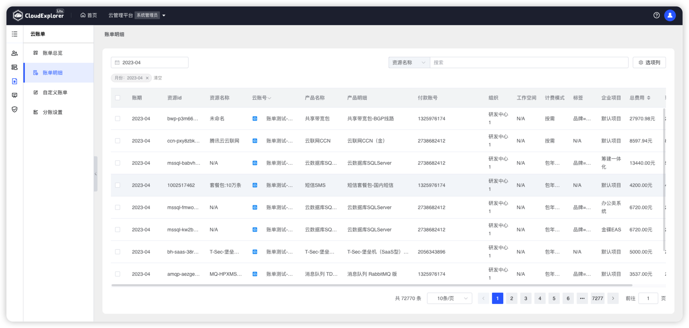


- 自定义账单

!!! Abstract ""
    只有系统管理员添加编辑自定义账单，组织管理员和普通用户只能在账单总览中查看月账单；  
    系统内置部分月账单：按云平台、按云账号、按产品名称、按付费类型、按企业项目；  
    若想要展示其他维度的月账单，系统管理员添加自定义月账单，支持的统计维度字段：云平台、云账号、区域、企业项目、组织（仅一级组织）、组织层级树（可选择组织层级）、工作空间、标签、产品名称、产品明细、付费方式、资源名称等。

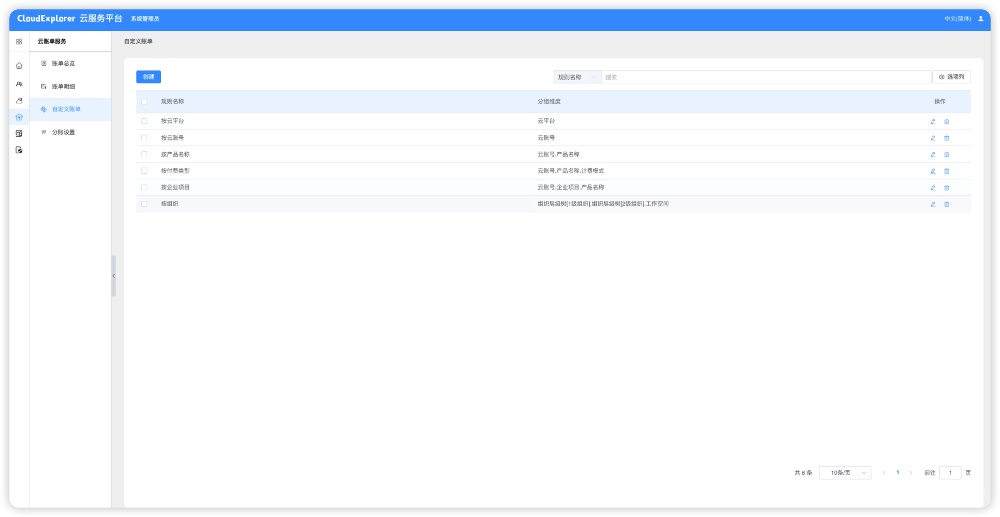

!!! Abstract ""
    创建一个“按工作空间”的自定义账单，统计字段是：组织、工作空间、产品名称。

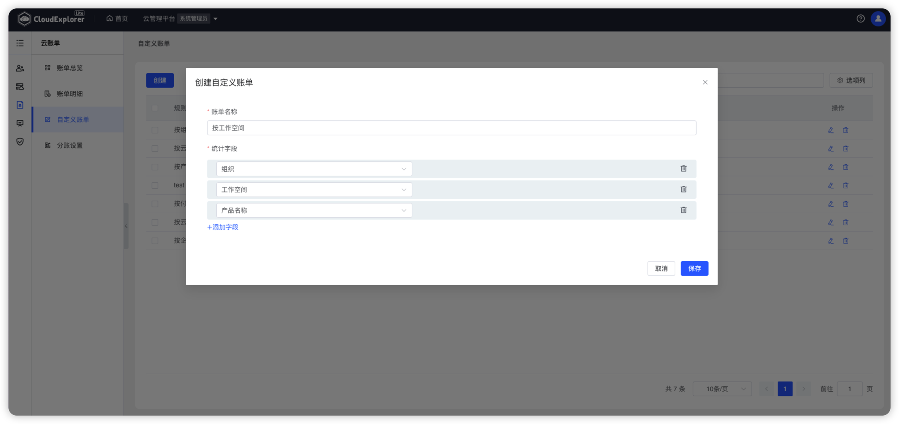

!!! Abstract ""
    自定义账单创建完成后可在【账单总览】中下面的月账单中查看。

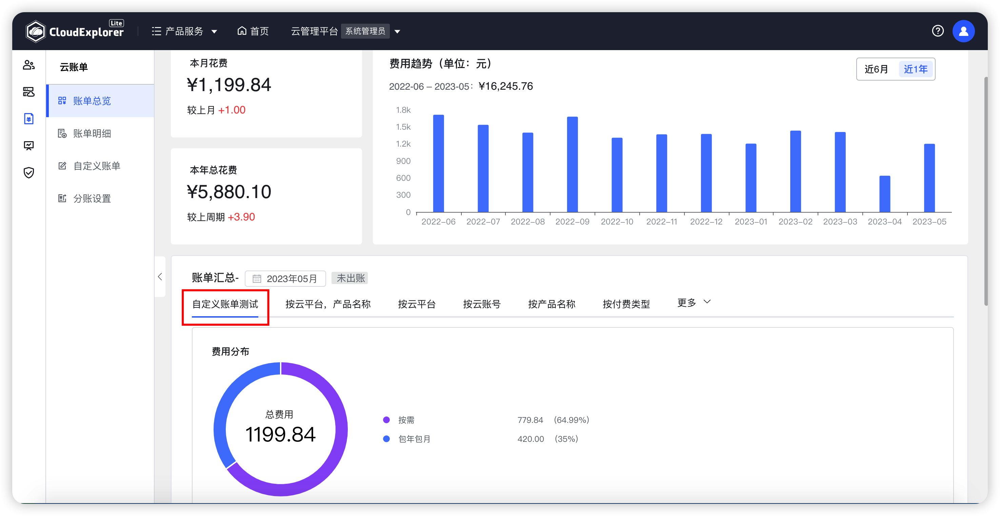

- 分账设置

!!! Abstract ""
    当前系统同步到的账单明细都是基于各云平台上的原始账单数据；  
    若想把这些账单分摊到系统中的组织或工作空间上时，需要在原始账单中存在按组织/工作空间对应的分账字段，如标签、企业项目/财务单元，此时系统管理员可以按照分账字段在系统中进行分账规则设定；  
    若当前还没有分账依据字段，需要先到公有云平台上规范账单，按照系统支持的分账依据进行归纳；  
    当前云管平台支持的分账依据字段有：云平台、云账号、企业项目/财务单元、产品名称、产品明细、标签。  

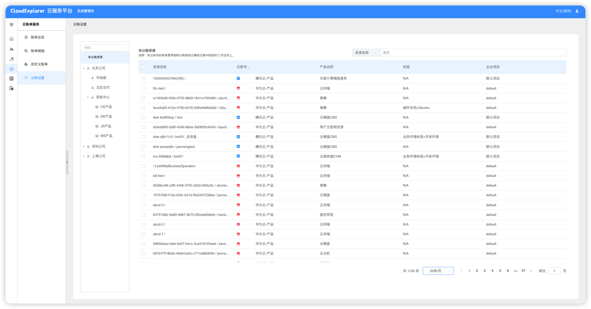

!!! Abstract ""
    在分账设置页面选择组织/工作空间，右侧设置分账规则。

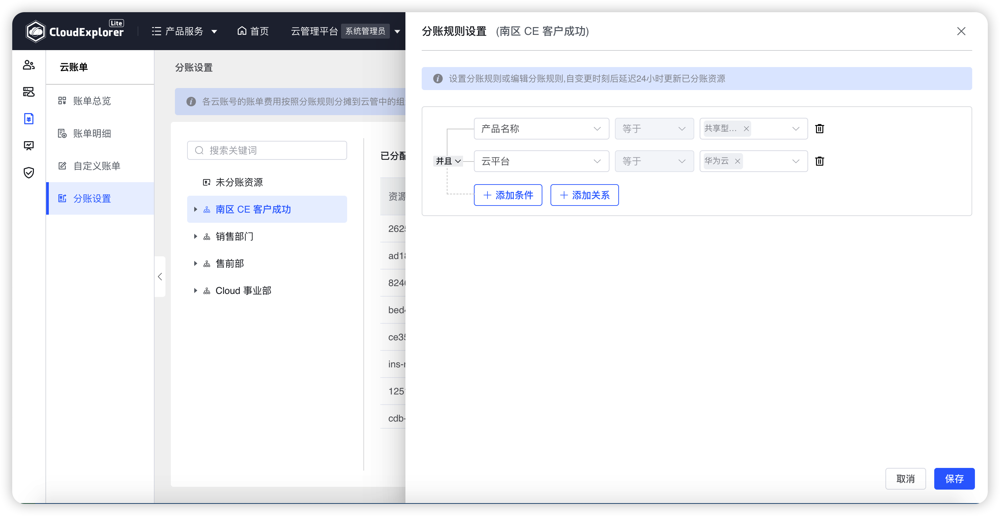

!!! Abstract ""
    分账规则设置保存后，需要延迟24小时可在已分账资源列表展示分摊过来的资源。

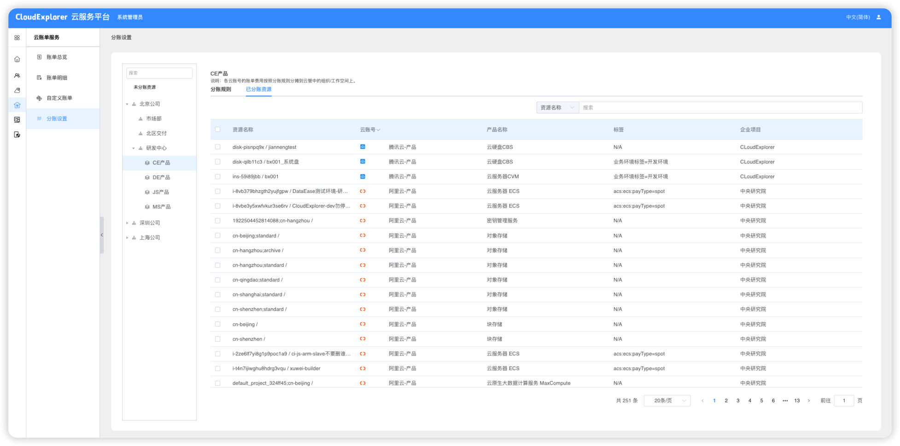

### 3.5 查看安全合规

!!! Abstract ""
    该模块针对对管理员提供查看云平台上的云资源的相关配置是否符合等保条款或企业配置规范；  
    当前支持检测的资源类型为：云服务器、云磁盘、弹性IP、对象存储、安全组、VPC、负载均衡、云数据库、宿主机、存储器、资源池、RAM用户;  
    支持的云平台：阿里云、华为云、腾讯云、VMware、OpenStack.

- 总览

!!! Abstract ""
    从不同维度展示最近一次扫描检测结果的统计信息.


- 合规扫描

!!! Abstract ""
    支持管理员一键扫描；  
    支持管理员可以按规则组、资源类型、云账号查看扫描规则及扫描结果详情.

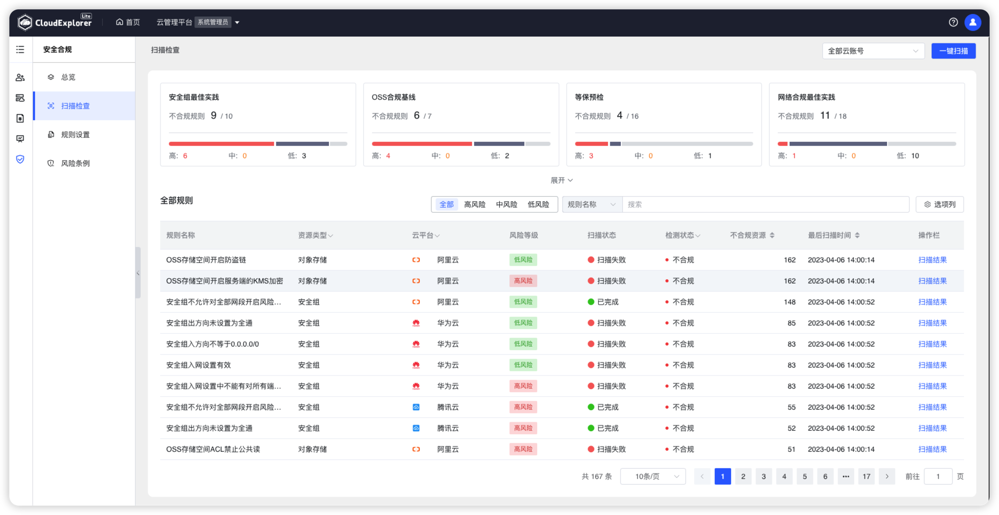

- 规则设置

!!! Abstract ""
    系统内置了多条合规规则，并支持管理员按照企业要求自定义合规规则;  
    支持管理员开启和关闭规则，关闭的规则不会在【合规扫描】中显示该规则，一键扫描时也不会扫描该规则。

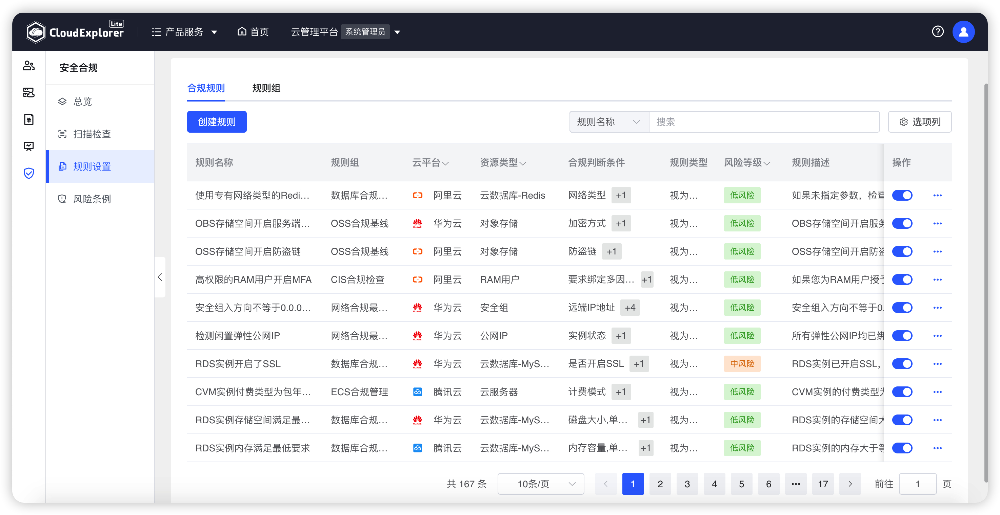

!!! Abstract ""
    新增一个阿里云的磁盘是否开启加密设置的检测规则，操作如下：

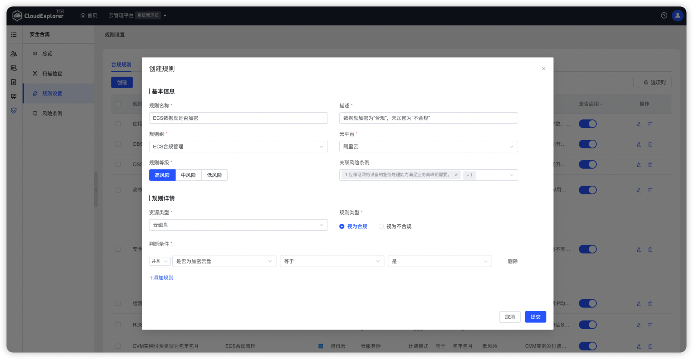

!!! Abstract ""
    添加完规则后，在【合规扫描】中变可以看到该规则，点击【一键扫描】后可以选择改规则所在的规则组进行资源扫描。
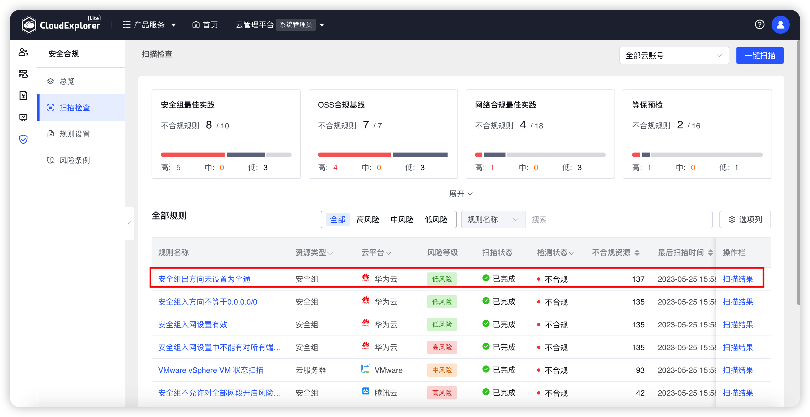
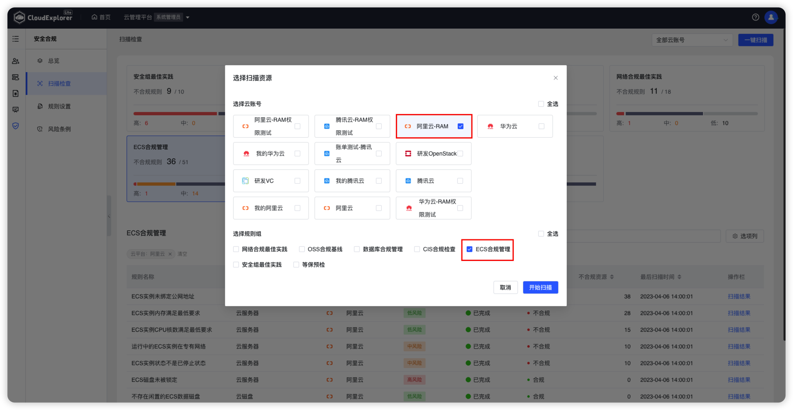


!!! Abstract ""
    点击相应规则的“不合规/合规资源”字段，可以进入扫描资源详情页面。

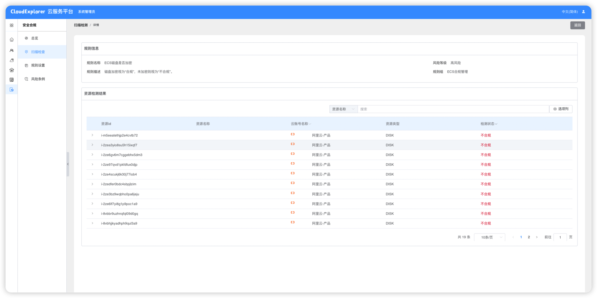

- 规则组

!!! Abstract ""
    支持用户自定义规则组将扫描规则进行分组。

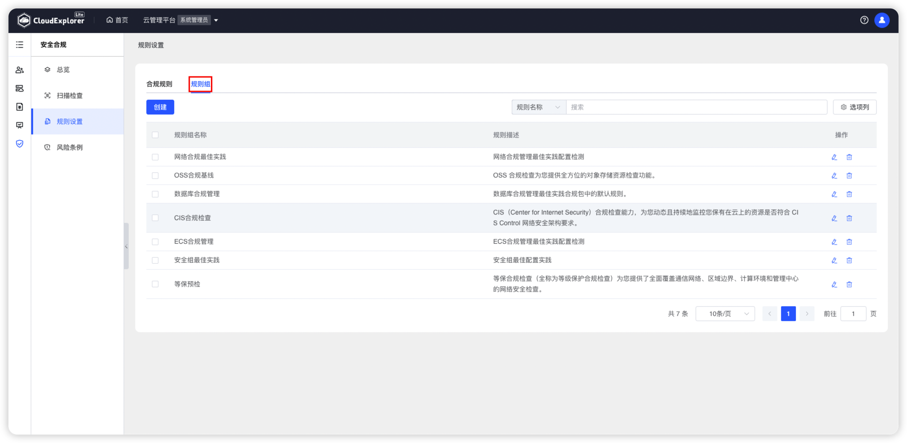

- 风险条例

!!! Abstract ""
    当前风险条例是根据等保2.0等级保护基本要求条款及改进建议说明，系统内置的条款覆盖安全审计、访问控制、入侵防范、网络架构等127条风险条例，用户在自定义规则时可以关联风险条例。关联风险条例的规则，在查看扫描结果时可以看到相关的改进建议。

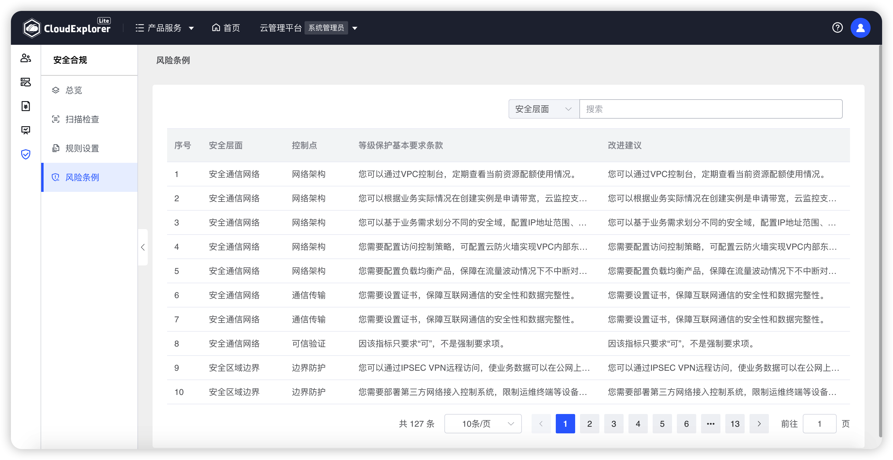
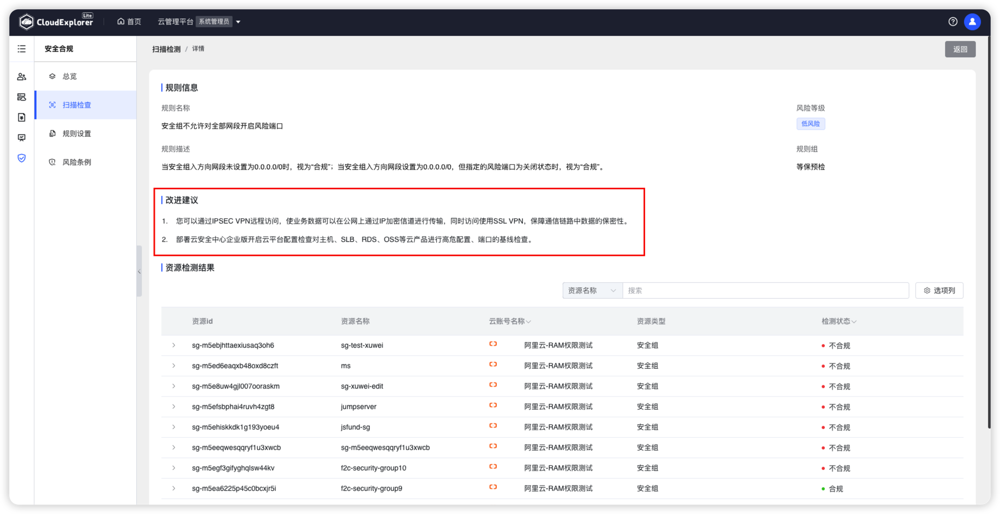

### 3.6 查看运营分析
!!! Abstract ""
    添加完云账号便可对已纳管的资源从分布、容量、使用情况等各维度进行分析，并提供资源优化建议。

- 总览

!!! Abstract ""
    整体查看当前所管理的资源数量统计，资源使用情况统计，资源分布、资源增长趋势以及资源的优化建议。可以按照云账号过滤显示每个云账号下的资源统计情况，


- 基础资源分析

!!! Abstract ""
    基础资源为私有云计算资源和存储器的整体资源从容量、分配情况、使用情况等不同维度进行分析，该功能只有系统管理员角色可查看。

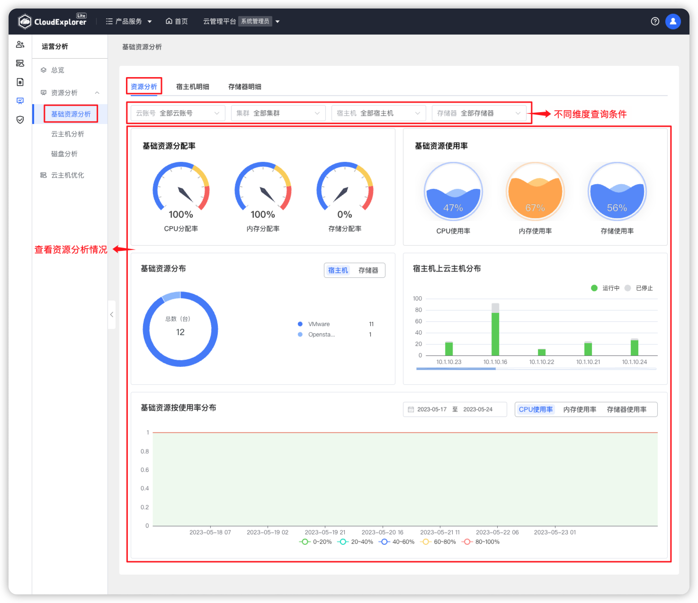

- 云主机分析

!!! Abstract ""
    对纳管的云主机从不同维度进行可视化分析，查看云主机的趋势、资源使用情况、运行状态、资源分布等。

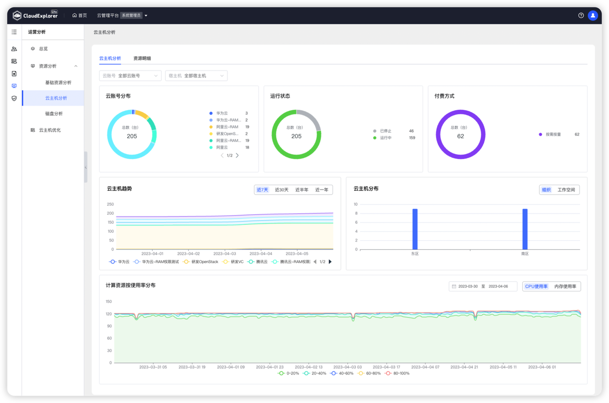

- 磁盘分析

!!! Abstract ""
    对纳管的磁盘从不同维度进行可视化分析，查看磁盘的趋势、资源使用情况、运行状态、资源分布等。

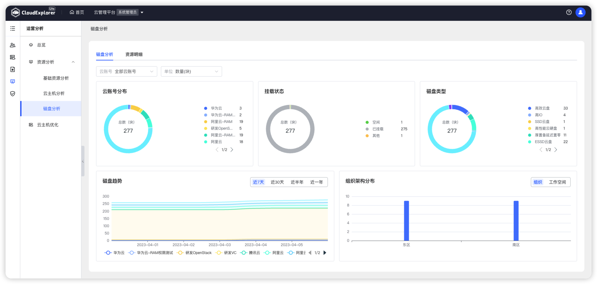

- 云主机优化
!!! Abstract ""
    根据优化策略查找出需要优化的资源，用户可以自定义优化策略的筛选条件；   
    支持查询建议升配、建议降配、变更付费方式、建议回收的云主机。   
   

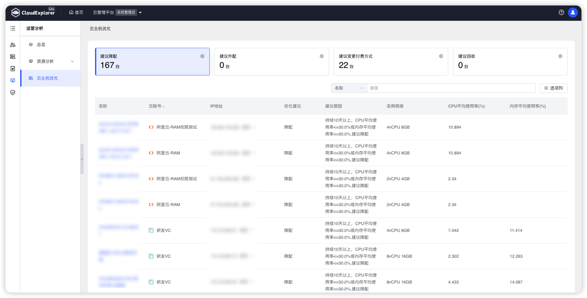

!!! Abstract ""
    点击每个优化策略面板右上角的设置按钮，可以对优化策略筛选条件进行自定义设置，设置保存后则按照最新的策略进行查询资源。

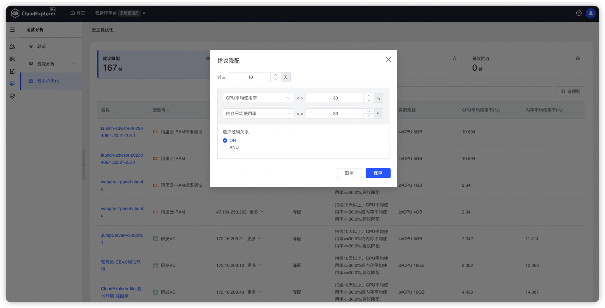
