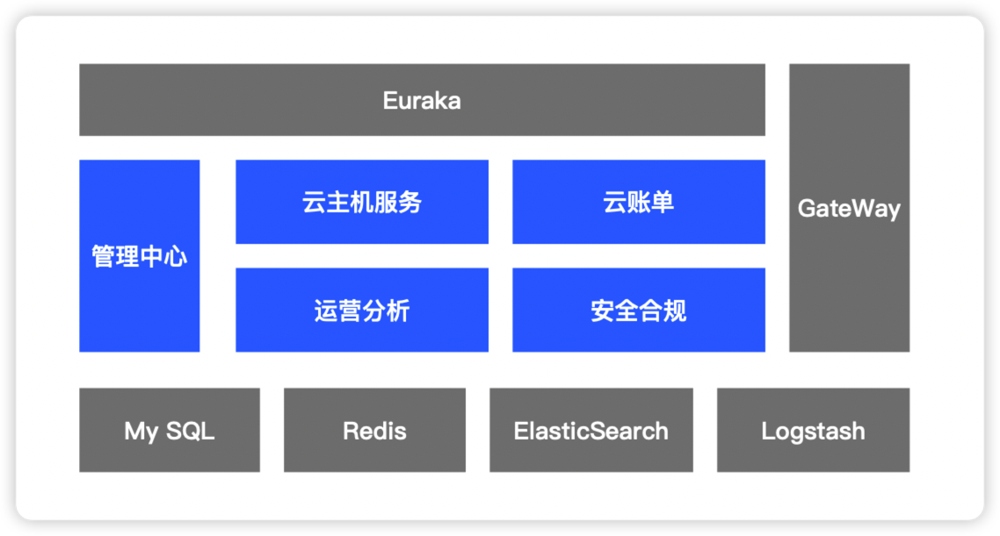
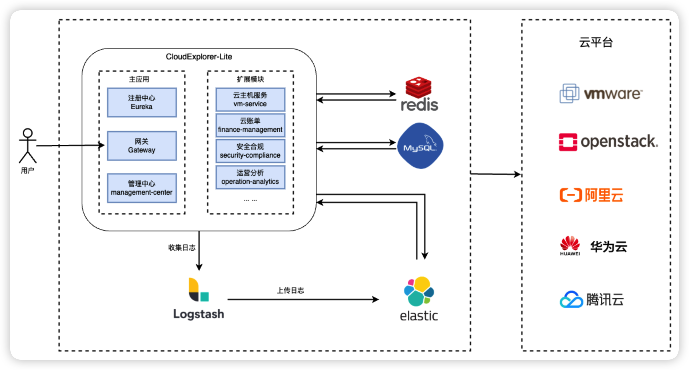

## 1 整体架构

{ width="12350px" }

## 2 组件说明

!!! Abstract ""
    - Eureka ：服务注册中心。
    - GateWay：API 网关服务。
    - 管理中心：CloudExplorer Lite 产品的管理中心模块。
    - 云主机管理：CloudExplorer Lite 产品的云主机管理模块。
    - 云账单：CloudExplorer Lite 产品的云账单模块。
    - 运营分析：CloudExplorer Lite 产品的运营分析模块。
    - 安全合规：CloudExplorer Lite 产品的安全合规模块。
    - MySQL：CloudExplorer Lite 产品主要数据均存储在MySQL。
    - Redis：缓存角色、权限数据。
    - ElasticSearch：存储账单数据、资源监控数据、安全合规检测资源数据和日志数据。
    - Logstash：将本地日志文件推送至 ElasticSearch。

各个组件间的关系可参考下图  
{ width="800px" }

## 3 管理模型

{ width="800px" }
!!! Abstract ""
    - 平台：每个独立部署的 CloudExplorer Lite 即称为一套云管理平台系统。
    - 系统管理员：角色的权限范围为整个平台，管理整个平台内的用户、组织、工作空间、云账号等所有资源。
    - 组织：平台中的一级租户，可以映射为企业的不同部门或业务线。
    - 组织管理员：角色的权限范围限定在某个组织及关联的子级组织或工作空间，可管理当前组织下的所有资源和用户。
    - 工作空间：资源划分的逻辑概念，可以映射为一个项目或个人，工作空间之间资源隔离。有效解决了资源对象和用户直接绑定的问题。
    - 普通用户：工作空间用户，管理工作空间下资源的用户。
    
## 4 技术栈

!!! Abstract ""
    - 前端： ts , vue3 , vite , element-plus , microapp
    - 后端： spring-security , spring-gateway
    - 中间件： MySQL , Redis , ElasticSerch , Logstash
    - 基础设施： Docker