!!! Abstract ""

    当用户需要新增云主机资源时，无需提前操作任何配置，在【云主机管理】-【云主机】页面，点击【创建】即可选择云账号，创建云主机。

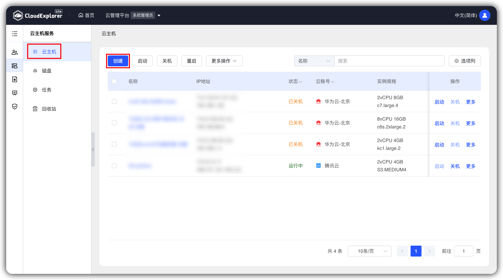{ width="1235px" }

!!! Abstract ""

    创建云主机时，用户可通过调整购买数量设置一次创建多台云主机。购买数量为多台时，每台云主机的实例规格相同。 
    若用户想要申请不同实例规格的多台云主机，则需要分多次申请。

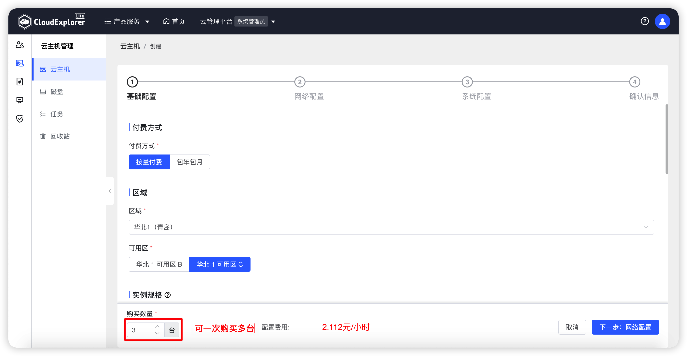{ width="1235px" }

!!! Abstract ""

    当用户创建公有云云主机时，可选择按量付费或包年包月的付费方式。当用户创建包年包月的云主机时，还需要设置购买时长。 
    页面下方会根据用户所选配置显示云主机费用。 

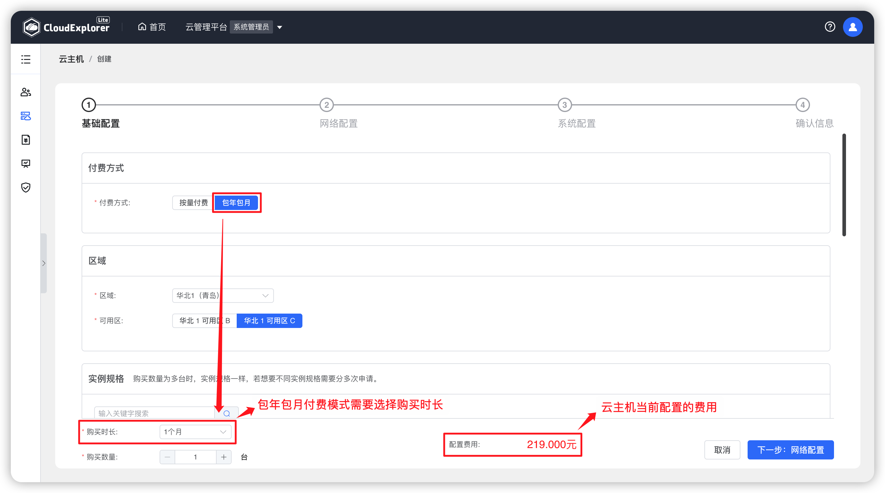{ width="1235px" }

!!! Abstract ""

    __情况说明：__ 
    - 云账号会根据状态过滤，云账号选择页面仅展示有效状态的云账号。 
    - 公有云账号会显示账户余额，当账号余额不足时，建议先去充值，否则云主机会创建失败。 
    - 每个云账号都会显示账号下已有的云主机和云磁盘数量。

## 1 创建阿里云云主机

!!! Abstract ""

    在云账号选择页面选择需要创建资源的阿里云云账号，点击“立即创建”进入创建云主机操作。 
    创建一台阿里云云主机需要经过基础配置、网络配置、系统配置、确认信息四个步骤。页面下方会根据基础配置和网络配置所设置的参数计算当前配置费用。
   
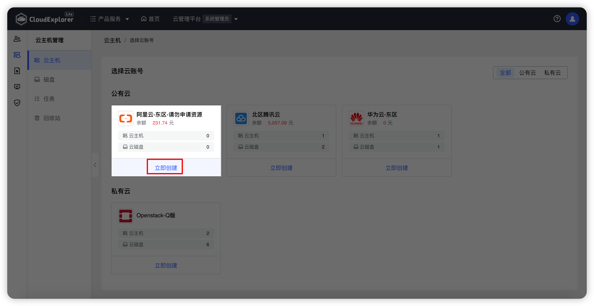{ width="1235px" }

- 基础配置

!!! Abstract ""

    基础配置页面需要用户确认云主机付费方式，选择云主机所在区域和可用区，设置云主机实例规格大小，选择操作系统和版本，并为云主机配置磁盘。 
    用户需对系统盘设置磁盘类型，并定义磁盘大小。数据盘可添加多块，并分别对每块设置磁盘类型、磁盘大小。系统盘和数据盘都默认随实例删除。
    
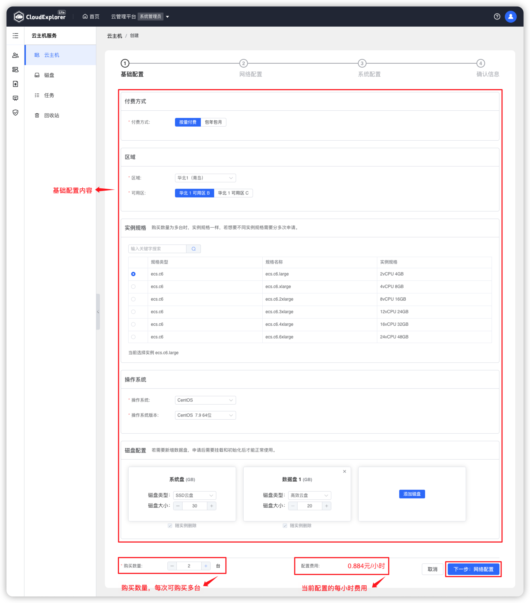{ width="1235px" }

- 网络配置

!!! Abstract ""

    网络配置即选择云主机所使用的网络、安全组和是否使用公网 IP。 
    如需使用公网 IP，则需选择带宽计费模式，并设置带宽（峰）值。

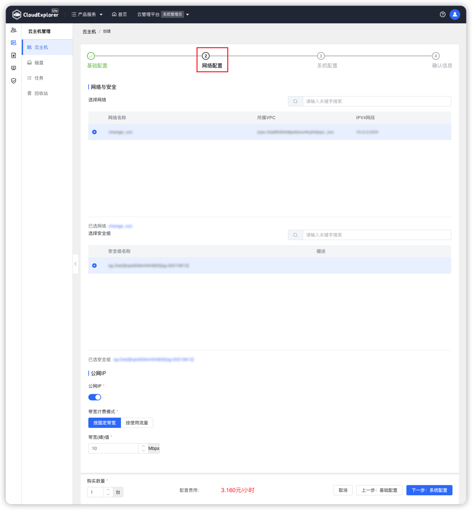{ width="1235px" }

- 系统配置

!!! Abstract ""

    系统配置中需要设置云主机的登录凭证并为主机命名。 
    当前阿里云云主机的登录方式为账号密码登录，登录名称默认为 root，登录密码为用户自定义输入密码。 
    如一次创建多台云主机，则系统配置页面会分多个标签页设置每台云主机的名称和 Hostname。

!!! Abstract ""

    __情况说明：__ 
    阿里云云主机的登录密码要求在 8 ～ 30 位字符数以内，不能以" / "开头，至少包含其中三项(小写字母 a ~ z、大写字母 A ～ Z、数字 0 ～ 9、()`~!@#$%^&*-+=_|{}[]:;'<>,.?/)。

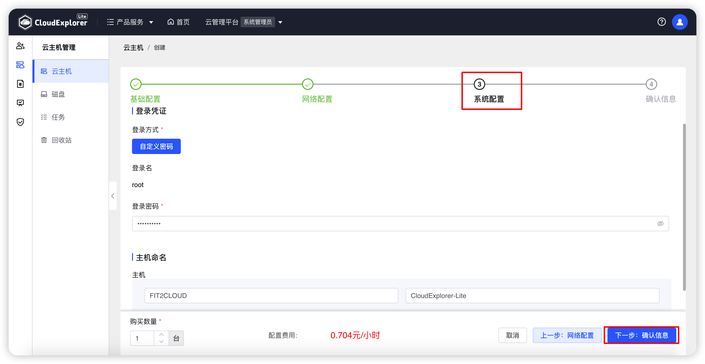{ width="1235px" }

- 确认信息

!!! Abstract ""

    确认信息页面内容是之前每一步所选的内容选项的再次确认。 
    如果存在信息选错情况，则可点击“上一步”按钮，返回修改云主机参数。 
    如果创建云主机信息全部正确，点击【确认创建】即可。

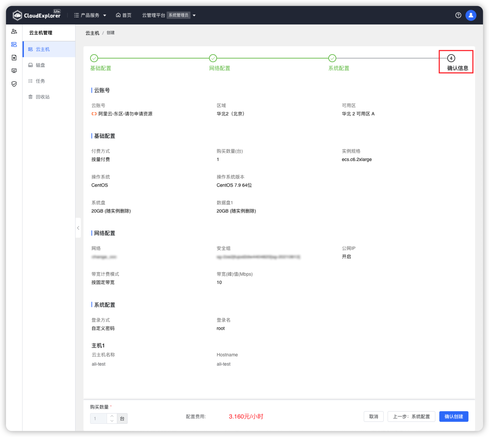{ width="1235px" }

!!! Abstract ""

    确认创建后，云主机列表生成一条状态为创建中的云主机数据，且在【任务】列表中生成一条创建云主机的任务。 
    在【任务】中可查看任务的进度和状态。

## 2 创建华为云云主机

!!! Abstract ""

    在云账号选择页面选择需要创建资源的华为云云账号，点击“立即创建”进入创建云主机操作。 
    创建一台阿里云云主机需要经过基础配置、网络配置、系统配置、确认信息四个步骤。页面下方会根据基础配置和网络配置所设置的参数计算当前配置费用。

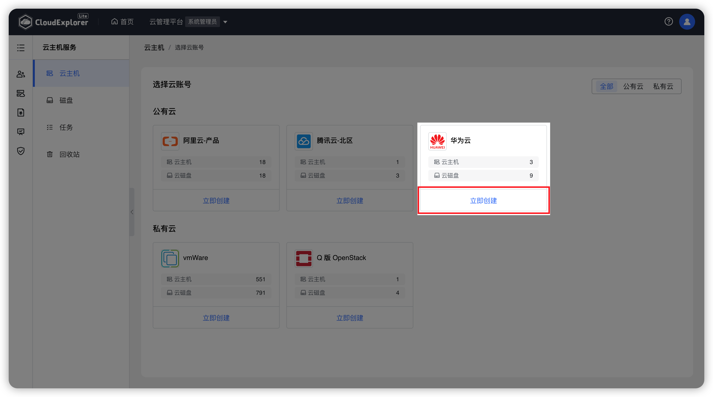{ width="1235px" }

- 基础配置

!!! Abstract ""

    基础配置页面需要用户确认云主机付费方式，选择云主机所在区域和可用区，设置云主机实例规格大小，选择操作系统和版本，并为云主机配置磁盘。 
    创建包年包月的云主机时,还需要设置购买时长。 
    用户可对系统盘设置磁盘类型，定义磁盘大小。数据盘可添加多块，并分别对每块设置磁盘类型、磁盘大小。

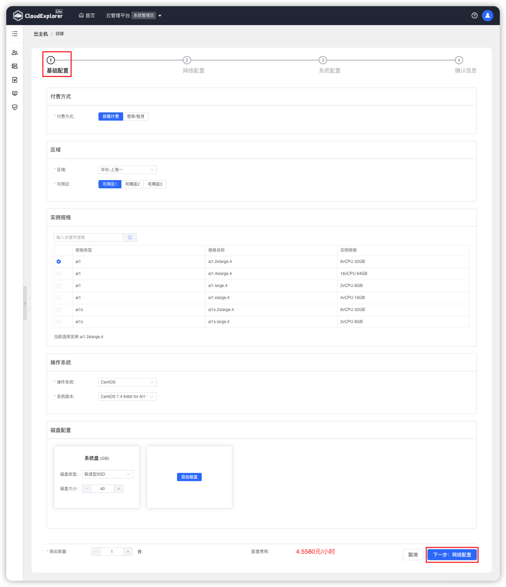{ width="1235px" }

- 网络配置

!!! Abstract ""

    网络配置即选择云主机所使用的网络、安全组和是否使用公网 IP，可选择多个安全组加入。 
    如需使用公网 IP，则需选择带宽计费类型，并设置带宽大小。

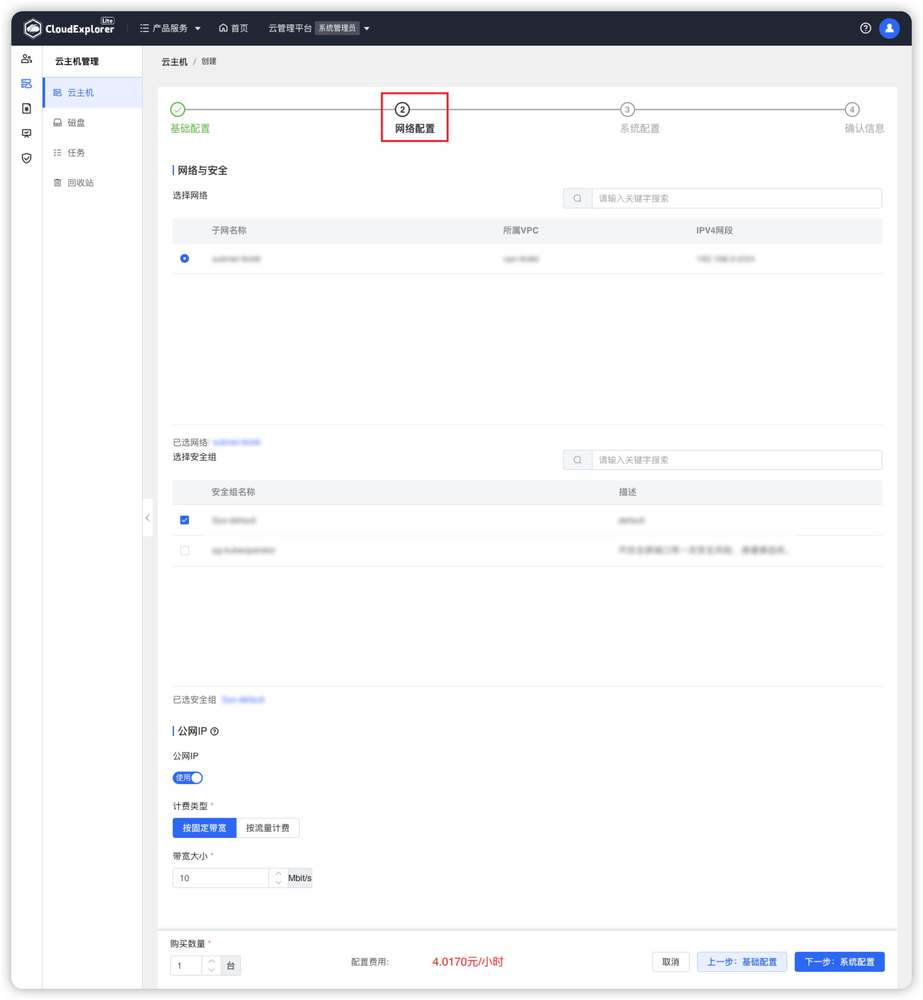{ width="1235px" }

- 系统配置

!!! Abstract ""

    系统配置中需要设置云主机的登录凭证并为主机命名。 
    当前华为云云主机的登录方式为账号密码登录，登录名称默认为 root，登录密码为用户自定义输入密码。 
    如一次创建多台云主机，则系统配置页面会分多个标签页设置每台云主机的名称和 Hostname。

!!! Abstract ""

    __情况说明：__ 
    华为云云主机的登录密码要求在 8 ～ 26 位字符数以内，码只能包含大写字母、小写字母、数字和特殊字符(l@$%^ =+.,./?#”)且至少包含四种字符中的三种。密码不能包含用户名或用户名的逆序。

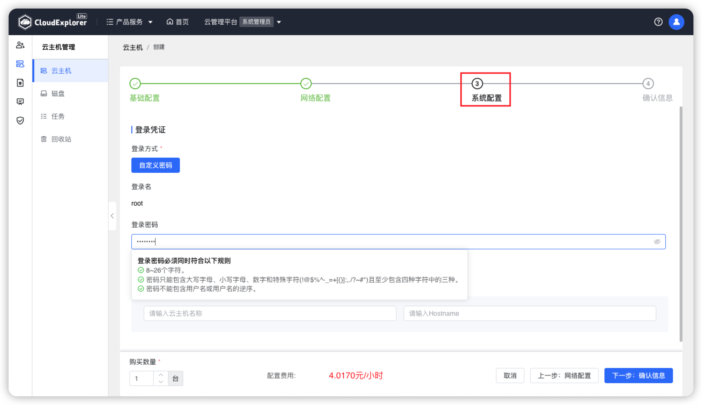{ width="1235px" }

- 确认信息

!!! Abstract ""

    确认信息页面内容是之前每一步所选的内容选项的再次确认。 
    如果存在信息选错情况，则可点击“上一步”按钮，返回修改云主机参数。 
    如果创建云主机信息全部正确，点击【确认创建】即可。

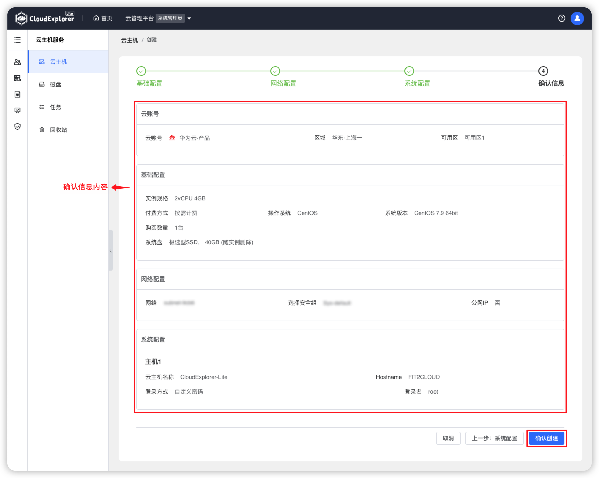{ width="1235px" }

!!! Abstract ""

    确认创建后，云主机列表生成一条状态为创建中的云主机数据，且在【任务】列表中生成一条创建云主机的任务。 
    在【任务】中可查看任务的进度和状态。

## 3 创建腾讯云云主机

!!! Abstract ""

    在云账号选择页面选择需要创建资源的腾讯云云账号，点击“立即创建”进入创建云主机操作。 
    创建一台阿里云云主机需要经过基础配置、网络配置、系统配置、确认信息四个步骤。页面下方会根据基础配置和网络配置所设置的参数计算当前配置费用。

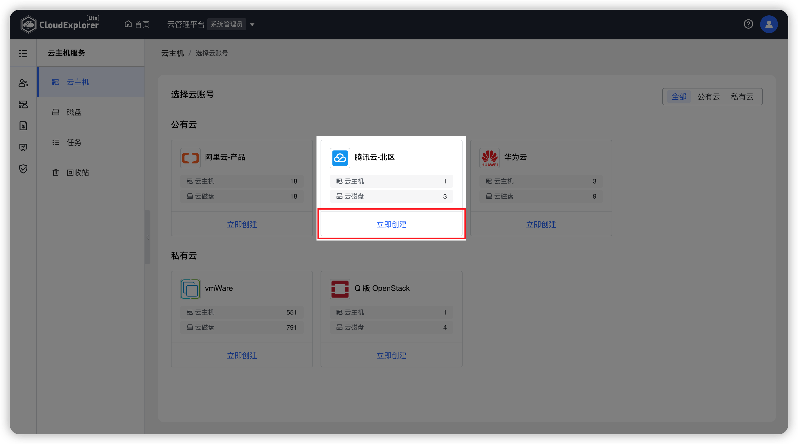{ width="1235px" }

- 基础配置

!!! Abstract ""

    基础配置页面需要用户确认云主机付费方式，选择云主机所在区域和可用区，设置云主机实例规格大小，选择操作系统和版本，并为云主机配置磁盘。 
    创建包年包月的云主机时,还需要设置购买时长。 
    用户需对系统盘设置磁盘类型，并定义磁盘大小，系统盘默认随实例删除，无法修改。数据盘可添加多块，并分别对每块设置磁盘类型、磁盘大小、是否随实例删除。

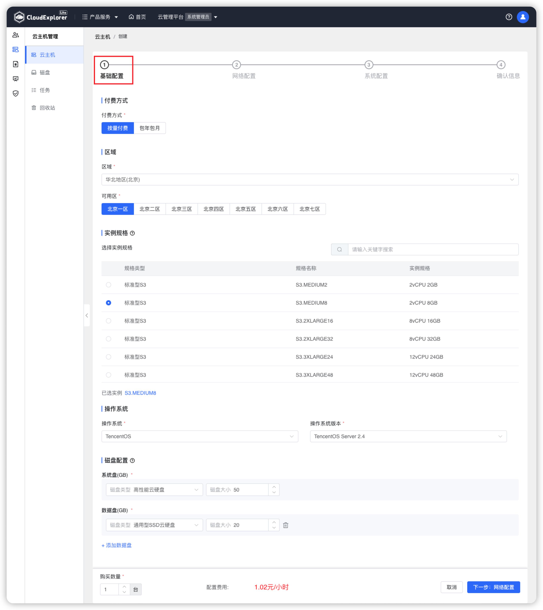{ width="1235px" }

- 网络配置

!!! Abstract ""

    网络配置即选择云主机所使用的网络、安全组和是否使用公网 IP，可选择多个安全组加入。 
    如需使用公网 IP，则需选择带宽计费模式，并设置带宽（峰）值。

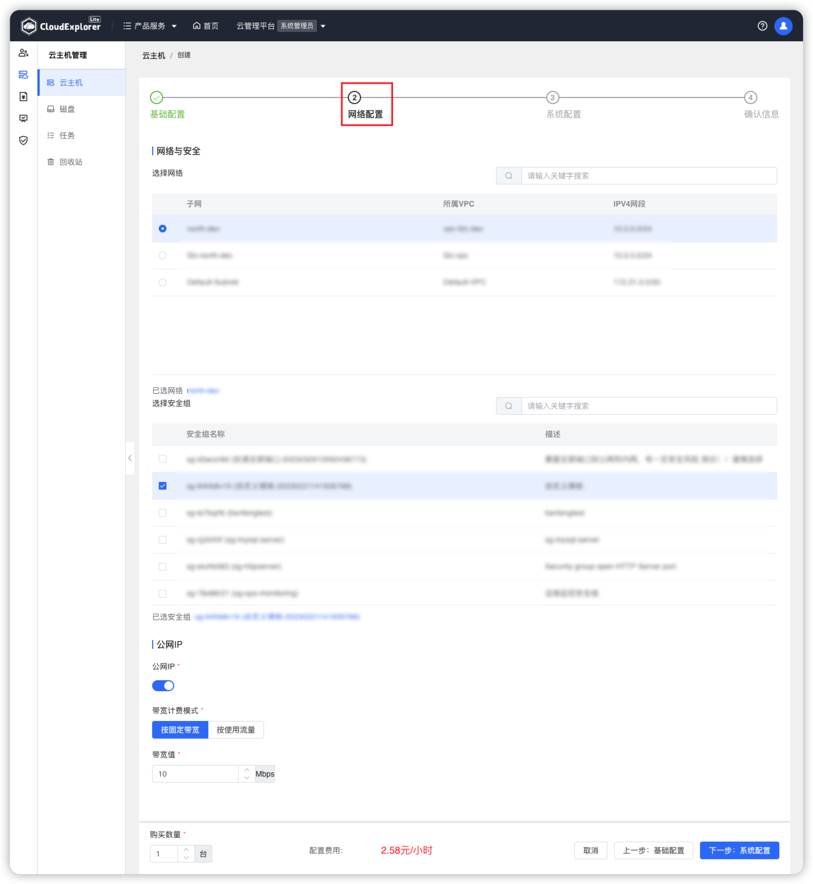{ width="1235px" }

- 系统配置

!!! Abstract ""

    系统配置中需要设置云主机的登录凭证并为主机命名。 
    当前腾讯云云主机的登录方式为账号密码登录，登录名称默认为 root，登录密码为用户自定义输入密码。 
    如一次创建多台云主机，则系统配置页面会分多个标签页设置每台云主机的名称和 Hostname。

!!! Abstract ""

    __情况说明：__ 
    腾讯云云主机的登录密码要求在 8 ～ 30 位字符数以内，不能以" / "开头，至少包含其中三项(小写字母 a ~ z、大写字母 A ～ Z、数字 0 ～ 9、()`~!@#$%^&*-+=_|{}[]:;'<>,.?/)。

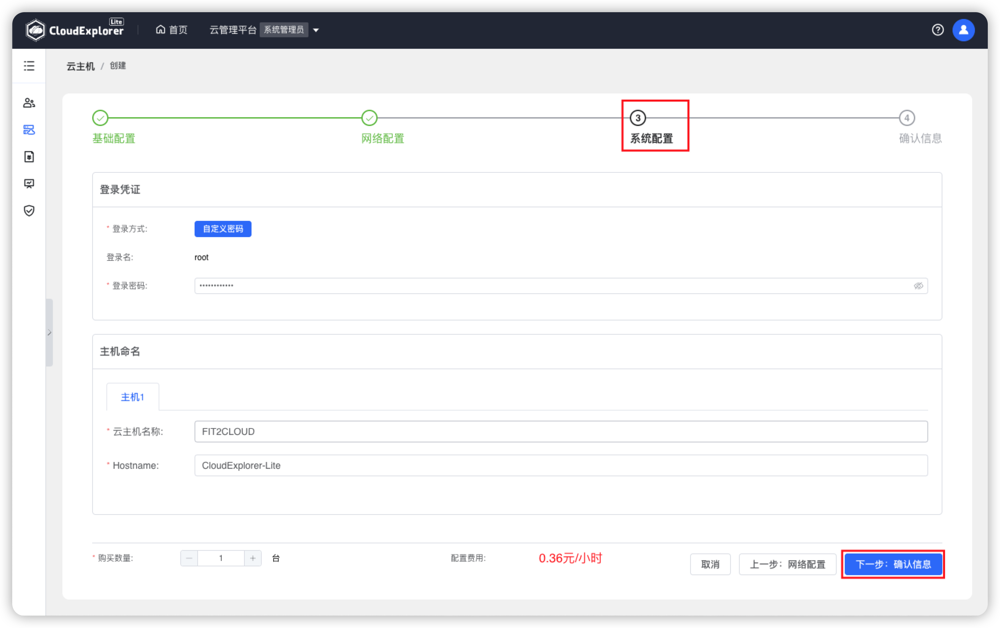{ width="1235px" }

- 确认信息

!!! Abstract ""

    确认信息页面内容是之前每一步所选的内容选项的再次确认。 
    如果存在信息选错情况，则可点击“上一步”按钮，返回修改云主机参数。 
    如果创建云主机信息全部正确，点击【确认创建】即可。

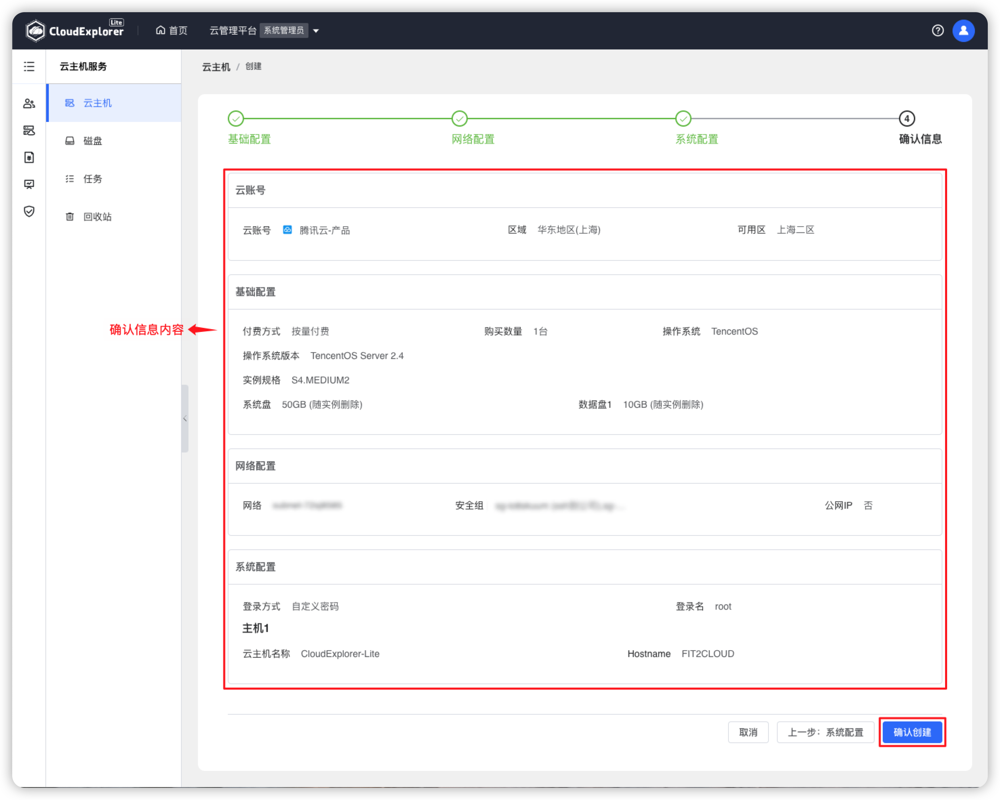{ width="1235px" }

!!! Abstract ""

    确认创建后，云主机列表生成一条状态为创建中的云主机数据，且在【任务】列表中生成一条创建云主机的任务。 
    在【任务】中可查看任务的进度和状态。

## 4 创建 VMware 云主机

!!! Abstract ""

    在云账号选择页面选择需要创建资源的 VMware 云账号，点击“立即创建”进入创建云主机操作。创建一台 VMware 云主机需要经过基础配置、资源配置、网络配置、系统配置、确认信息五个步骤。

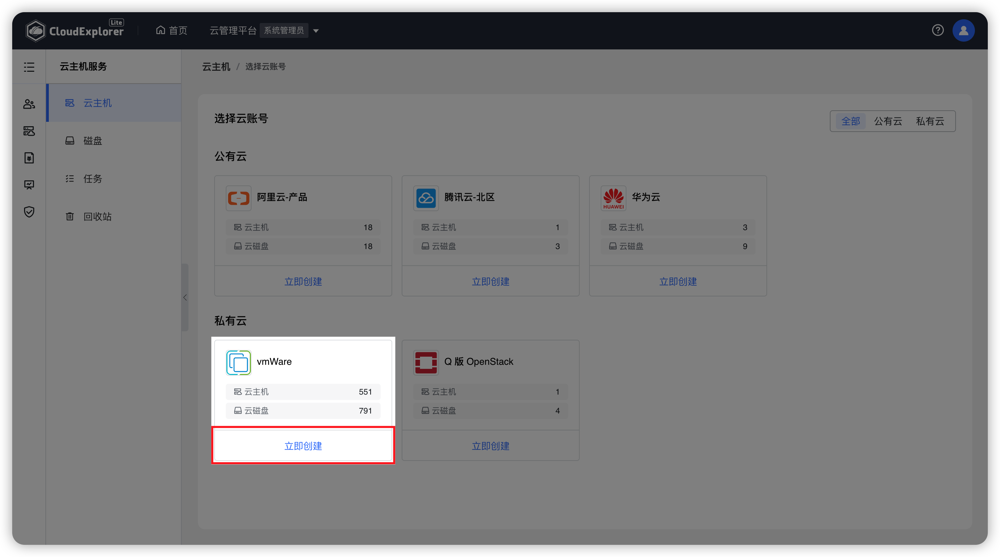{ width="1235px" }

- 基础配置

!!! Abstract ""

    基础配置页面需要用户选择付费方式，设置云主机所属的数据中心、集群，选择需要使用的镜像模板，输入实例规格大小，可添加多块数据盘并设置每块数据盘大小，选择磁盘是否随实例删除。

!!! Abstract ""

    云主机的系统盘大小根据用户所选择的镜像模板中的系统盘大小确定，不可编辑修改，但可以选择是否随实例删除。如用户所选镜像模板中带有数据盘，则此块数据盘大小也不可编辑修改，但可以选择是否随实例删除。此外，用户还可以选择再添加磁盘。

!!! Abstract ""

    用户可通过调整购买数量设置一次创建多台云主机。 
    设置计费策略后，创建页面根据所选付费方式和实例规格显示预估价格。 
    购买数量为多台时，每台云主机的实例规格相同。若用户想要申请不同实例规格的多台云主机，则需要分多次申请。

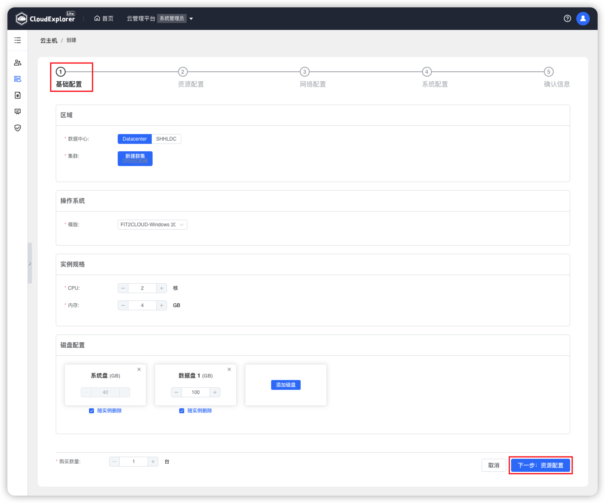{ width="1235px" }

- 资源配置

!!! Abstract ""

    计算资源需要选择计算资源类型并根据所选类型选择具体资源池。 
    存储资源需要选择创建云主机所需的存储资源。 
    主机存放位置选择云主机创建完成挂载的文件夹目录。

!!! Abstract ""

    __字段说明：__ 
    - 计算资源类型：选择创建云主机所需的计算资源类型，分为宿主机、资源池和 Automatic selection 三种类型。 
    - 宿主机：选择该类型后，会列出 VMware 上所有的主机资源以及每个资源的 CPU 和内存使用情况。 
    - 资源池：选择该类型后，会列出 VMware 上创建的资源池列表以及每个资源池的 CPU 和内存使用情况. 
    - Automatic selection：只有在基础配置中所选的集群开启了 DRDS 功能时，才会显示该类型，选择该类型后，会根据 VMware 的均衡资源策略分配云主机资源。 
    - 磁盘格式：选择创建云主机的磁盘格式类型。 
    - 存储器：根据所选的计算资源，列出可以选择的存储器列表，以及每个存储器的使用量，选择磁盘具体使用的存储器。

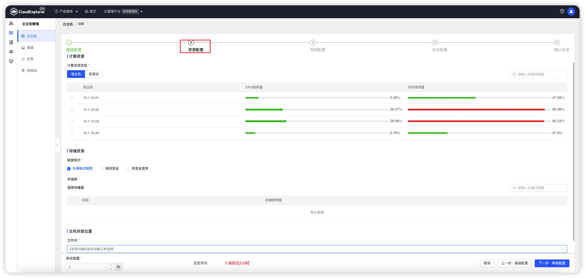{ width="1235px" }

- 网络配置

!!! Abstract ""

    网络配置即选择云主机所使用的网卡。

!!! Abstract ""

    __情况说明：__ 
    - VMware 支持多网卡创建云主机，因此选择网络时可以添加多张网卡 
    - 支持IP分配类型为 DHCP 和手动分配。 
    - 创建云主机时会将模板中的网卡删除，然后新增用户设置的网卡。

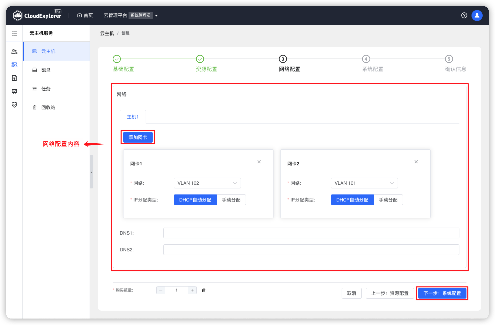{ width="1235px" }

- 系统配置

!!! Abstract ""

    当前 VMware 云主机的登录凭证默认为模板的用户名和密码。 
    系统配置只需要设置云主机名称和 Hostname 即可。
    如需一次创建多台云主机，则系统配置页面会分多个标签页设置每台云主机的名称和 Hostname。

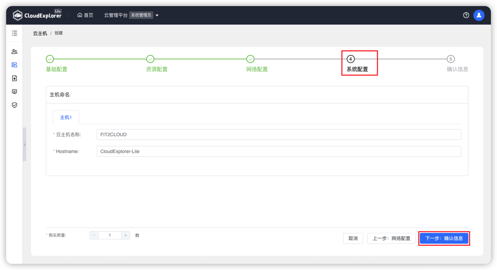{ width="1235px" }

- 确认信息

!!! Abstract ""

    确认信息页面内容是之前每一步所选的内容选项的再次确认。 
    如果存在信息选错情况，则可点击“上一步”按钮，返回修改云主机参数。 
    如果创建云主机信息全部正确，点击【确认创建】即可。

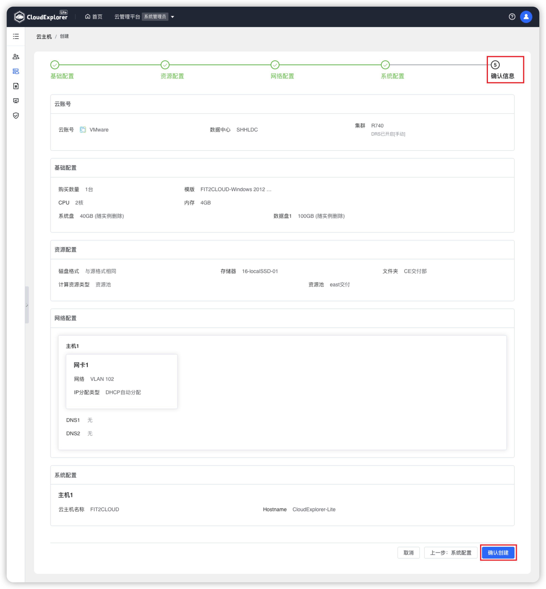{ width="1235px" }

!!! Abstract ""

    确认创建后，云主机列表生成一条状态为创建中的云主机数据，且在【任务】列表中生成一条创建云主机的任务。 
    在【任务】中可查看任务的进度和状态。

## 5 创建 OpenStack 云主机

!!! Abstract ""

    在云账号选择页面选择需要创建资源的 OpenStack 云账号，点击“立即创建”进入创建云主机操作。创建一台 OpenStack 云主机需要经过基础配置、网络配置、系统配置、确认信息四个步骤。

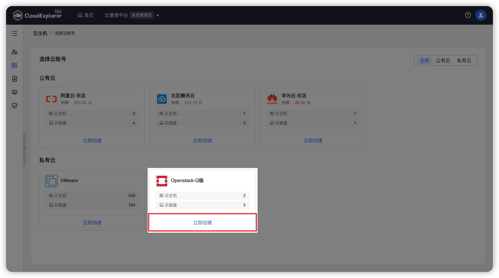{ width="1235px" }

- 基础配置

!!! Abstract ""

    基础配置页面需要用户选择付费方式，设置云主机所在区域，选择需要使用的镜像模板、实例规格大小，及是否创建启动盘。可添加多块数据盘并设置每块数据盘的磁盘类型和磁盘大小。

!!! Abstract ""

    云主机的系统盘大小根据用户所选择的实例规格中硬盘大小确定，但用户可以增加磁盘大小，并需要选择磁盘类型。

!!! Abstract ""

    用户可通过调整购买数量设置一次创建多台云主机。 
    设置计费策略后，创建页面根据所选付费方式和实例规格显示预估价格。 
    购买数量为多台时，每台云主机的实例规格相同。若用户想要申请不同实例规格的多台云主机，则需要分多次申请。

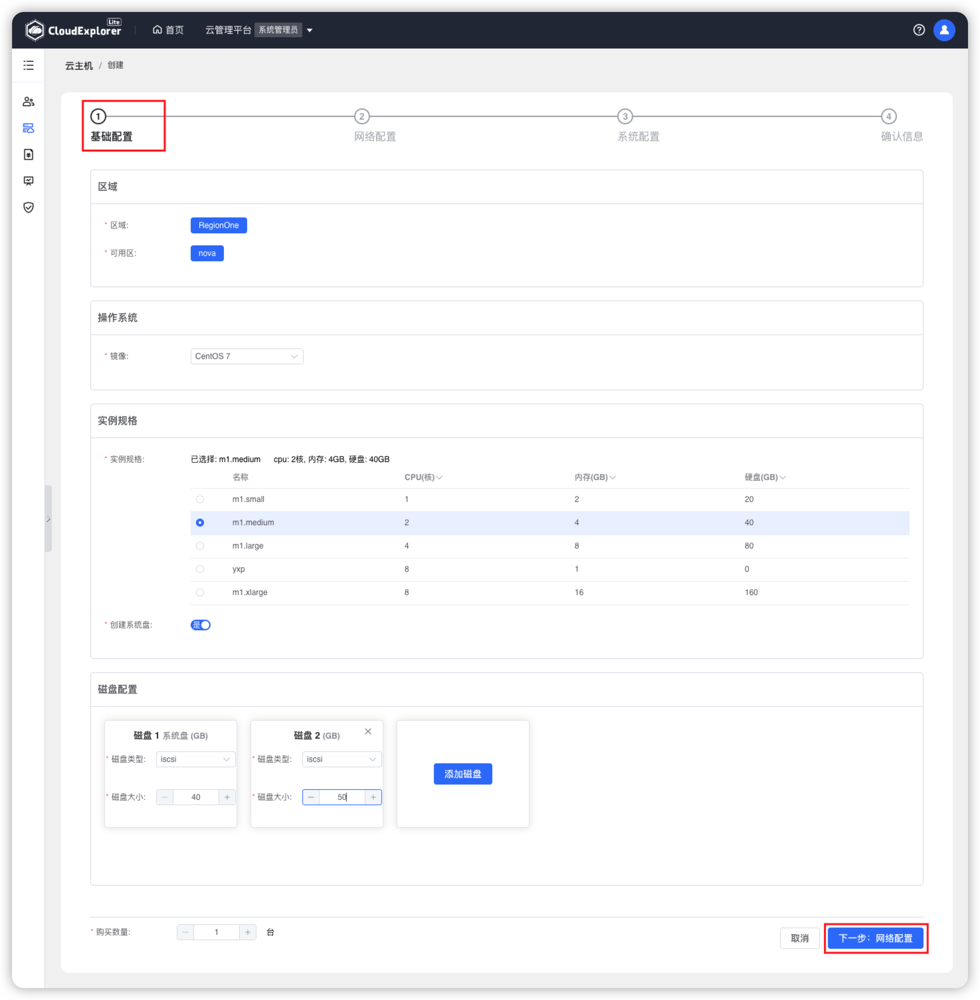{ width="1235px" }

- 网络配置

!!! Abstract ""

    网络配置即选择云主机所使用的网络和安全组。

!!! Abstract ""

    __情况说明：__ 
    - OpenStack 支持多网卡创建云主机，因此选择网络时可以勾选多个网络。 

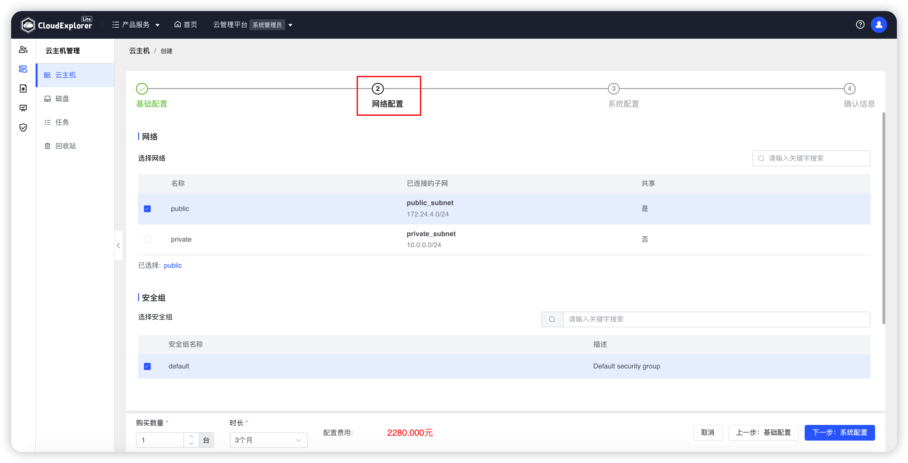{ width="1235px" }

- 系统配置

!!! Abstract ""

    系统配置中需要设置云主机的登录凭证和主机名称。 
    当前 OpenStack 云主机的登录方式为密码登录，用户需要自己设置云主机的登录密码。 
    如需一次创建多台云主机，则系统配置页面会分多个标签页设置每台云主机的名称。 

{ width="1235px" }

- 确认信息

!!! Abstract ""

    确认信息页面内容是之前每一步所选的内容选项的再次确认。 
    如果存在信息选错情况，则可点击“上一步”按钮，返回修改云主机参数。 
    如果创建云主机信息全部正确，点击【确认创建】即可。

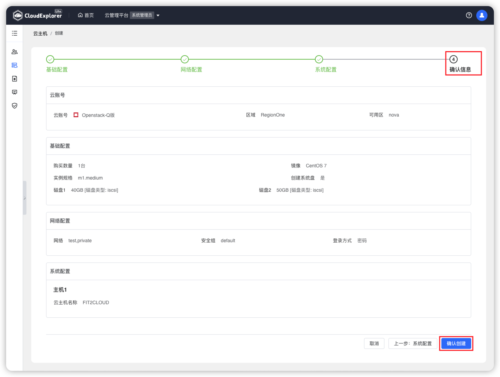{ width="1235px" }

!!! Abstract ""

    确认创建后，云主机列表生成一条状态为创建中的云主机数据，且在【任务】列表中生成一条创建云主机的任务。 
    在【任务】中可查看任务的进度和状态。
