!!! Abstract ""

    云管平台中所纳管云账号的全部云磁盘资源均会被同步到磁盘列表中。 
    由于云磁盘的属性较多，当页面显示的列数过多时，为方便用户查看和操作，特将磁盘列表页面““名称”和“操作”列的显示设为固定冻结状态。

{ width="1235px" }

## 1 查看磁盘

!!! Abstract ""

    在【云主机管理】-【磁盘】列表中，可以查看云磁盘的基本信息，包括：名称、大小、磁盘属性、磁盘类型、状态、挂载信息等。
    
    不同角色用户所查看到的云磁盘会有所不同。“系统管理员”角色用户能查看到平台上所纳管全部云账号下的云磁盘；“组织管理员”角色用户能查看到授权到本组织下的所有云磁盘；“普通用户”角色用户可以查看到授权到本工作空间下的所有云磁盘。
    
    操作方式：在云磁盘列表点击云磁盘名称，进入所选云磁盘的详情页面，可查看云磁盘的基本信息。

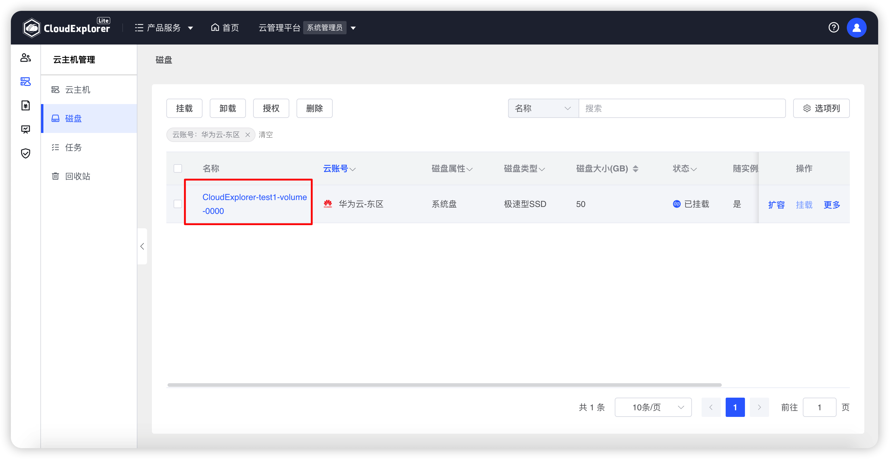{ width="1235px" }
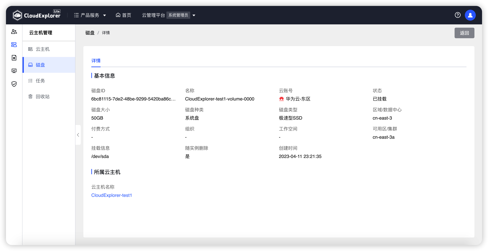{ width="1235px" }

## 2 授权

!!! Abstract ""

    云磁盘可以进行授权和取消授权操作。 
    通过云磁盘授权功能可以将云磁盘授权到相应的组织或工作空间。 
    授权过的云磁盘可以取消授权，取消授权后的云磁盘会清空组织和工作空间信息变为未授权状态，未授权的云磁盘只有系统管理员可以查看和管理。

!!! Abstract ""

    __情况说明：__ 
    - 若系统管理员知道云磁盘属于哪个工作空间，可以直接将云磁盘授权到对应的工作空间下。 
    - 若系统管理员仅知道云磁盘属于某个组织下，而不确定具体属于哪个工作空间，系统管理员可以将云磁盘授权到对应的组织，由其组织管理员在授权到下面的子组织或工作空间。 
    - 只有未挂载到云主机上，且状态为可用的云磁盘才可以授权。

- 授权

!!! Abstract ""

    “系统管理员”角色用户可对全部云磁盘进行授权到组织或工作空间操作； 
    “组织管理员”角色用户可将本组织的云磁盘授权到本组织的工作空间下，或将已授权到工作空间的云磁盘改授权到本组织其他工作空间下； 
    “普通用户”角色用户无法对云磁盘进行授权操作。

!!! Abstract ""

    在云磁盘列表中勾选要授权的云磁盘，点击列表上方的【授权】，打开云磁盘授权页面，选择【授权】，可对选中磁盘进行批量授权。 

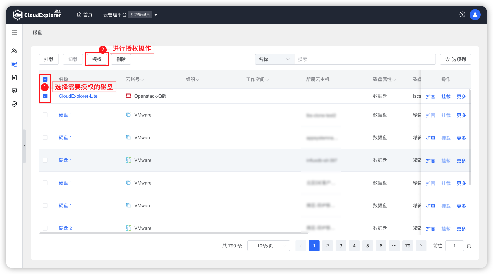{ width="1235px" }

!!! Abstract ""

    若要授权到组织，就勾选所要授权的组织，点击保存。授权完成后，组织字段显示所授权的组织。 

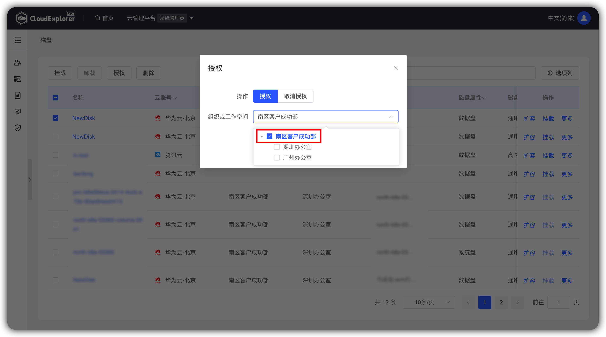{ width="1235px" }
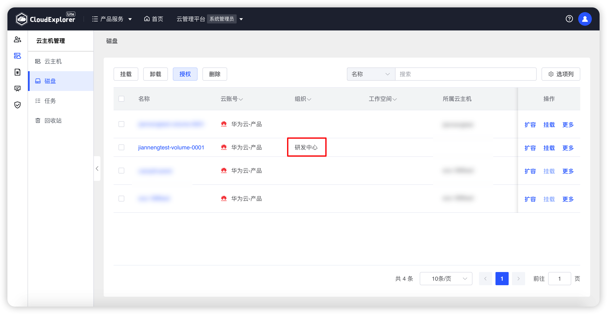{ width="1235px" }

!!! Abstract ""

    若要授权到工作空间，就勾选所要授权的工作空间，点击保存。授权完成后，工作空间显示所授权的工作空间，组织显示工作空间的上级组织。

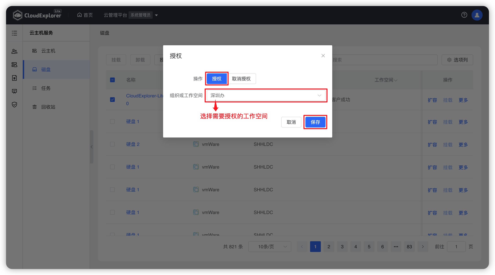{ width="1235px" }
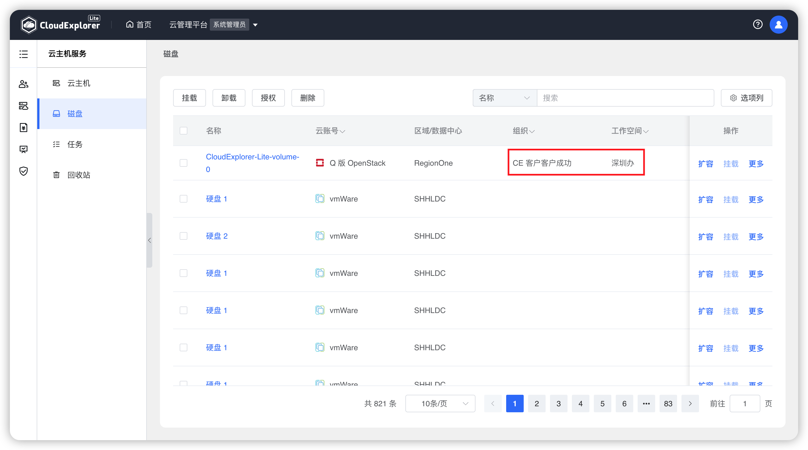{ width="1235px" }

- 取消授权

!!! Abstract ""

    “系统管理员”角色用户可对全部已授权云磁盘进行取消授权操作； 
    “组织管理员”角色用户可对本组织的云磁盘进行取消授权操作； 
    “普通用户”角色用户无法对云主机进行取消授权操作。

!!! Abstract ""

    在云磁盘列表勾选取消授权的云主机，点击列表上方的【授权】，打开云磁盘授权页面，选择【取消授权】，可对选中磁盘进行批量取消授权操作。 

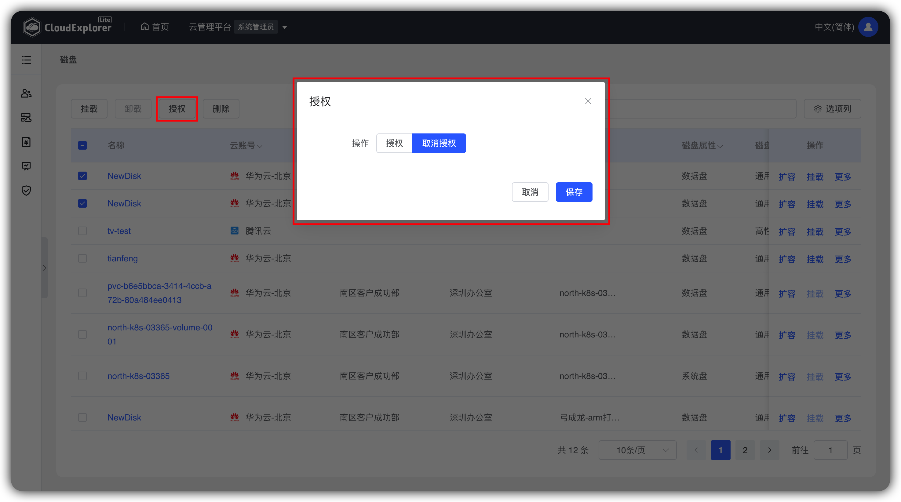{ width="1235px" }

!!! Abstract ""

    取消授权前云磁盘有组织和工作空间，取消授权后云磁盘无组织和工作空间。 

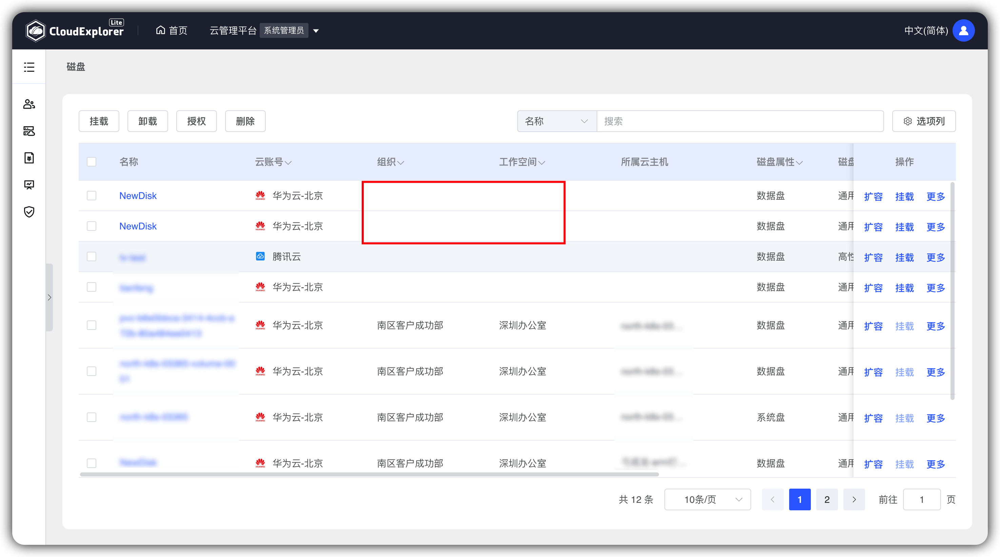{ width="1235px" }

## 3 挂载

!!! Abstract ""
    
    未挂载且可用状态的云磁盘可以挂载到云主机上，但只能选择所属云账号、组织、工作空间都与所挂载云磁盘一致的云主机。 
    挂载时可选择云磁盘是否随云主机删除。

    操作方式：选择需要挂载云主机的磁盘，点击云磁盘列表上方的【挂载】操作，选择需要挂载的云主机，设置是否随实例删除，点击确认即可.

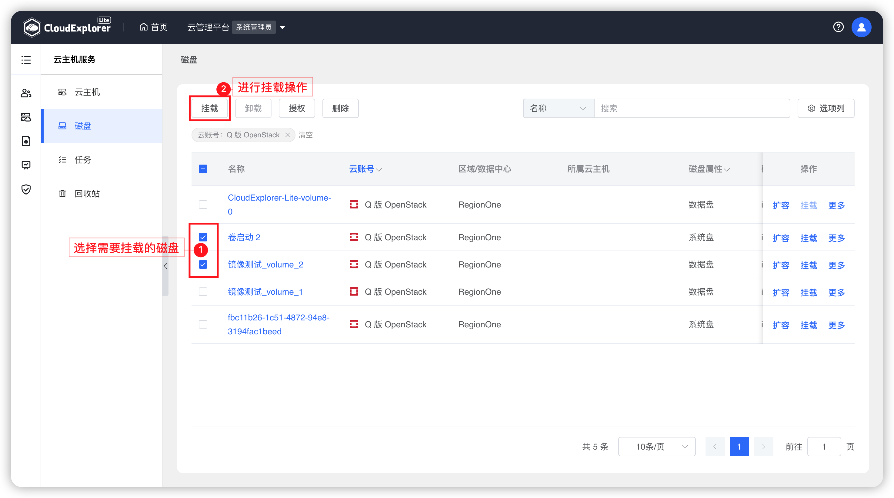{ width="1235px" }
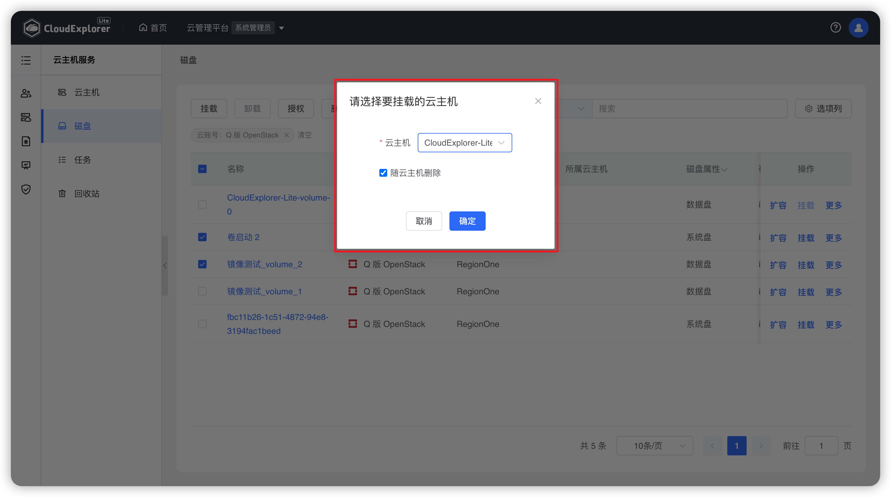{ width="1235px" }

!!! Abstract ""

    挂载前的云磁盘没有所属云主机信息。

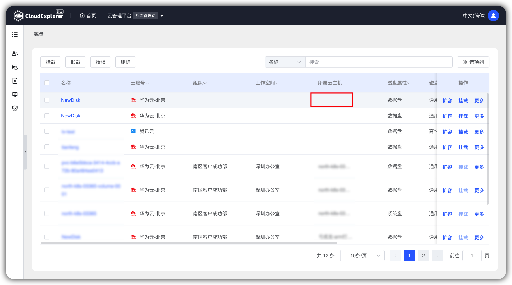{ width="1235px" }

!!! Abstract ""

    挂载后的云磁盘有所属云主机信息。

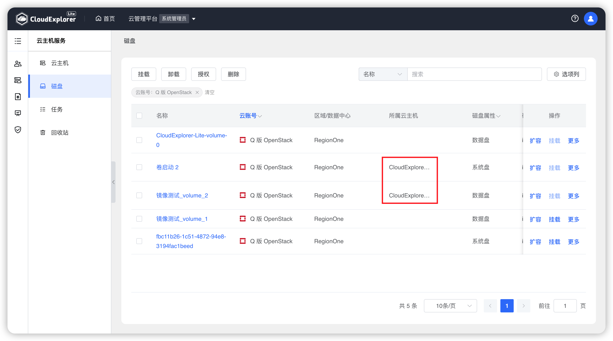{ width="1235px" }

!!! Abstract ""

    对云磁盘进行挂载操作后，会在【任务】列表中生成一条云磁盘挂载任务。

## 4 卸载

!!! Abstract ""

    可以对已挂载状态的数据盘进行卸载操作（VMware类型的磁盘除外）。

    卸载云磁盘有两种方式： 
    - 方式一：云磁盘列表的【更多】-【卸载】，对单个数据盘进行卸载。 
    - 方式二：云磁盘列表上方的【卸载】，可对多个数据盘进行批量卸载。 

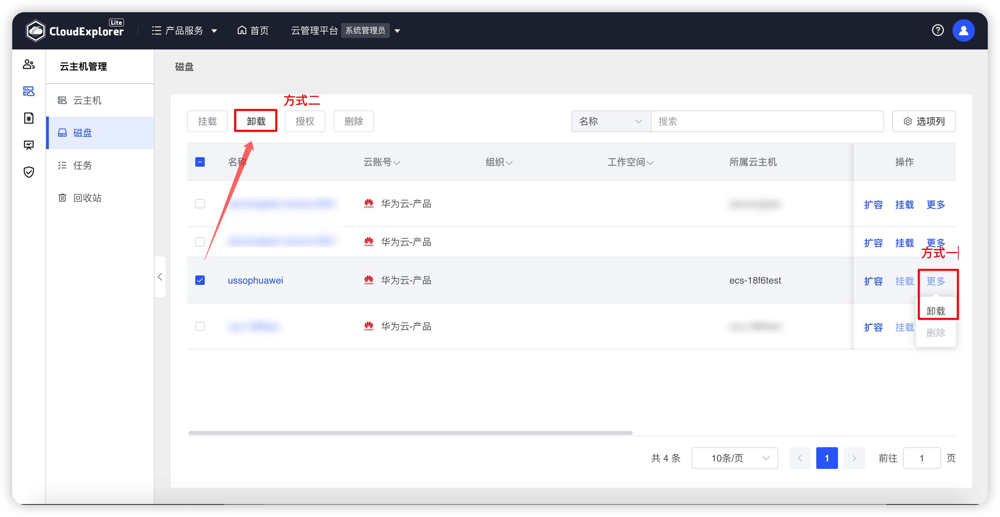{ width="1235px" }
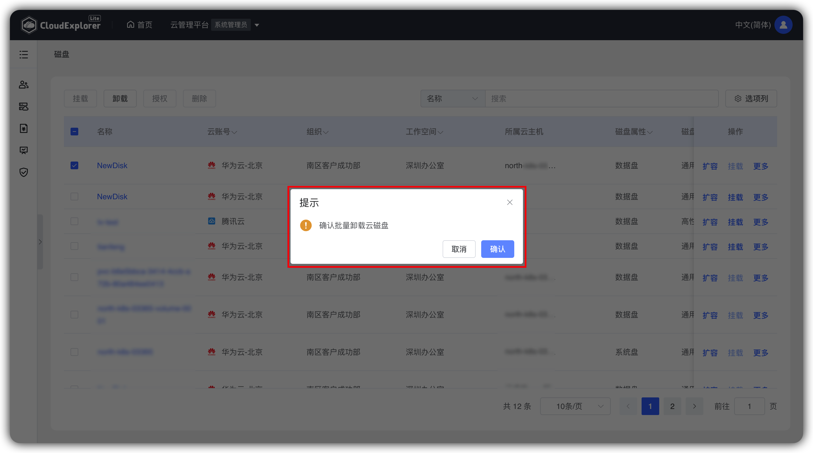{ width="1235px" }

!!! Abstract ""

    卸载前的云磁盘有所属云主机信息。

{ width="1235px" }

!!! Abstract ""

    卸载后的云磁盘没有所属云主机信息。

{ width="1235px" }

!!! Abstract ""

    对云磁盘进行卸载操作后，会在【任务】列表中生成一条云磁盘卸载任务。 

## 5 扩容

!!! Abstract ""

    当用户的磁盘剩余容量不多需要增加容量时，可对磁盘进行扩容操作。

    操作方式：磁盘列表-【操作】-【扩容】，在变更后配置中输入扩容后的磁盘大小。 

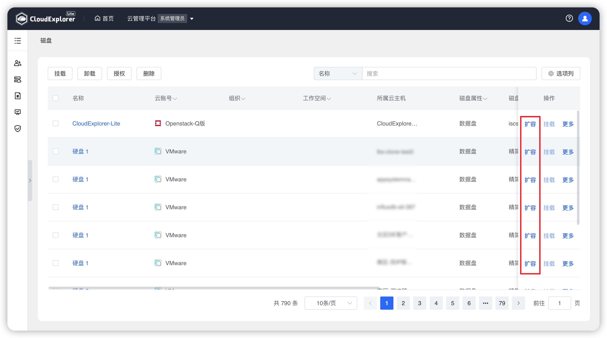{ width="1235px" }
{ width="1235px" }

!!! Abstract ""

    对云磁盘进行扩容操作后，会在【任务】列表中生成一条云磁盘扩容任务。 

## 6 删除

!!! Abstract ""

    只有未挂载，且为可用状态的数据盘才可以进行删除
    
    删除云磁盘有两种方式： 
    - 方式一：云磁盘列表的【更多】-【删除】，对单个数据盘进行删除。 
    - 方式二：云磁盘列表上方的【删除】，可对多个数据盘进行批量删除。 

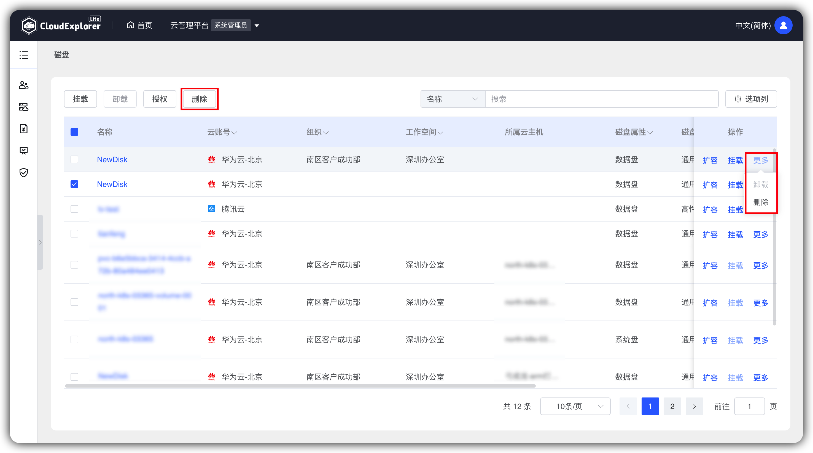{ width="1235px" }
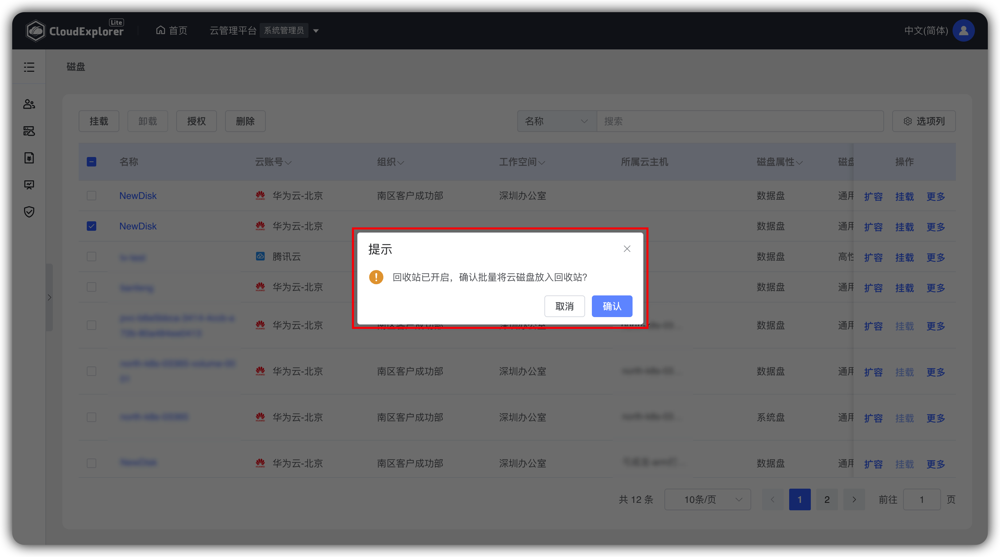{ width="1235px" }

!!! Abstract ""

    对云磁盘进行删除操作后，会在【任务】列表中生成一条云磁盘删除任务。 