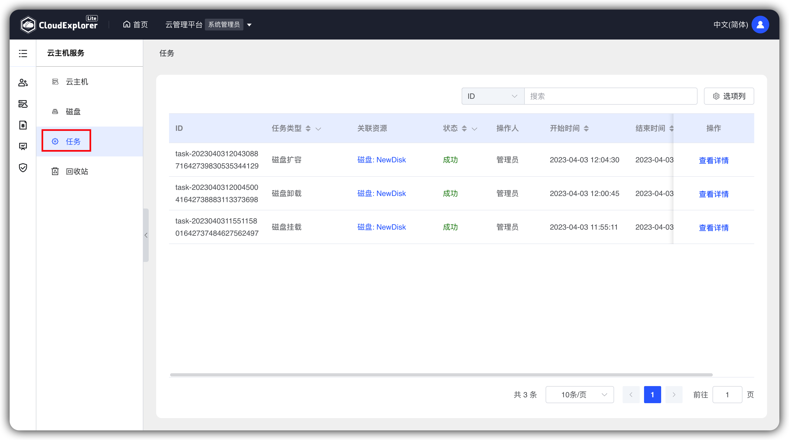
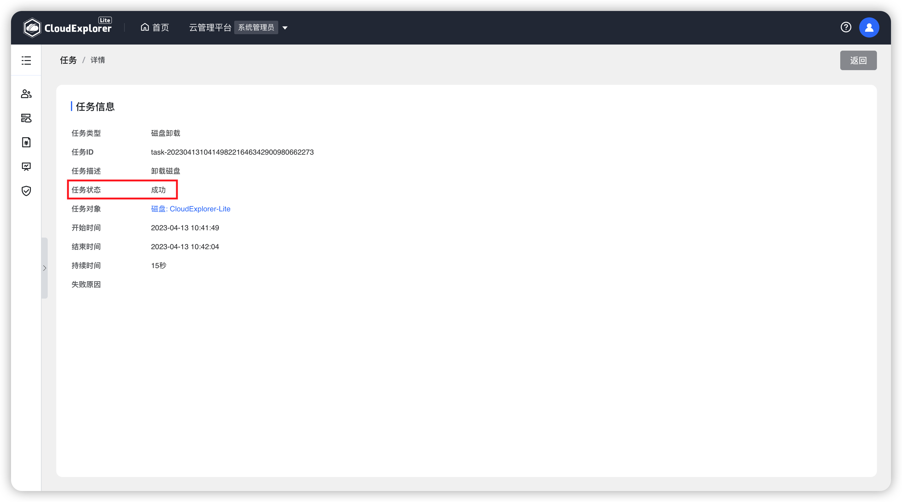

## 1 任务查看

!!! Abstract ""

    在【云主机管理】-【任务】中，可查看系统全部任务情况。 
    云主机的创建、关机、开机、关闭电源、重启、添加磁盘、配置变更、删除操作均会生成相应的任务记录。 
    云磁盘的挂载、卸载、扩容和删除操作也会生成相应的任务记录。 

    操作方式：【操作】-【查看详情】，打开任务详情页面，查看选中任务的具体情况。 

{ width="1235px" }
{ width="1235px" }
{ width="1235px" }