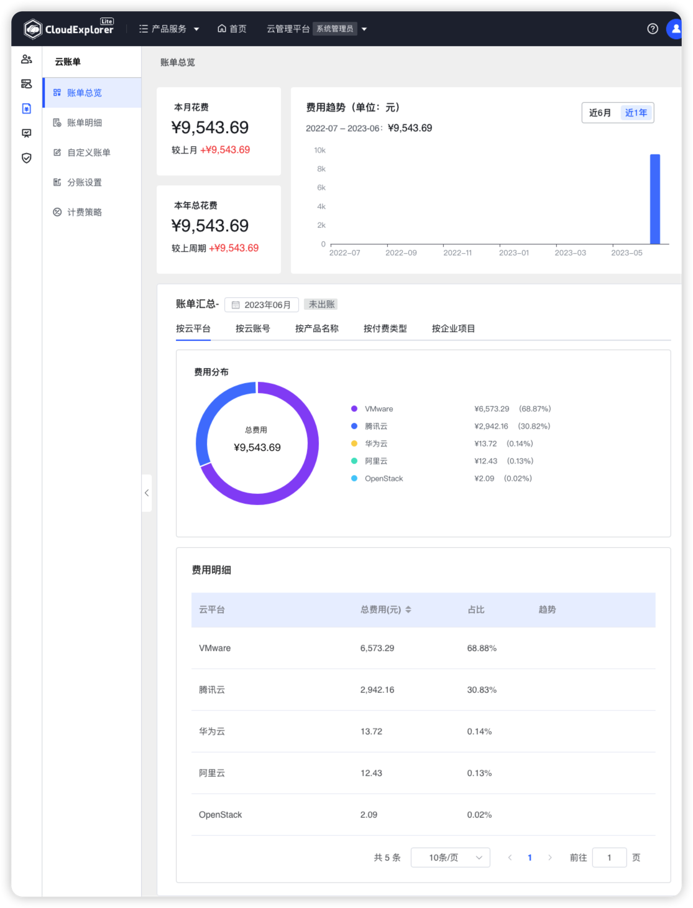

!!! Abstract ""

    支持用户查看公有云投入的成本费用，展示不同维度的费用统计。 
    不同角色用户查看到的数据有所不同：系统管理员显示所有公有云账号的账单费用，组织管理员显示所有公有云账号分账到本组织及所有子组织的账单费用，普通用户显示所有公有云账号分账到当前工作空间的账单费用。

{ width="1235px" }

!!! Abstract ""

    __页面内容说明：__ 
    - 本月费用：统计本月账单费用总和； 
    - 本年总费用：统计本年度账单费用总和； 
    - 费用趋势：统计近 6 月/近一年的总费用趋势； 
    - 账单汇总：统计按云平台、按云账号、按产品名称、按付费类型、按企业项目和自定义账单维度的费用分布情况，具体维度可以在【自定义账单】中设置； 
    - 费用明细：统计不同云平台、不同产品在不同工作空间下的总费用数据、费用占比数据、和近半年费用趋势。
