!!! Abstract ""
     当前计费策略仅对私有云生效，1 个云账号只能关联 1 个计费策略。 
     按规格计费优先级高于按单价计费说明：当实例配置与按规格计费配置匹配时，优先按规格计费，不匹配时将按单价进行计费。 
     添加计费策略后机器开始计费，默认每天0点生成账单，存量机器默认按量计费。  
     功能指引：设置计费策略 —> 关联云账号 —> 创建私有云云主机展示预览费用 —> 云账号同步生成账单 —> 查看账单明细 —> 分账设置 —> 账单总览查看报表。
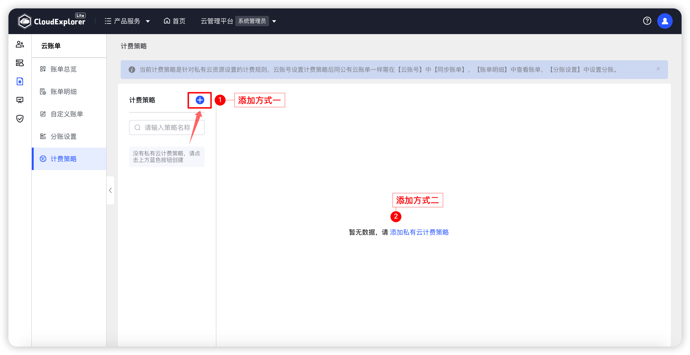{ width="1235px" }
    

## 1 设置计费策略

!!! Abstract ""

    __情况说明：__ 
    如有统计私有云费用需求，管理员可以设置私有云计费策略。  
    当前支持对云主机、磁盘设置计费策略。  
    已关联的云账号再次关联新的计费策略，之前的关联关系会自动解绑，以最终的关联为准。

### 设置云主机计费策略

- 基本信息

!!! Abstract ""
     计费策略名称：计费策略列表支持策略名称搜索。 
     选择云账号：选择云账号后默认与策略关联

- 按单价计费

!!! Abstract ""
     按照最小单位 1核CPU、1GB内存的单价 * 云主机实际的配置按小时或按月进行计费。 
     按量付费规则：[CPU：1核 0.06 元/小时；内存：1GB 0.04元/小时] * 云主机实际配置 * 小时 * 天数，用户创建机器时选择付费方式为：按需按量计费后，使用当前按需按量的计费策略进行计费。 
     包年包月付费规则：[CPU:1核 35元/月；内存：1GB 28元/月] * 云主机实际配置 * 月数，用户创建机器时选择付费方式为：包年包月计费后，使用当前包年包月的计费策略进行计费。 
     付费规则设置价格后支持费用预览。   
 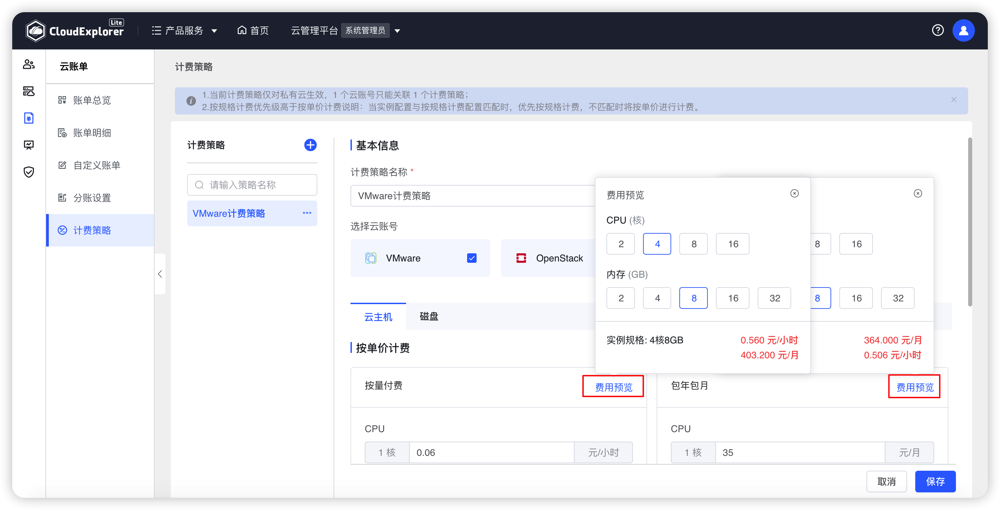{ width="1235px" }

- 按规格计费

!!! Abstract ""
     按照云主机的实例规格整体配置，设置每小时的价格和每月的价格。 
     未设置价格或与按规格计费中配置不同的云主机将按照单价进行计费。 
     云主机配置与按规格计费相同配置的将按照规格计费。 

     __情况说明：__ 
     规格名称：一般为实例配置的规格名称。 
     规格配置：CPU、内存具体的大小。 
     当前配置按单价计费价格参考： 显示按单价计费的具体价格如：10元/小时、300元/月 
     规格价格：输入按量付费价格，如：5元/小时；输入包年包月价格，如：150元/月。 
     注意：规格价格输入为0，则该配置不收费。规格价格未输入，则等于未设置。未设置将按单价计费。
 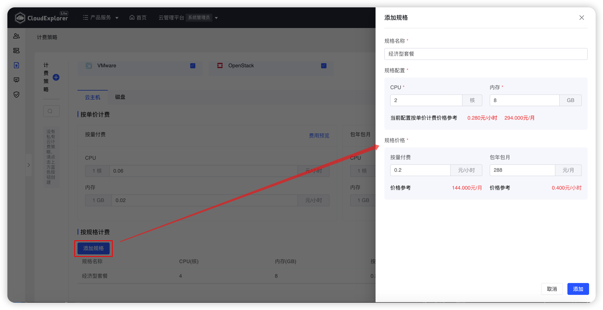{ width="1235px" }
 { width="1235px" }

- 计费设置
!!! Abstract ""
     默认开启。 
     未开启关机不计费：已删除云主机不计费，其他状态云主机均按照规则进行计费。 
     开启关机不计费：已删除/已关机云主机不计费，其他状态云主机均按规则进行计费。 

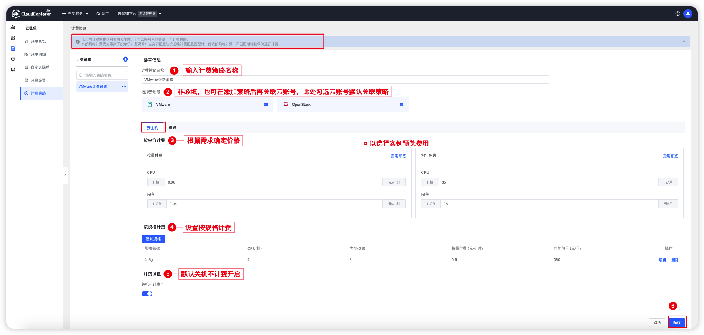{ width="1235px" }

### 设置磁盘计费策略

- 基本信息

!!! Abstract ""
     计费策略名称：计费策略列表支持策略名称搜索。 
     选择云账号：选择云账号后默认与策略关联。

- 按单价计费

!!! Abstract ""
     按照最小单位 1GB内存的单价 * 磁盘实际的配置按小时或按月进行计费。 
     按量付费规则：[磁盘：1GB 0.04元/小时] * 磁盘实际配置 * 小时 * 天数，用户创建机器时选择付费方式为：按需按量计费后，使用当前按需按量的计费策略进行计费。 
     包年包月付费规则：[磁盘：1GB 28元/月] * 磁盘实际配置 * 月数，用户创建机器时选择付费方式为：包年包月计费后，使用当前包年包月的计费策略进行计费。 
     付费规则设置价格后支持费用预览。   
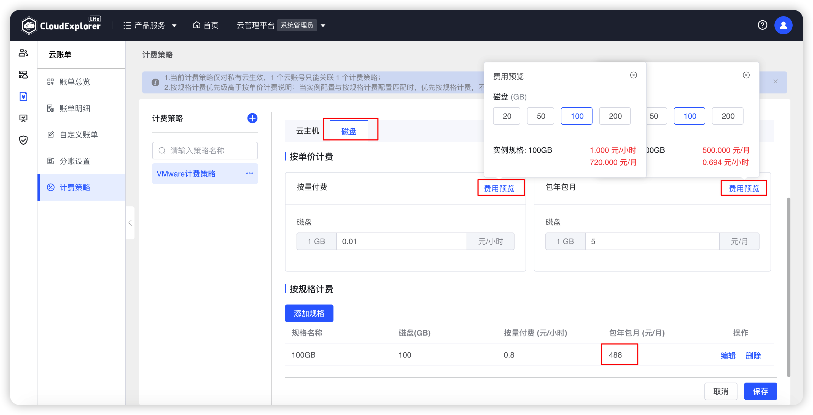{ width="1235px" }

- 按规格计费

!!! Abstract ""
     按照磁盘的实例规格整体配置，设置每小时的价格和每月的价格。 
     未设置价格或与按规格计费中配置不同的磁盘将按照单价进行计费。 
     磁盘配置与按规格计费相同配置的将按照规格计费。 

    __情况说明：__ 
     规格名称：一般为实例配置的规格名称。 
     规格配置：磁盘具体的大小。 
     当前配置按单价计费价格参考： 显示按单价计费的具体价格如：3元/小时 、 140元/月 
     规格价格：输入按量付费价格，如：5元/小时；输入包年包月价格，如：150元/月。 
     注意：规格价格输入为0，则该配置不收费。规格价格未输入，则等于未设置。未设置将按单价计费。
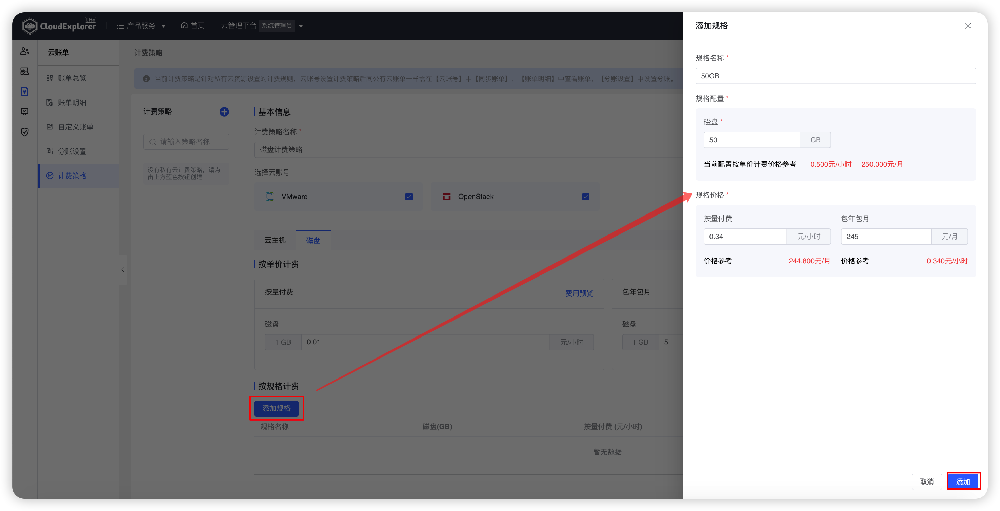{ width="1235px" }
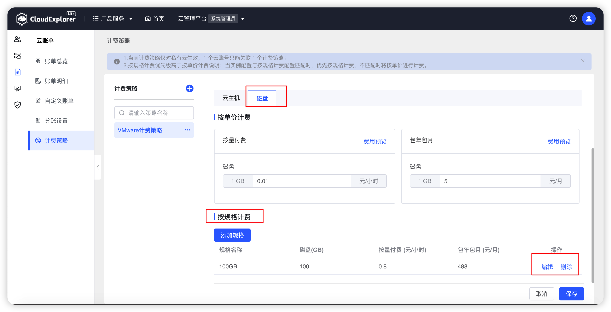{ width="1235px" }

## 2 编辑计费策略

!!! Abstract ""
     选中计费策略，点击“编辑”
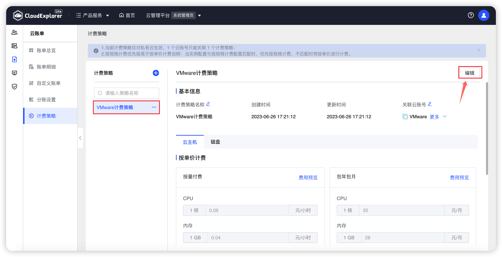{ width="1235px" }

## 3 关联云账号

!!! Abstract ""
     选中计费策略，点击“...”，选择关联云账号。 
     1 个计费策略可以关联 N 个云账号。
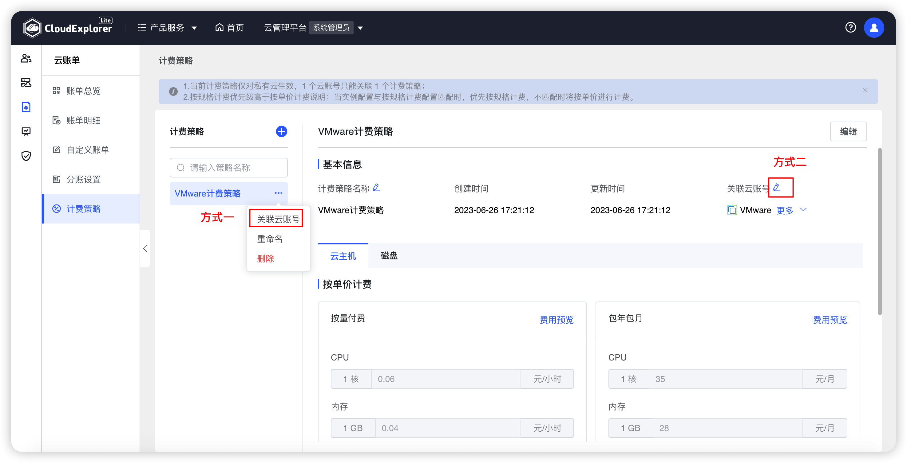{ width="1235px" }

## 4 计费策略重命名

!!! Abstract ""
     选中计费策略，点击“...”，选择重命名。 
     输入策略名称，点击“确定”。
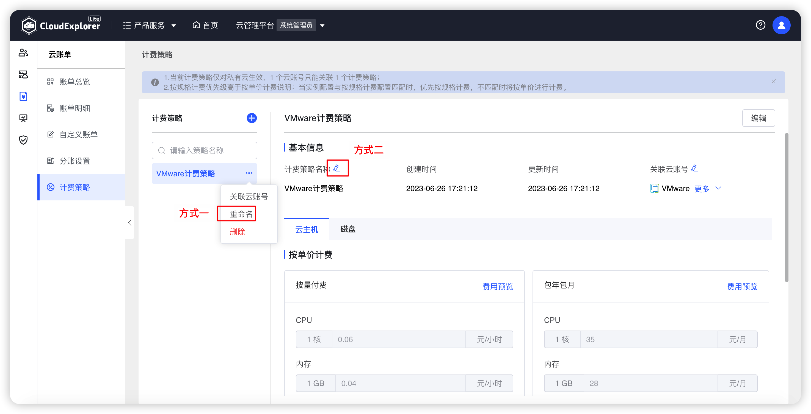{ width="1235px" }

## 5 删除计费策略

!!! Abstract ""
     选中计费策略，点击“...”，选择删除。 
     二次确认，点击“删除”。
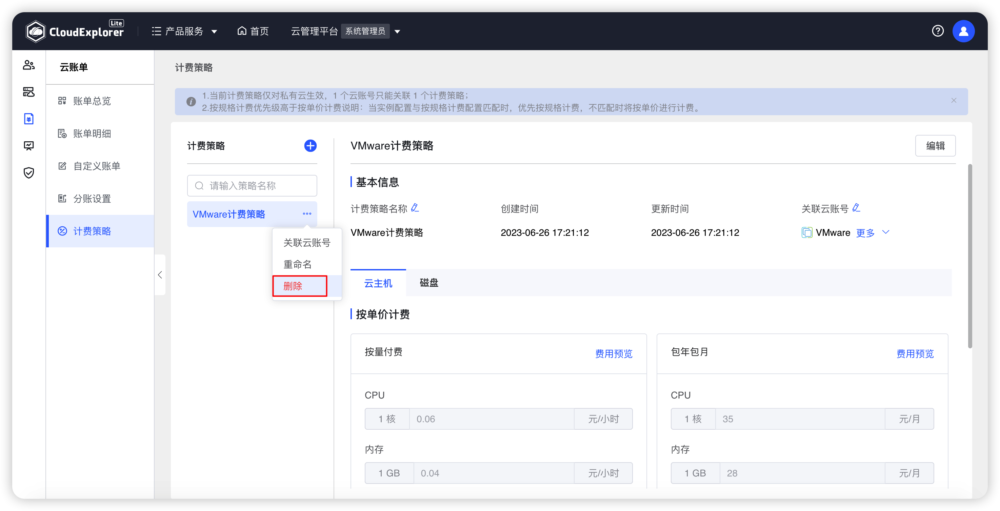{ width="1235px" }