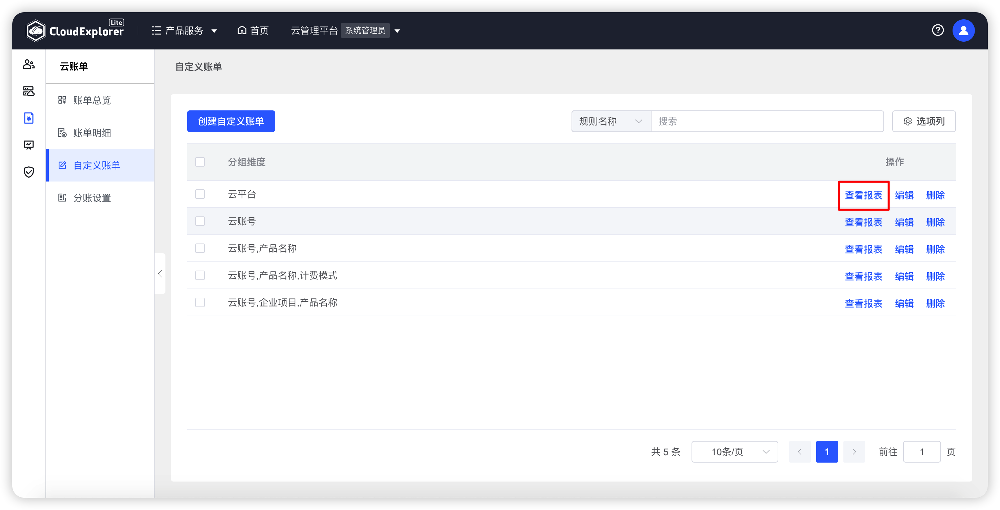
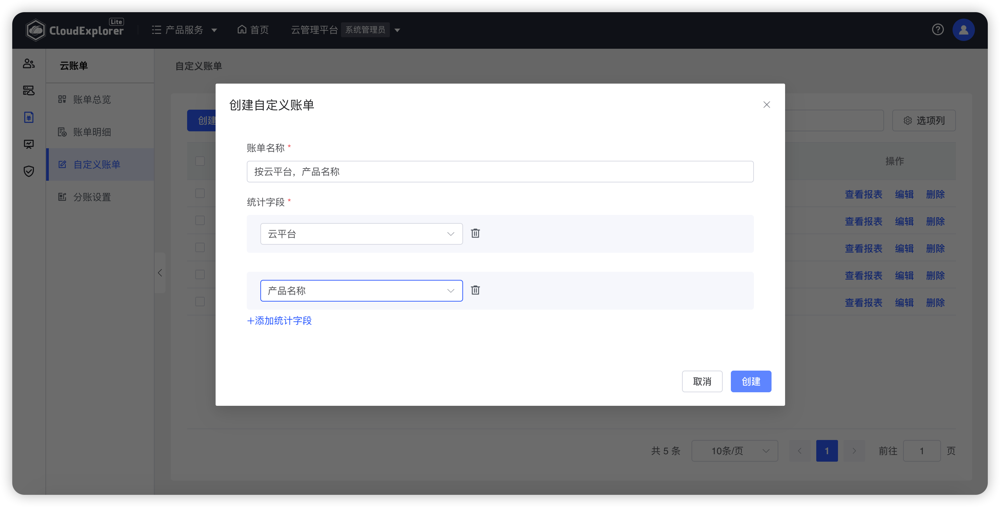
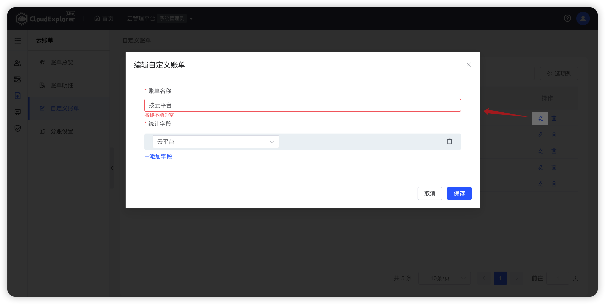
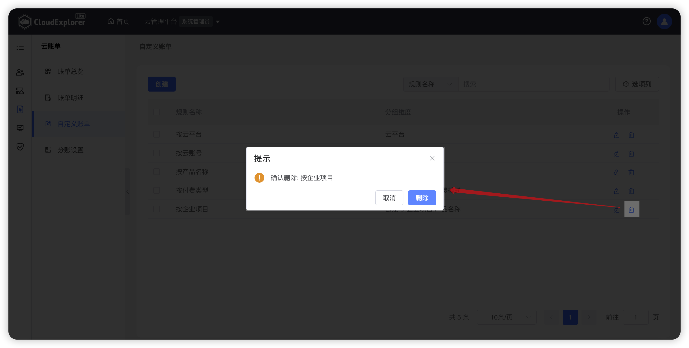

## 1 查看自定义账单

!!! Abstract ""
    当前内置的月账单若不满足需求时，管理员可根据需要可自定义月账单，当前支持按云平台、云账号、区域、企业项目、组织（工作空间的父级组织）、组织层级树（可选择组织层级）、工作空间、标签、产品名称、产品明细、付费方式、资源名称维度创建自定义账单。 
    点击【查看报表】，可直接跳转至账单页面。   

{ width="1235px" }

## 2 创建自定义账单

!!! Abstract ""

    点击自定义账单页面上方【创建自定义账单】按钮，输入规则名称和统计字段，统计字段支持添加多个。确认后点击【保存】即可。 
    创建完成中可在【账单总览】的账单汇总中看到。

{ width="1235px" }

## 3 编辑自定义账单

!!! Abstract ""

    在自定义账单列表选择需要编辑的数据，点击【操作】列的【编辑】，修改对应参数，点击【保存】即可。

{ width="1235px" }

## 4 删除自定义账单

!!! Abstract ""

    在自定义账单列表选择需要删除的数据，点击【操作】列的【删除】，在再次确认弹窗中点击【删除】即可。

{ width="1235px" }