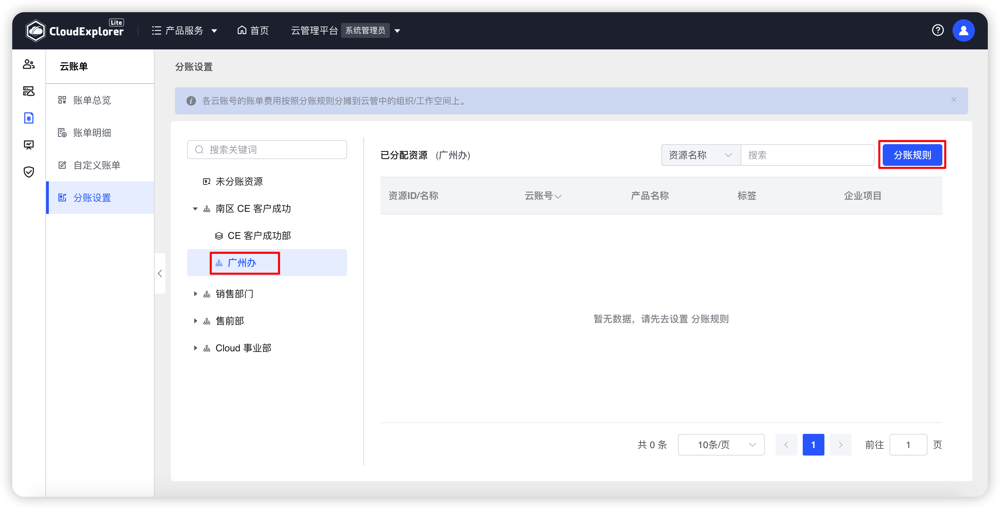
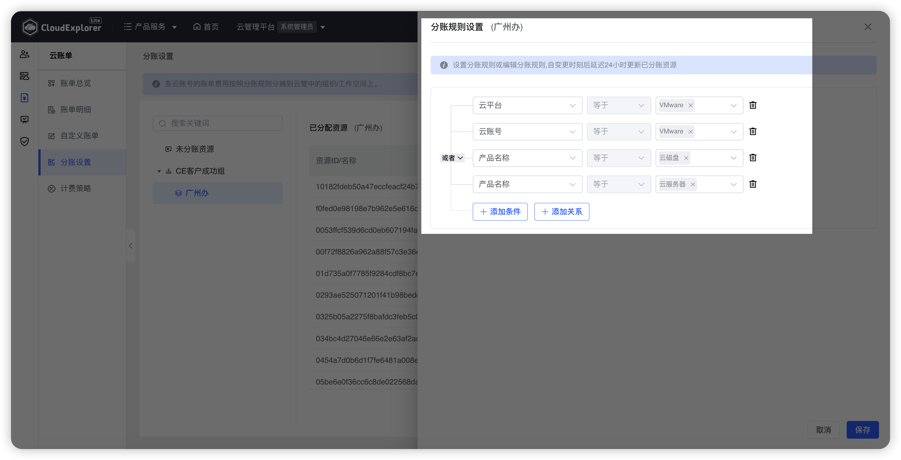

!!! Abstract ""

    当前云管平台同步到的账单数据为所有云账号上的原始账单明细，不能与云管平台中的组织/工作空间进行关联，若管理员想看到云管平台上组织/工作空间在公有云上的费用账单，则需要对组织/工作空间进行分账设置。

!!! Abstract ""

    __页面内容说明：__ 
    -  分账规则设置前提条件：公有云平台上账单中有区分组织、工作空间的字段依据，如标签、企业项目、财务单元；没有区分字段依据，请先在公有云平台规划相关字段。私有云可以直接设置分帐规则。 
    -  平台支持的分账依据字段：产品名称、云平台、产品明细、云账号、标签、企业项目。

## 1 未分账资源

!!! Abstract ""
    在【云账单】-【分账设置】-【未分账资源】中，可查看所有未进行分账的资源。

{ width="1235px" }

## 2 设置分账规则

!!! Abstract ""

    组织分账规则：选择某个组织，显示该组织内符合分账规则资源；点击“分账规则”可设置分账规则。 
    工作空间分账规则：选择工作空间，显示该工作空间内符合分账规则资源，点击“分账规则”可设置分账规则。

{ width="1235px" }
{ width="1235px" }

