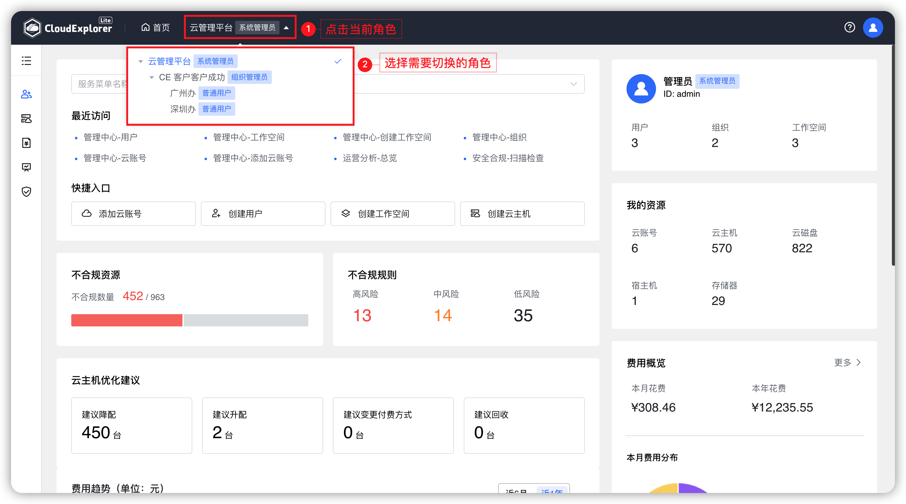
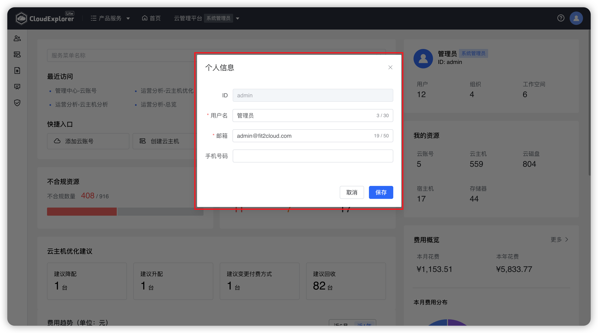
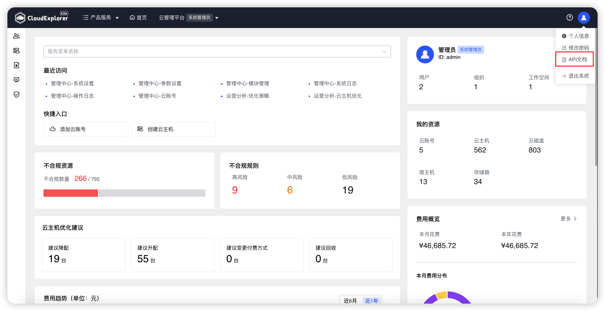
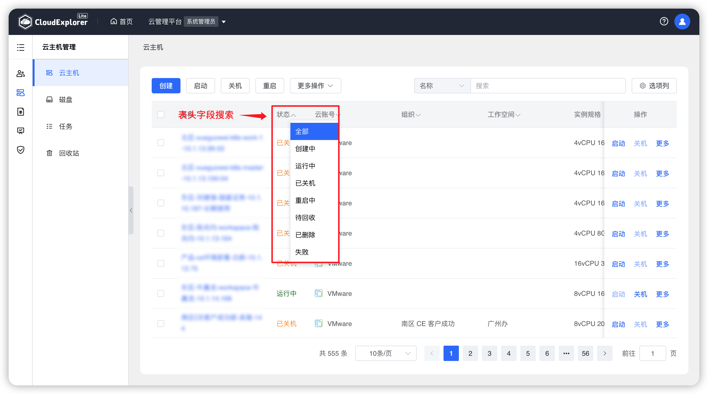
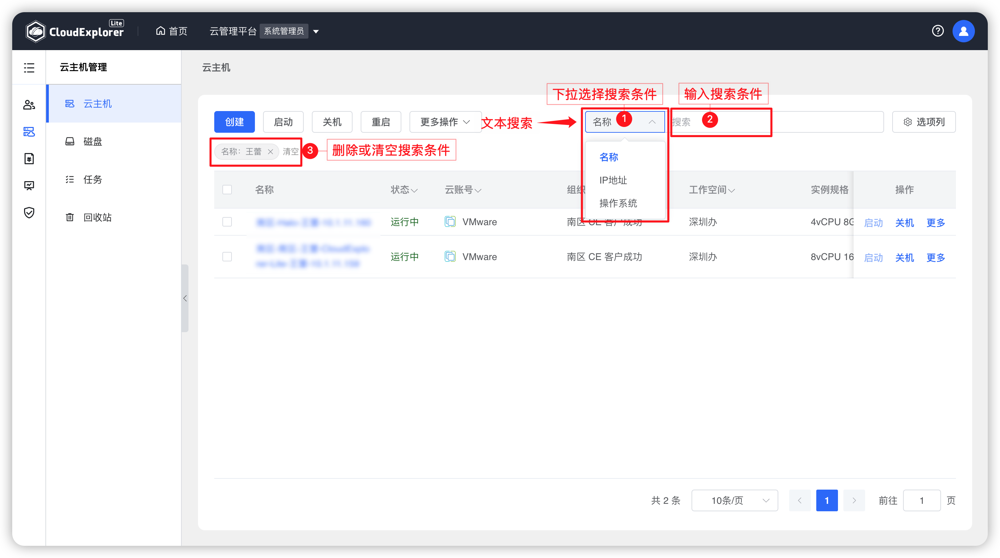
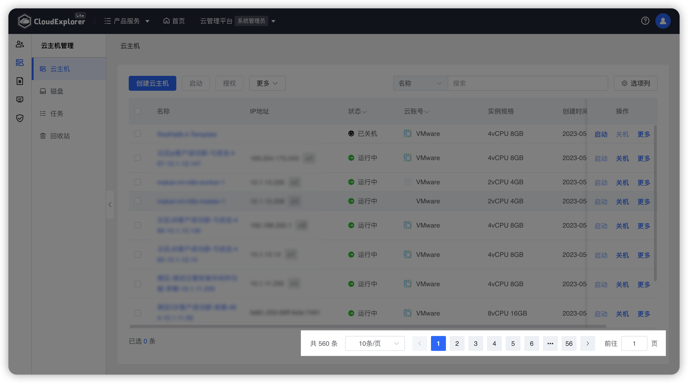
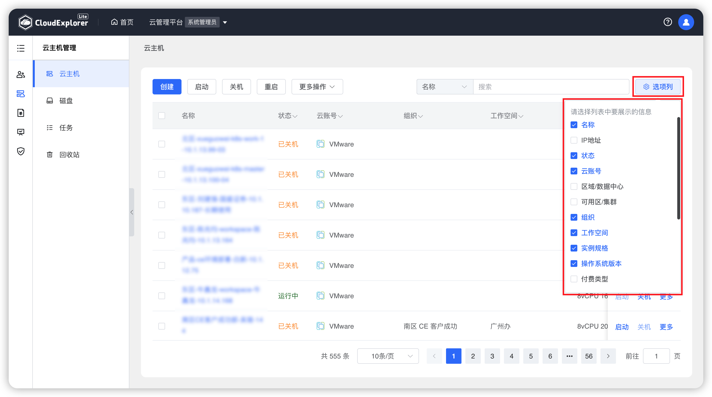
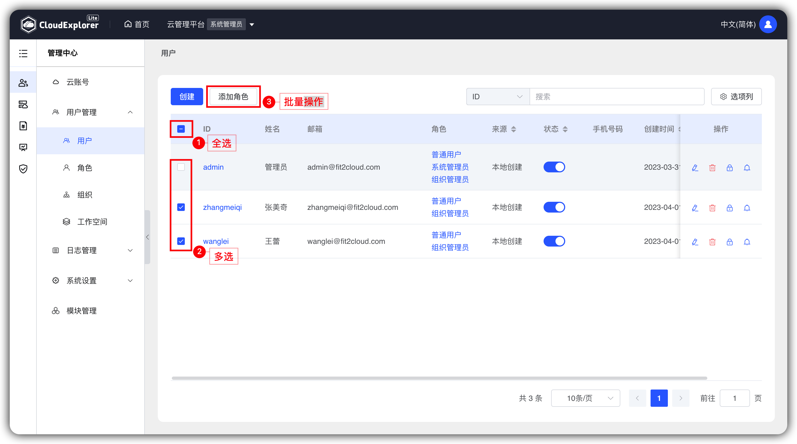
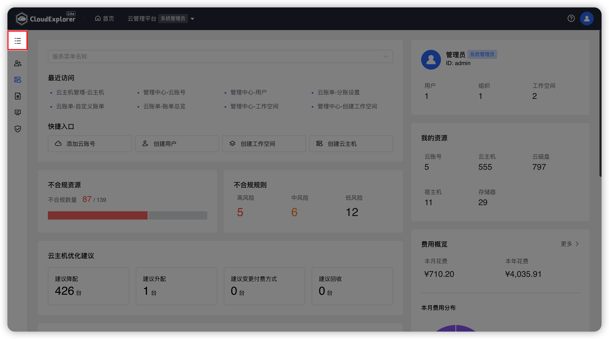

# 通用功能
## 1 角色切换

!!! Abstract ""

    如果用户账号具备多个角色，比如同时具有系统管理员、组织管理员、普通用户等角色，通过点击页面上方角色名称，在下拉框中选择并点击具体角色，可切换至所选角色。
     
{ width="1235px" }

## 2 个人信息

!!! Abstract ""

    点击页面右上角用户头像，“个人信息”选项，可查看当前登录账号的个人信息，其中“用户名”、“Email”、“手机号”信息可直接修改，修改后点击“保存”即可生效。 
    

{ width="1235px" }
{ width="1235px" }

## 3 API文档

!!! Abstract ""
     
  点击页面右上角用户头像，可以获取云管平台API文档。

{ width="1235px" }

## 4 搜索

!!! Abstract ""

    云管平台的搜索条件分为表头字段搜索和文本搜索两种方式： 
    - 表头字段搜索：所有可枚举类型的属性可以在表头字段直接搜索。拿云主机列表举例，可以表头搜索的字段为：状态、云账号、组织、工作空间、付费类型、VMTools状态。 
    - 文本搜索：不能枚举的文本类型可以在搜索框中按选定字段进行搜索。拿云主机列表举例，可以选定的字段为：名称、IP地址、操作系统版本。 

{ width="1235px" }

{ width="1235px" }

## 5 翻页

!!! Abstract ""

    列表页面下方该区域记录数据总条数，当前页码和每页展示数据条数，可点击下拉框选择每页展示数据条数，也可输入页码直接跳转至目标页。

{ width="1235px" }

## 6 选项列

!!! Abstract ""
    每个列表页面右上角的“选项列”按钮，点击可自定义列表显示字段。

{ width="1235px" }

## 7 批量操作

!!! Abstract ""
    系统中的大部分列表均提供了多选及全选功能，当选中多个数据后点击页面上方操作按钮，可对选中数据进行批量操作。

{ width="1235px" }

## 8 菜单切换

!!! Abstract ""
    鼠标悬浮至页面左上角“服务列表”图标，页面将展开出现服务菜单列表，选择需要跳转的菜单项，点击后可跳转到对应菜单页面。

{ width="1235px" }