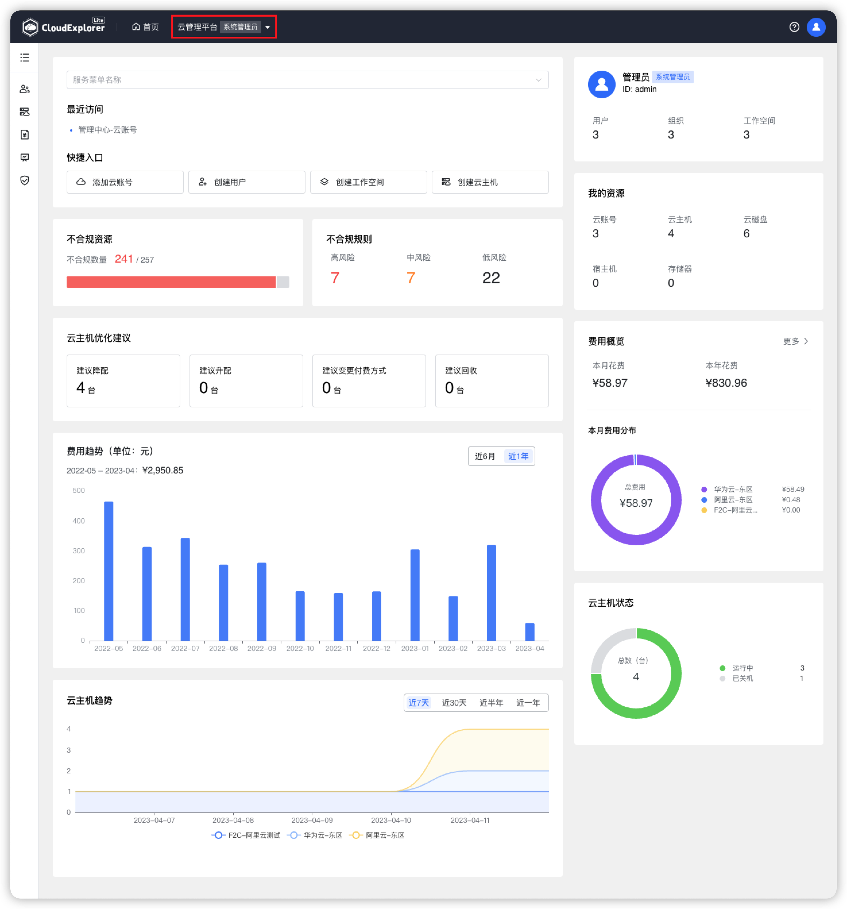
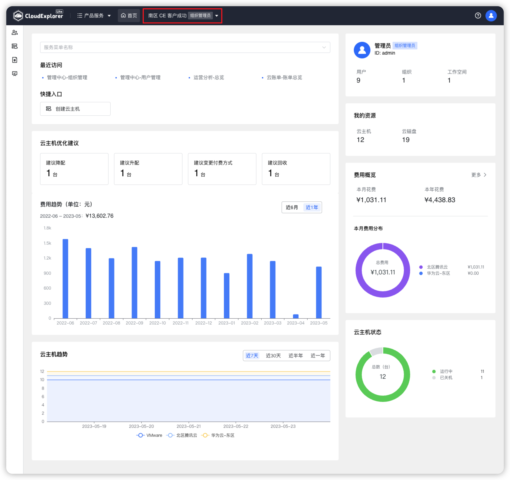
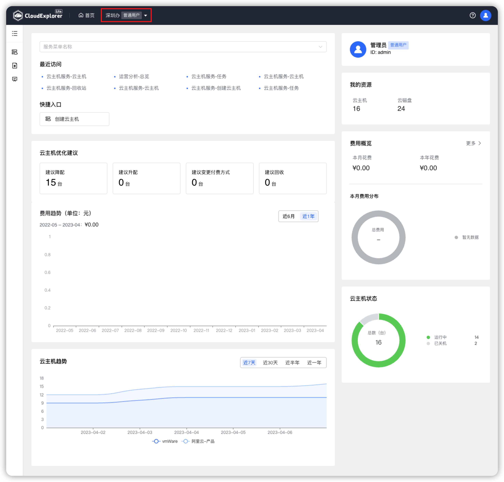

!!! Abstract ""
    首页展示内容和统计数据根据登录用户的角色、权限和部署的服务模块确定，因此不同角色用户首页所展示内容和数据可能不相同。

## 1 系统管理员首页展示内容

!!! Abstract ""
    系统管理员角色用户登录系统后，首页右侧展示账号信息、系统资源情况、系统费用概览和系统云主机状态。左侧展示最近访问菜单及菜单快捷入口、资源合规情况、云主机优化建议、云主机趋势。

{ width="1235px" }

## 2 组织管理员首页展示内容

!!! Abstract ""
    组织管理员角色用户登录系统后，首页右侧展示账号信息、本组织资源情况、本组织费用概览和云主机状态。左侧展示最近访问菜单及快捷入口、云主机优化建议、云主机趋势。

{ width="1235px" }

## 3 工作空间用户首页展示内容

!!! Abstract ""
    工作空间用户角色用户登录系统后，首页右侧展示账号基本信息、用户资源情况、本组织工作空间费用概览和云主机状态。左侧展示最近访问菜单及菜单快捷入口、云主机优化建议、云主机趋势。

{ width="1235px" }