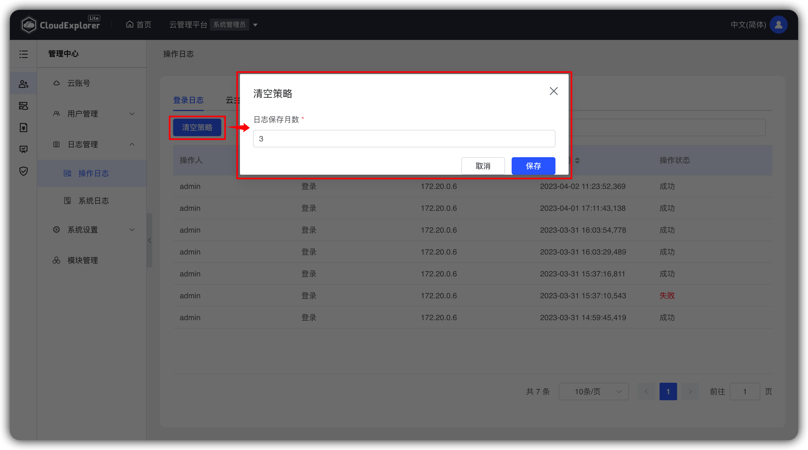
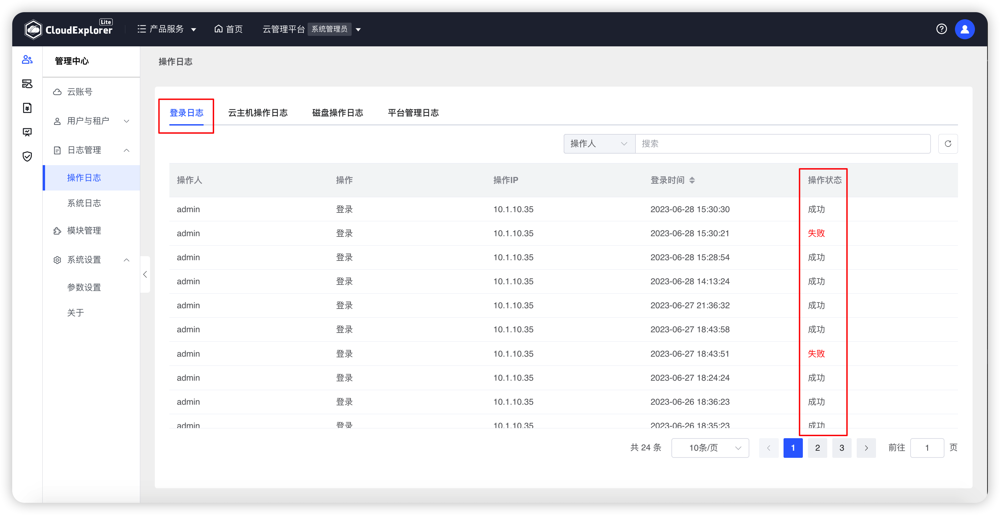
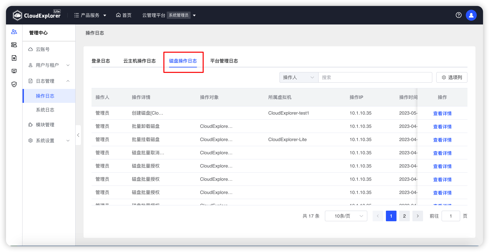
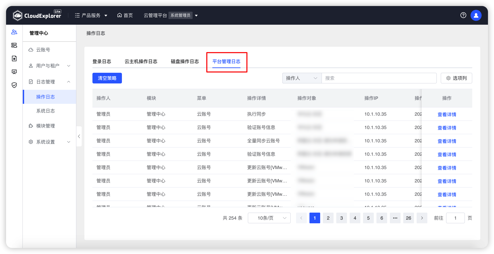
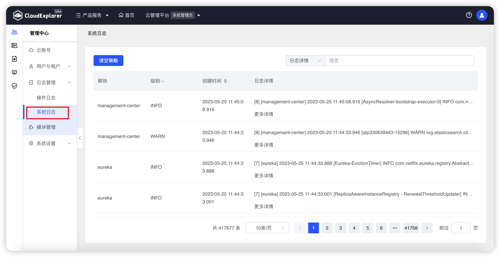

## 1 操作日志

!!! Abstract ""

    操作日志用于记录所有用户登录云管后的所有操作日志。分为登录日志、云主机操作日志、云磁盘操作日志和平台操作日志。   
    
    点击“清空策略”按钮可自定义日志保存月数，如未自行定义，系统默认保存 3 个月。

{ width="1235px" }

### 1.1 登录日志

!!! Abstract ""

    登录日志可以查看所有用户登录系统的日志记录。列表展示信息包括：操作人、登录时间、操作 IP、登录时间、操作状态。

    操作：【操作日志】-【登录日志】进行查看。

{ width="1235px" }

### 1.2 云主机操作日志

!!! Abstract ""

    云主机操作日志可以查看云管云平上所有云主机相关的操作日志记录。列表展示信息包括：操作人、操作类型、操作详情、操作对象、操作IP、操作时间、操作状态、API详情。
    
    操作：【操作日志】-【云主机操作日志】进行查看。

{ width="1235px" }

### 1.3 磁盘操作日志

!!! Abstract ""

    云磁盘操作日志可以查看云管平台上所有云磁盘相关的操作日志记录。列表展示信息包括：操作人、操作类型、操作详情、操作对象、所属虚拟机、操作IP、操作时间、操作状态、API详情。

    操作：【操作日志】-【云磁盘操作日志】进行查看。

{ width="1235px" }

### 1.4 平台管理日志

!!! Abstract ""

    平台管理日志可以查看云管平台上所有平台管理相关的操作日志记录。列表展示信息包括：操作人、模块、菜单、操作类型、操作详情、操作对象、操作IP、操作时间、操作状态、API详情。

    操作：【操作日志】-【平台管理日志】进行查看。

{ width="1235px" }

## 2 系统日志

!!! Abstract ""

    系统日志页面显示了所有模块的日志信息，列表展示信息包括：模块、级别、创建时间、日志详情。

    点击“清空策略”按钮可自定义日志保存月数，如未自行定义，系统默认保存 3 个月。

{ width="1235px" }