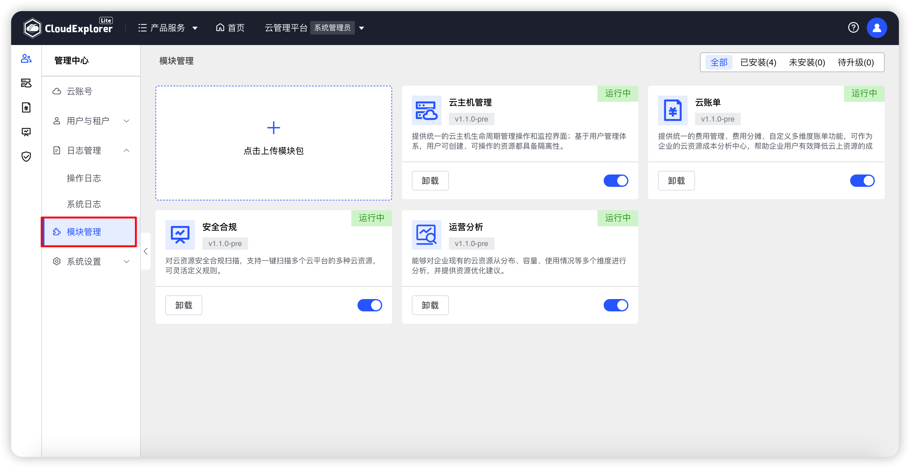
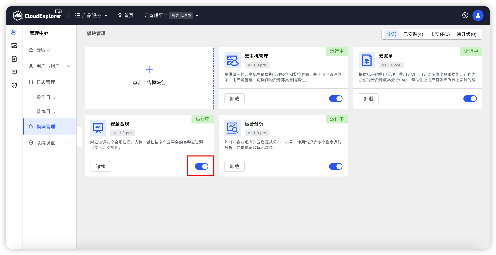
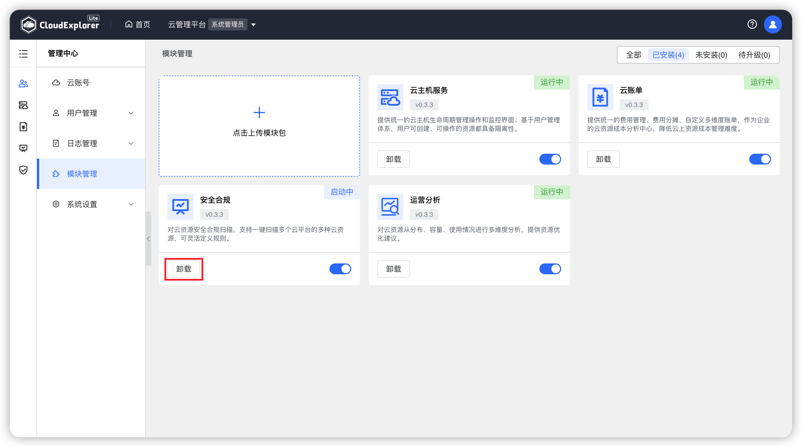
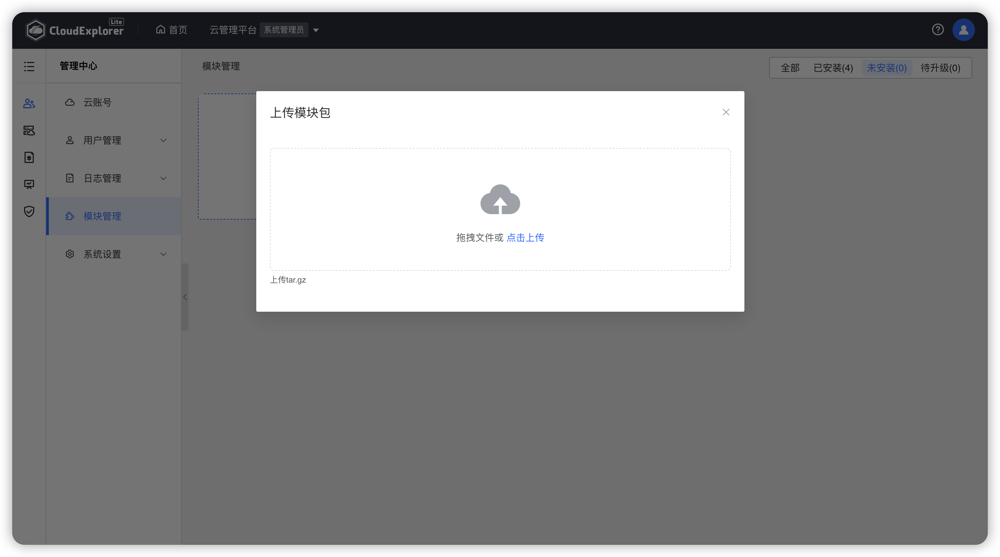

!!! Abstract ""

    模块管理中可查看云管平台已安装模块及其状态，对已安装模块进行管理，并可本地安装新模块。 

## 1 模块管理

!!! Abstract ""

    对于云管平台已安装成功的模块，可在模块管理页面中查看各模块的基本信息、安装情况、版本信息，并可进行更新、启动、停止、卸载操作。

{ width="1235px" }

### 1.1 模块升级

!!! Abstract ""

    如检测到本地模块模块有新版本，可对该模块进行升级操作，升级至最新版本。

    操作：在模块管理页面中，选择需要升级的模块，点击模块下方“升级”图标，页面会出现点再次确认弹窗，再次点击“升级”即可删除该工作空间。

{ width="1235px" }

### 1.2 模块重启

!!! Abstract ""

    操作：在模块管理页面中，选择需要重启的模块，点击模块下方“重启”图标，页面会出现点再次确认弹窗，再次点击“重启”即可停止该模块。

{ width="1235px" }

### 1.3 模块停止

!!! Abstract ""

    对于暂不开放使用的模块，可进行停止操作。

    操作：在模块管理页面中，选择需要停止的模块，点击模块下方“升级”图标，页面会出现点再次确认弹窗，再次点击“停止”即可停止该模块。

{ width="1235px" }

### 1.4 模块卸载

!!! Abstract ""

    对于不再使用的模块，可进行卸载操作。

    操作：在模块管理页面中，选择需要卸载的模块，点击模块下方“卸载”图标，页面会出现点再次确认弹窗，再次点击“卸载”即可停止该模块。

{ width="1235px" }

## 2 本地安装模块

!!! Abstract ""

    除官方发布的模块外，用户可以云管平台进行本地安装模块

    操作：在模块管理页面中，点击“本地安装”按钮，拖拽或上传本地模块安装包后，云管平台会对安装包进行读取解析，

{ width="1235px" }
