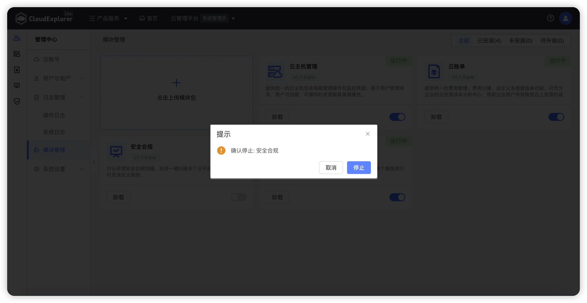
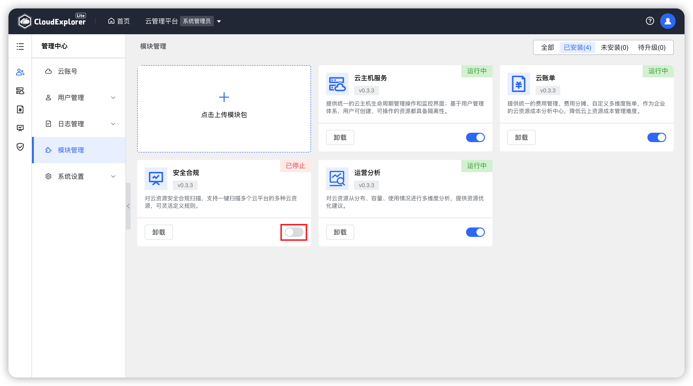
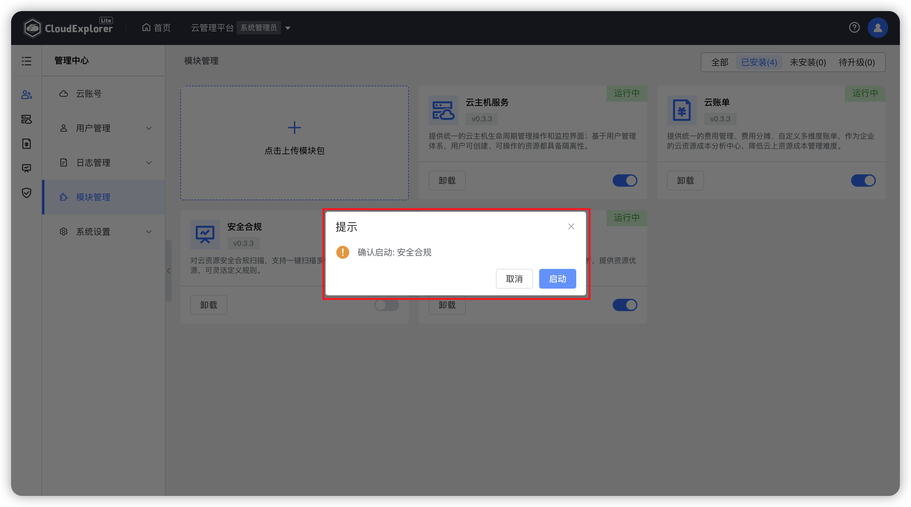
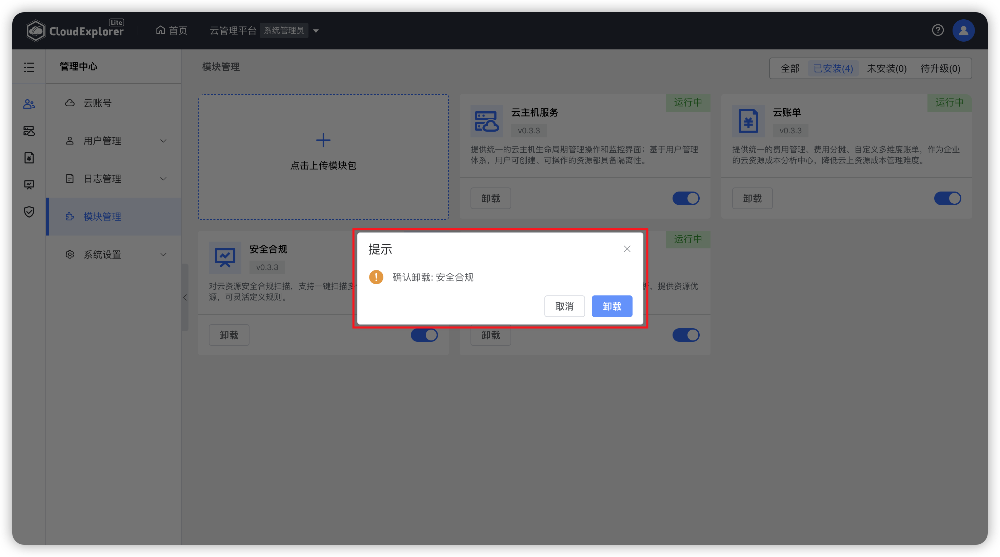
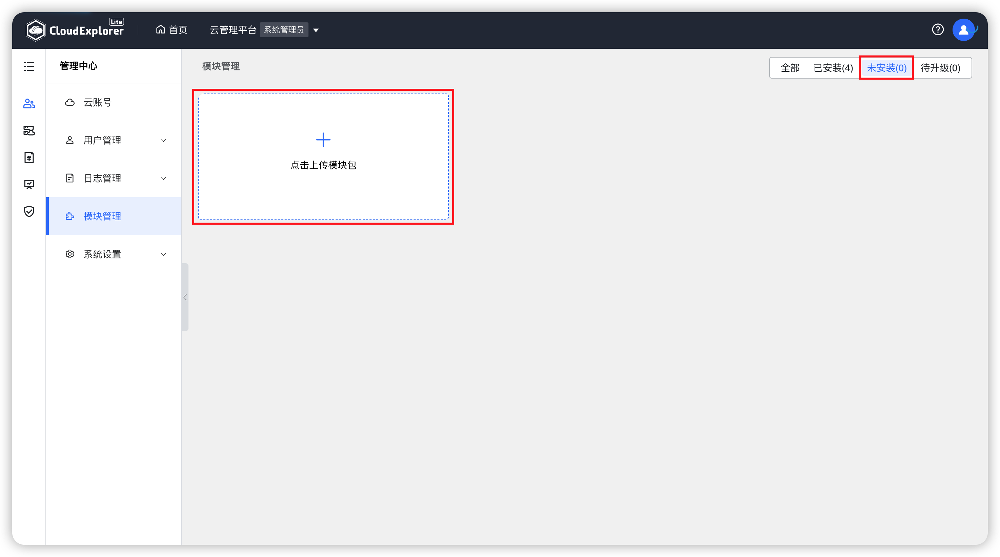
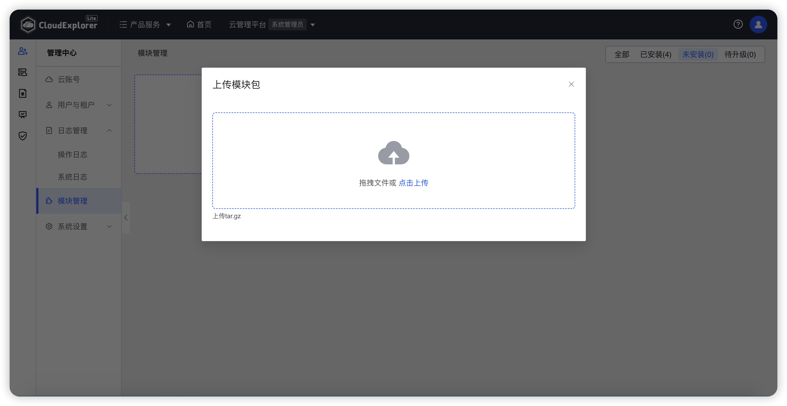

!!! Abstract ""

    模块管理中可查看云管平台已安装模块及其状态，对已安装模块进行管理，并可本地安装新模块。 

{ width="1235px" }

## 1 模块管理

!!! Abstract ""

    对于云管平台已安装的模块，可在模块管理页面中查看各模块的基本信息、安装情况、版本信息，并可进行停止、启动、卸载、升级操作。

### 1.1 模块停止

!!! Abstract ""

    对于暂不开放使用的模块，可进行停止操作。

    操作：在模块管理页面中，选择需要停止的模块，点击启停图标，页面会出现点再次确认弹窗，点击“停止”即可停止该模块。

{ width="1235px" }
{ width="1235px" }

### 1.2 模块启动

!!! Abstract ""
    对于需要开放使用的模块，可进行启动操作。

    操作：在模块管理页面中，选择需要启动的模块，点击启停图标，页面会出现点再次确认弹窗，点击“启动”即可启动该模块。

{ width="1235px" }
{ width="1235px" }

### 1.3 模块卸载

!!! Abstract ""

    对于不再使用的模块，可进行卸载操作。

    操作：在模块管理页面中，选择需要卸载的模块，点击“卸载”按钮，页面会出现点再次确认弹窗，点击“卸载”即可卸载该模块。

{ width="1235px" }
{ width="1235px" }

## 2 本地安装模块

!!! Abstract ""

    除官方发布的模块外，用户可以云管平台进行本地安装模块

    操作：在模块管理页面中，点击“点击上传模块包”按钮，拖拽或上传本地模块安装包后，云管平台会对安装包进行读取解析与安装。
{ width="1235px" }
{ width="1235px" }
