!!! Abstract ""
    组织为云管平台下面的一级租户，可以是企业的一个部门，或者是企业下面的二级法人，也可以是企业的一个虚拟组织。云管平台支持多级组织创建，列表页面按组织级别展示组织信息。 
    组织对应的组织管理员角色的权限范围限定在该组织当中, 可管理整个组织内的成员、下级组织、下属工作空间及成员等。可操作的资源也在本组织内。 
    用户可以先将企业本身的组织结构划为好级别，然后到云管平台中根据级别创建组织。

## 1 创建组织

!!! Abstract ""

    操作方式:【管理中心】-【用户与租户】-【组织管理】-【创建】。 
    方式一：选中某个组织层级点击 “+” 图标，选择“创建组织”。 
    方式二：选中某个组织层级，切换到组织页面，点击“创建组织”。

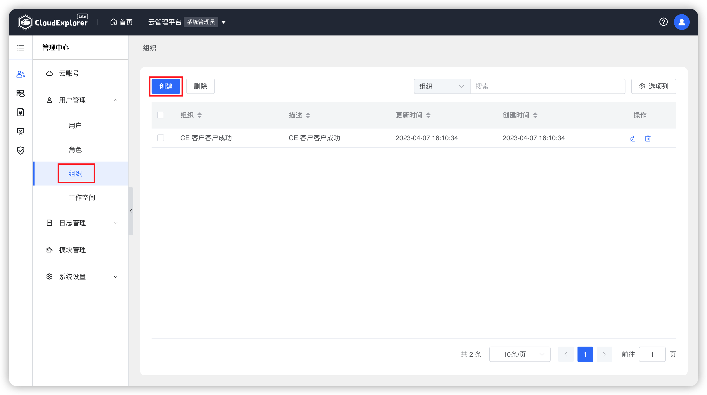{ width="1235px" }

!!! Abstract ""

    创建组织时，要填写组织基本信息并选择所属组织信息（选填），如选择了所属组织，则是在所选组织下创建子组织。保存时系统会校验组织名称的唯一性。 
    点击基本信息下方添加图标可以同时创建多个组织。在创建多个组织时点击描述后面的删除图标可以删除一条组织数据。

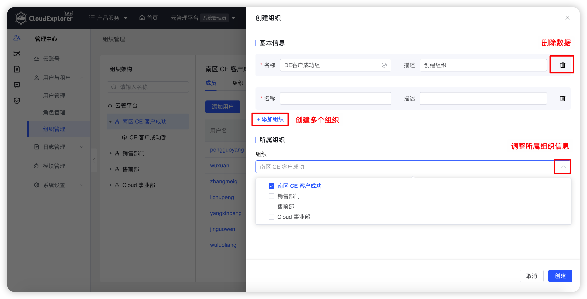{ width="1235px" }

!!! Abstract ""

    __字段说明：__  
    - 名称：云管平台的标识，名称唯一。 
    - 描述：对组织的说明描述。 
    - 所属组织：当前新增组织的父级组织，若当组织为一级组织则不必选择所属组织。

## 2 编辑组织

!!! Abstract ""

    当组织的名称变更或者组织级别调整时，可以编辑组织，对组织基本信息和所属组织进行修改调整。

    方式一：在需要编辑的组织右侧点击“...”图标，选择“编辑”操作，可以修改组织所有属性。 
    方式二：有多级组织时，选择一级组织，切换右侧组织页面，点击列表右侧“操作”列中的“编辑”按钮，可以修改子级组织所有属性。

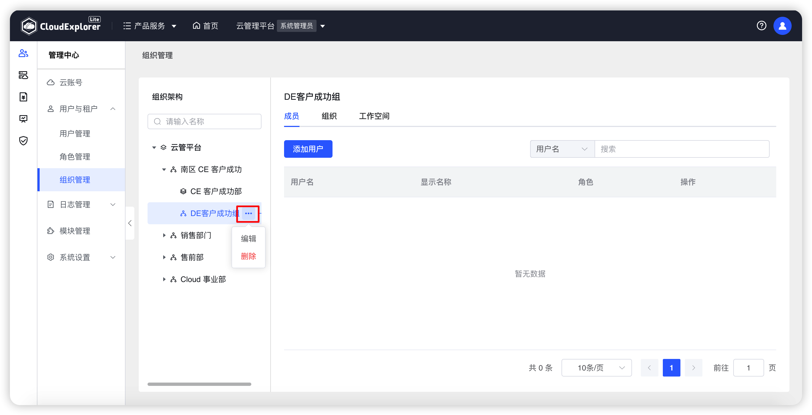{ width="1235px" }
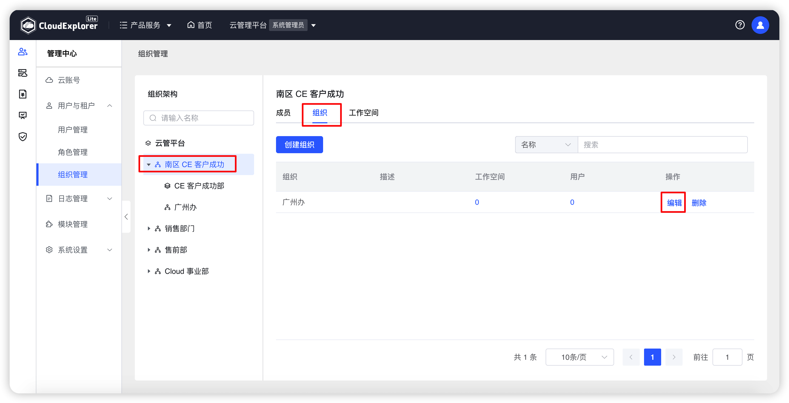{ width="1235px" }
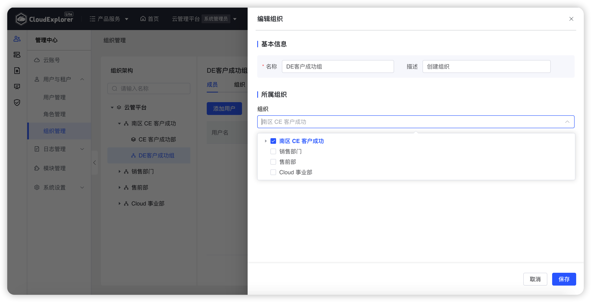{ width="1235px" }

## 3 删除组织

!!! Abstract ""

    方式一：在需要删除的组织右侧点击“...”图标，选择“删除”操作，二次确认删除组织。 
    方式二：有多级组织时，选择一级组织，切换右侧组织页面，点击列表右侧“操作”列中的“删除”按钮，二次确认可以删除子级组织。

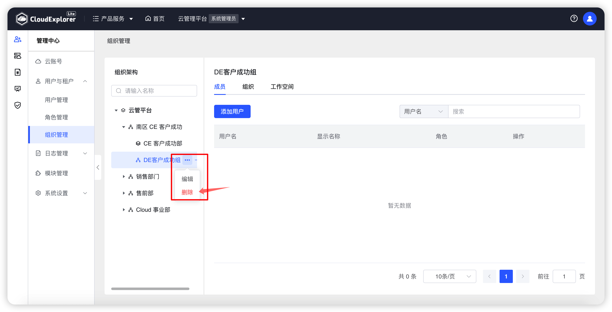{ width="1235px" } 
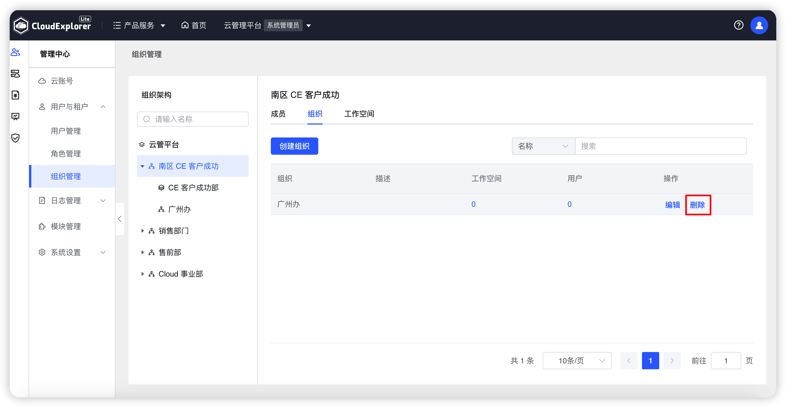{ width="1235px" }   
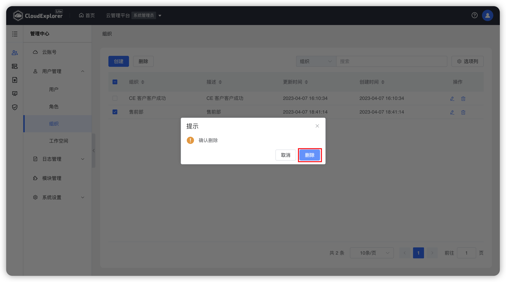{ width="1235px" }  

!!! Abstract ""

    __注意：__  
    当云管平台上的组织下没有子组织和工作空间时，才可以删除此组织。若组织下存在子组织或工作空间则无法被删除。

## 4 添加组织成员

!!! Abstract ""

    方式一：在组织右侧点击“+”图标，选择“添加成员”操作，选择用户，分配“组织管理员”角色。 
    方式二：选择对应组织，切换右侧成员页面，点击“添加用户”，选择用户，分配“组织管理员”角色。 
    取消组织成员，在成员页面选择“移除用户”。

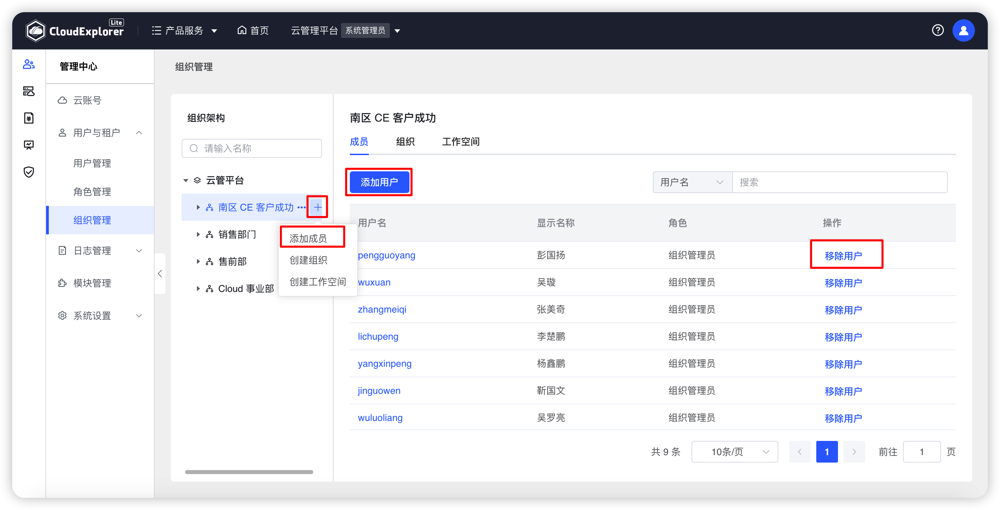{ width="1235px" }  
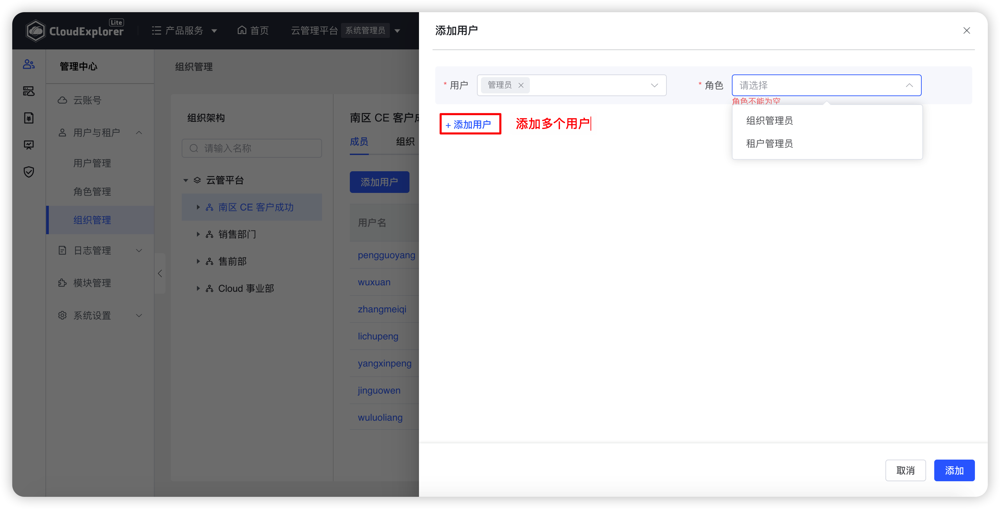{ width="1235px" }  

## 5 创建工作空间

!!! Abstract ""

    工作空间为云管平台中组织下的级别划分，可以是部门中的一个小组，也可以是项目。 
    工作空间对应的工作空间用户角色的权限范围限定在该工作空间内，可操作资源也在本工作空间范围内。

!!! Abstract ""

    方式一：选中某个组织层级点击 “+” 图标，选择“创建工作空间”。 
    方式二：选中对应组织，切换到工作空间页面，点击“创建工作空间”。 
    创建工作空间时，要填写工作空间基本信息并选择父级组织（必填），保存时系统会校验工作空间名称的唯一性。 
    点击基本信息下方添加图标可以同时创建多个工作空间。在创建多个工作空间时点击描述后面的删除图标可以删除一条工作空间数据。
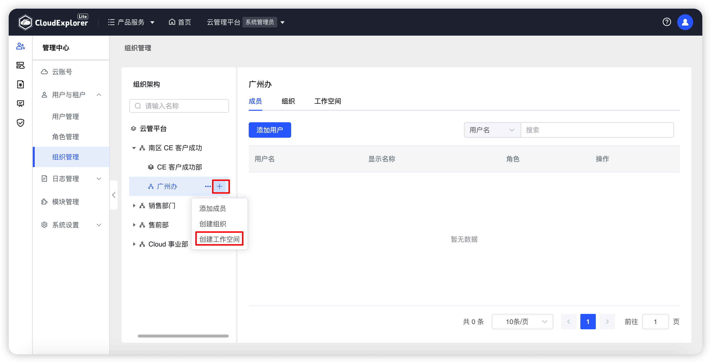{ width="1235px" }
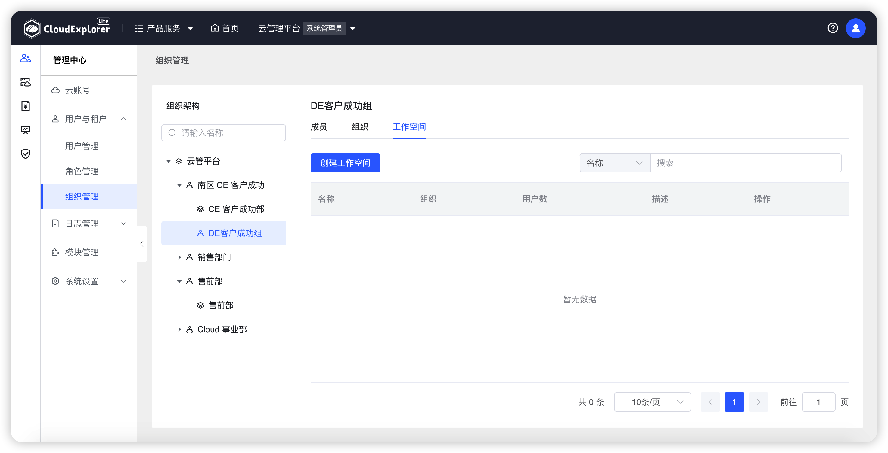{ width="1235px" }
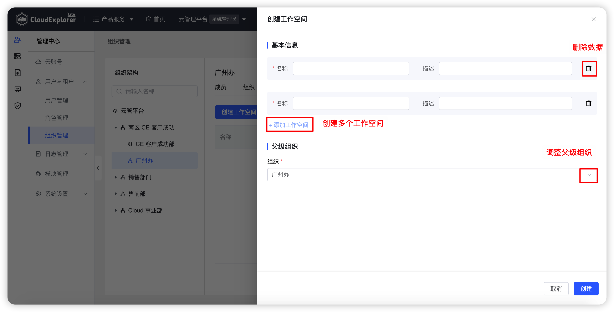{ width="1235px" }

!!! Abstract ""

    __字段说明：__  
    - 名称：云管平台的标识，名称唯一。 
    - 描述：对工作空间的说明描述。 
    - 父级组织：当前新增工作空间的父级组织，一个工作空间仅能属于一个组织。

## 6 编辑工作空间

!!! Abstract ""

    当工作空间的名称变更或者变更到其他组织下时，可以编辑工作空间，对工作空间的基本信息和父级组织进行调整。

    方式一：在需要编辑的工作空间右侧点击“...”图标，选择“编辑”操作，可以修改工作空间所有属性。 
    方式二：选择父级组织，切换右侧工作空间页面，点击列表右侧“操作”列中的“编辑”按钮，可以修改工作空间所有属性。

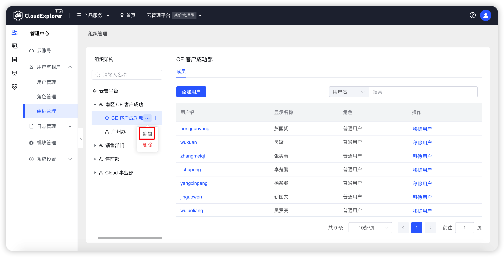{ width="1235px" }
{ width="1235px" }
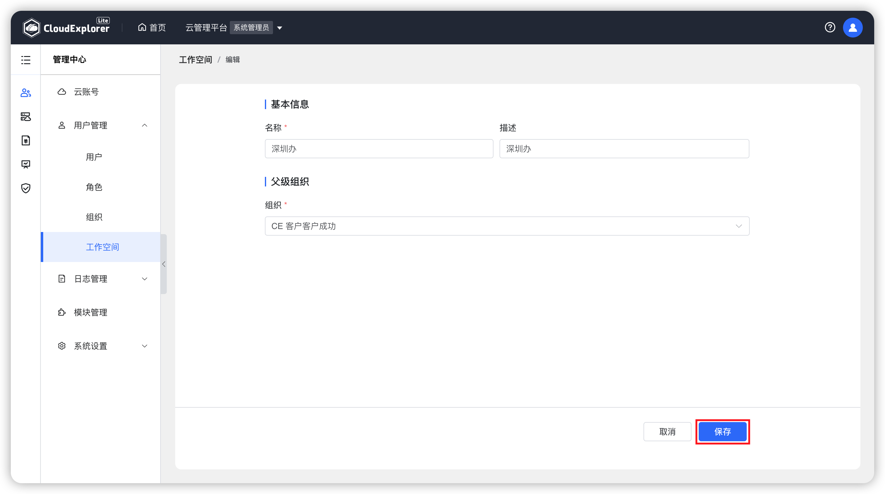{ width="1235px" }

## 7 删除工作空间

!!! Abstract ""

    当工作空间已经不再使用时，可以删除该工作空间。工作空间删除，当前工作空间下的用户和资源授权均会被取消。

    方式一：在需要删除的工作空间右侧点击“...”图标，选择“删除”操作，二次确认删除工作空间。 
    方式二：选择父级组织，切换右侧工作空间页面，点击列表右侧“操作”列中的“删除”按钮，二次确认可以删除工作空间。

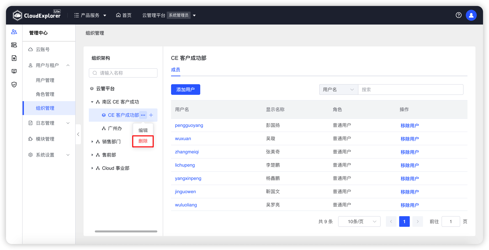{ width="1235px" }  
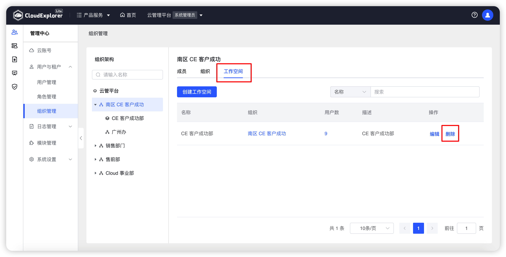{ width="1235px" }  
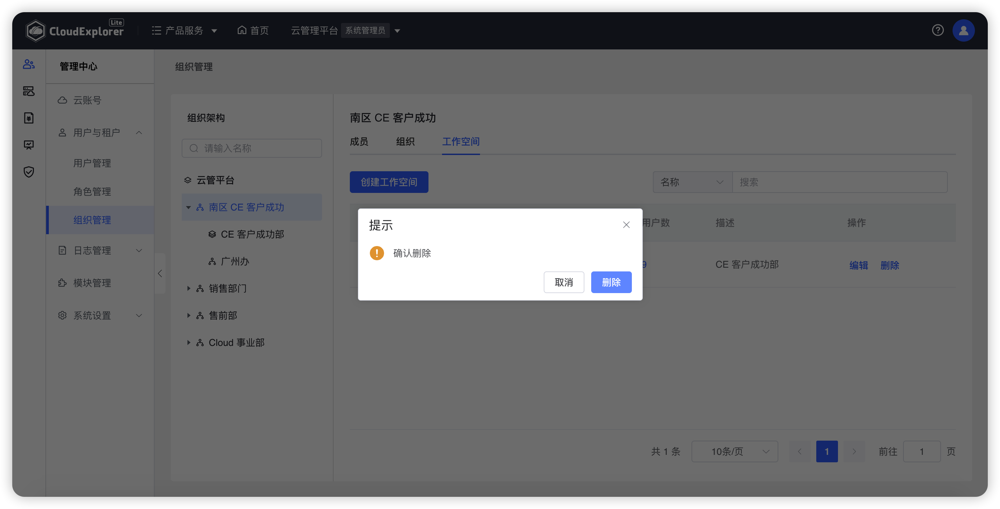{ width="1235px" }  

## 8 添加工作空间成员

!!! Abstract ""

    方式一：在工作空间右侧点击“+”图标，选择“添加成员”操作，选择用户，分配“普通用户”角色。 
    方式二：选择对应组织，切换右侧成员页面，点击“添加用户”，选择用户，分配“普通用户”角色。 
    取消工作空间成员，在成员页面选择“移除用户”。

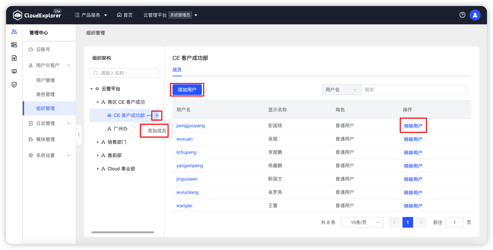{ width="1235px" }  
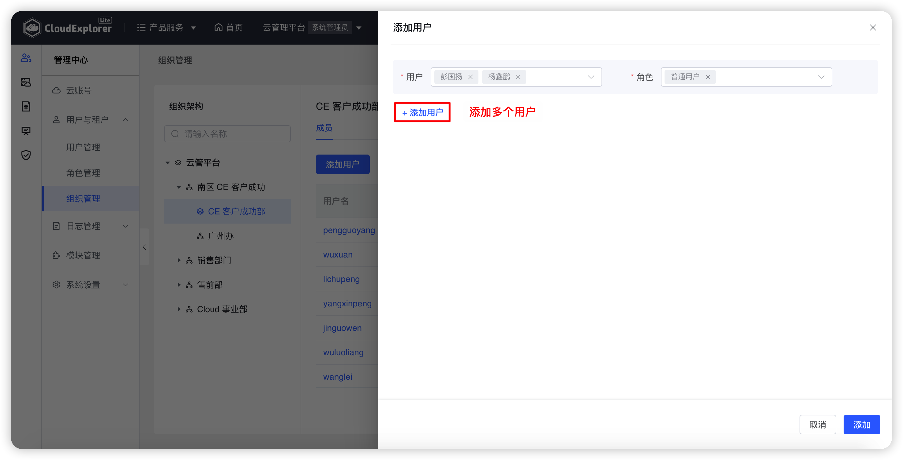{ width="1235px" }  
