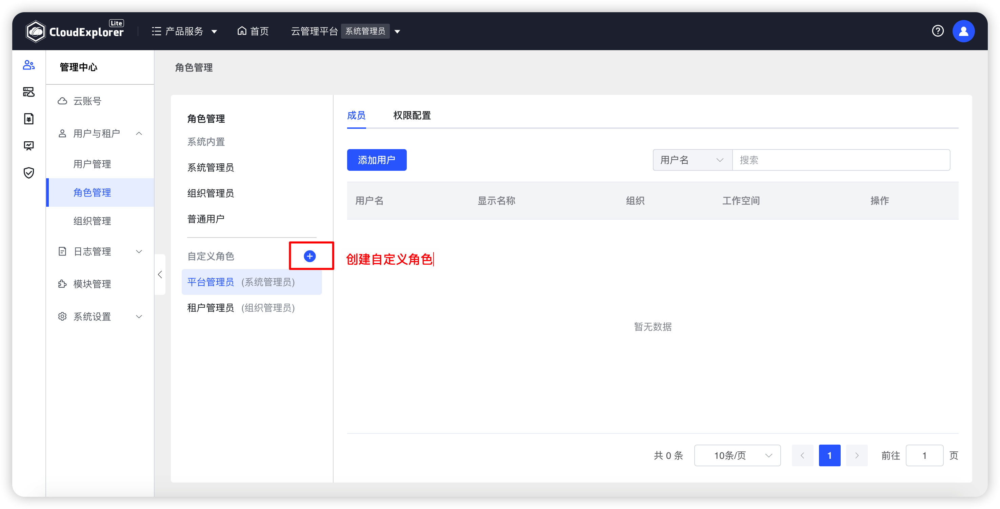
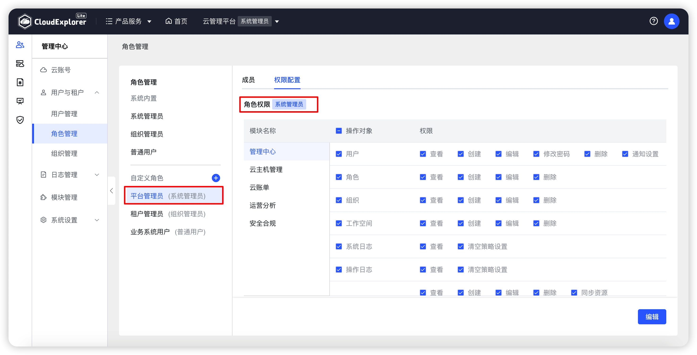
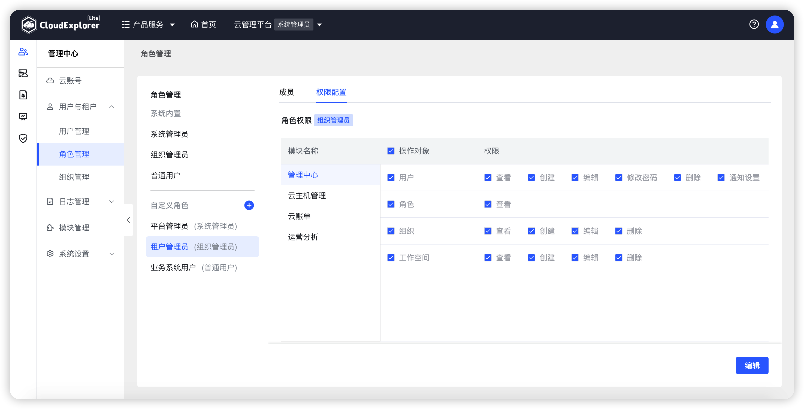
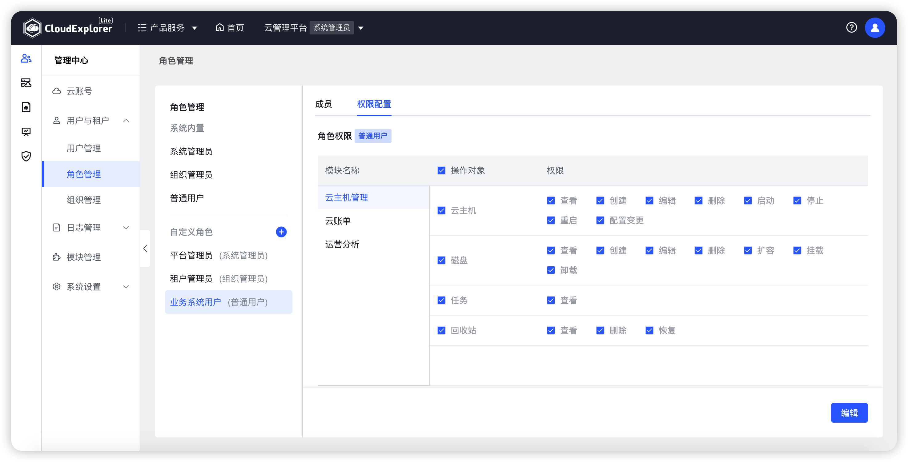
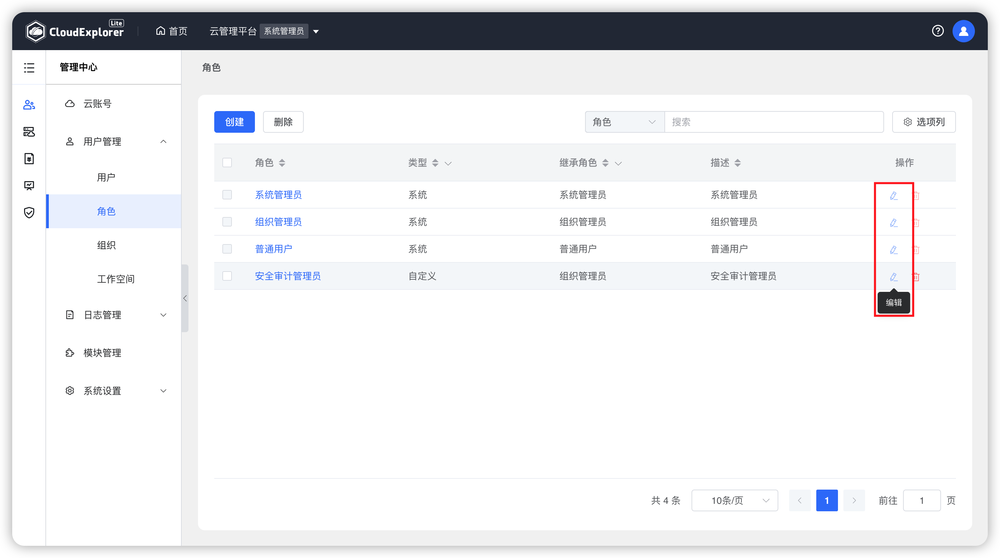
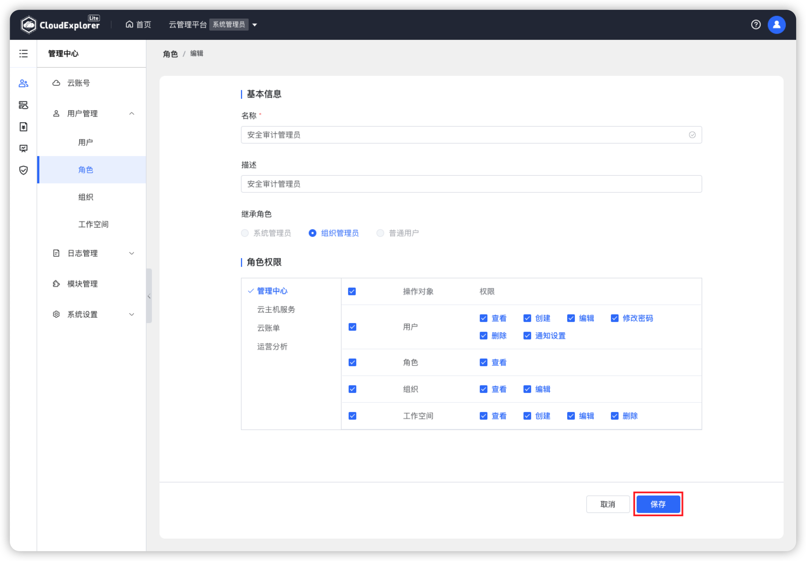
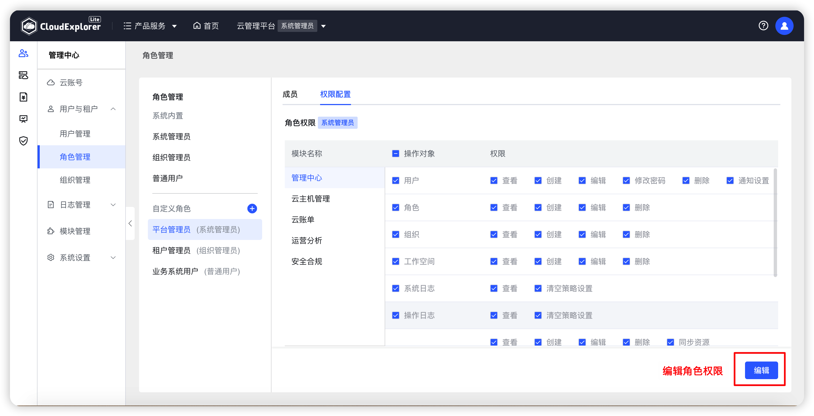
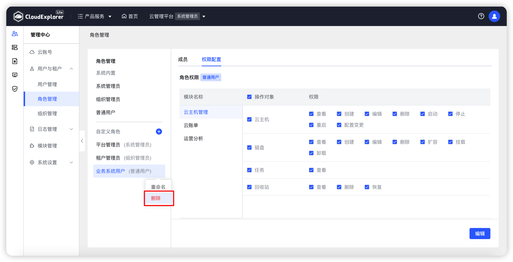
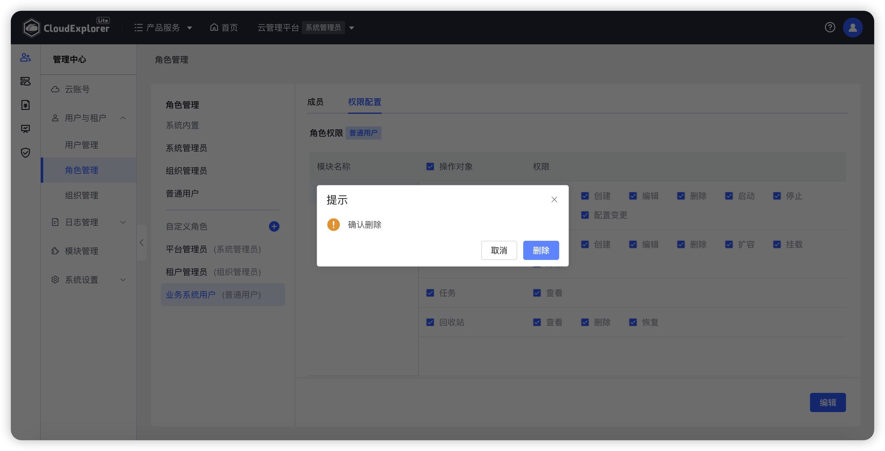
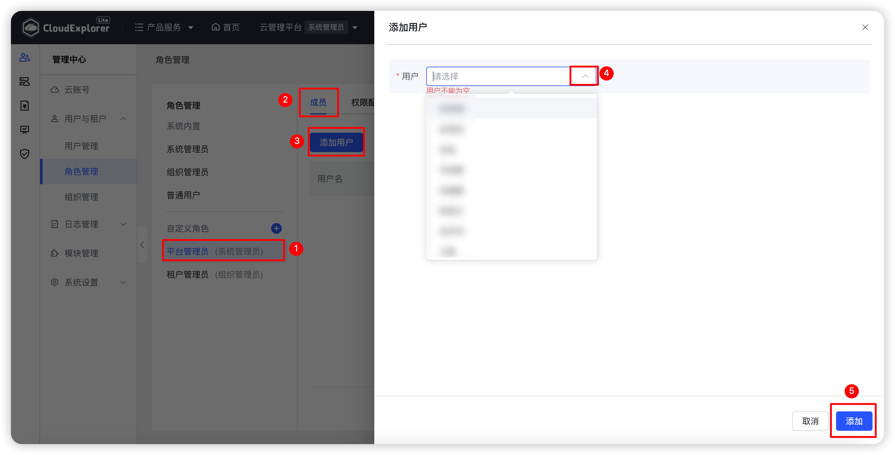

!!! Abstract ""

    云管平台默认支持三种角色，系统管理员、组织管理员和工作空间用户。系统内置的3种角色仅可以使用，不能编辑和删除。但系统管理员可以根据业务需要自定义角色，设置自定义角色对各模块各功能的操作权限。

## 1 创建自定义角色

!!! Abstract ""

    操作：【管理中心】-【用户与租户】-【角色管理】-【+】。

{ width="1235px" }

!!! Abstract ""

    创建自定义角色时，要填写角色基本信息并选择继承角色。保存时系统会校验角色名称的唯一性。 
    新建角色必须继承云管平台默认的三种角色的其中一个角色，选择好所继承角色后，新建角色的权限也是在所继承角色的权限范围下进行选择，无法添加所继承角色权限范围之外的新权限。 

{ width="1235px" }
{ width="1235px" }
{ width="1235px" }

!!! Abstract ""

    __字段说明：__  
    - 名称：云管平台的标识，名称唯一。 
    - 继承角色：继承系统内置的3种角色（系统管理员、组织管理员、普通用户）。

## 2 编辑自定义角色

!!! Abstract ""

    支持对自定义角色重命名。 
    当需要对角色权限进行调整时，可以编辑角色权限，修改相关权限，但编辑角色不能修改继承角色。 
    操作：在角色列表中，选择需要编辑的角色，点击列表右下角的“编辑”，可以修改角色所有属性。

{ width="1235px" }
{ width="1235px" }
{ width="1235px" }

!!! Abstract ""

    __注意：__  
    系统内置角色（系统管理员、组织管理员、普通用户）无法编辑。

## 3 删除自定义角色

!!! Abstract ""

    当角色已经不再使用时，可以删除该角色。若删除正在使用的角色，关联了该角色全部用户将会被取消关联。

    操作：在角色管理页面，选择需要删除的角色，点击角色右侧“...”图标，选择删除。页面会出现点再次确认弹窗，再次点击“删除”即可删除该角色。

{ width="1235px" }    
{ width="1235px" }  

!!! Abstract ""

    __注意：__  
    系统内置角色（系统管理员、组织管理员、普通用户）无法删除。

## 4 角色关联用户

!!! Abstract ""

    在角色管理页面可以直接为角色关联用户，用户会继承对应角色并且继承该角色已配置权限。

    操作：在角色管理页面，选中角色，页面右侧切换为成员页面，点击【添加用户】。

{ width="1235px" }

