## 1 定时同步资源（数据同步设置）

!!! Abstract ""

    为了与云平台上的资源数据保持一致，云管平台会定时同步各云账号的资源数据。
    但由于每个云平台的特性（如每个云平台的同步范围区域不一样）和每个服务模块要同步的数据类型可能不同，因此可以根据每个云账号的特性对每个云账号设置定时数据同步策略。

!!! Abstract ""

    云账号数据同步设置的操作入口有两种方式： 
    - 方式一：云账号列表中【操作】-【数据同步设置】。 
    - 方式二：云账号详情中【数据同步设置】-【编辑】。 

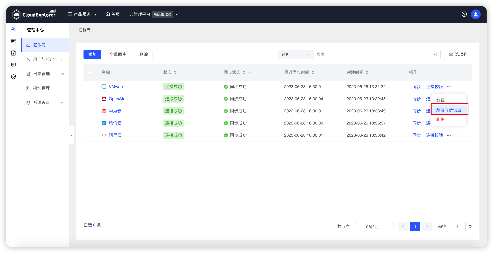{ width="1235px" }

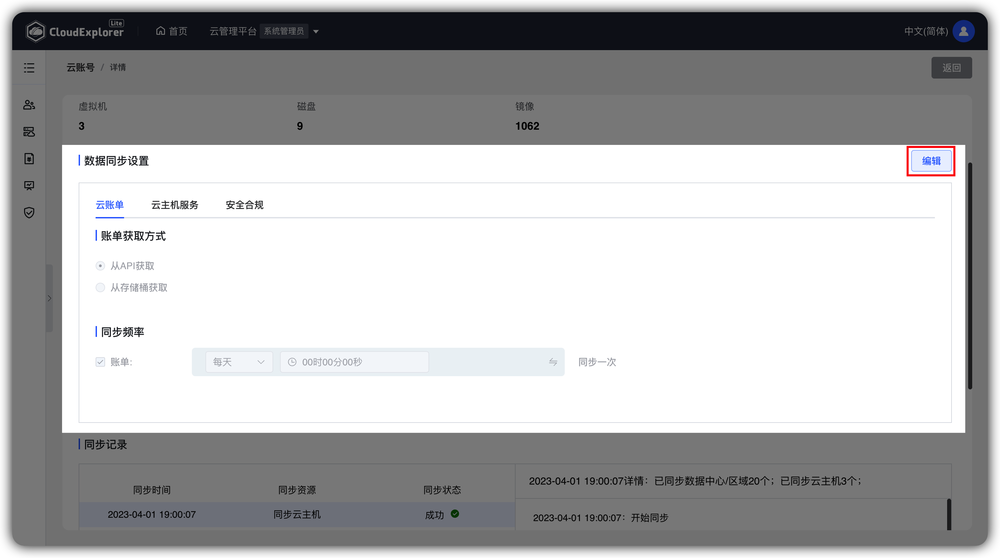{ width="1235px" }

### 1.1 云主机同步设置

!!! Abstract ""

    用户可以在【云主机管理】中勾选云账号所需同步的范围，未被勾选的范围不会参与同步任务。 
    用户可以在【同步频率设置】中分别对云主机、磁盘、镜像、宿主机和存储器分别设置是否进行同步，如需同步则可分别设置不同的同步频率。

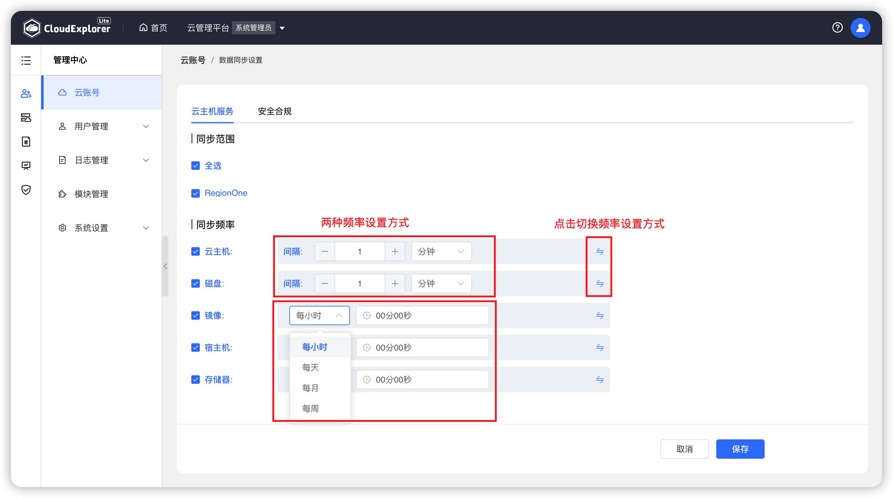{ width="1235px" }

### 1.2 安全合规设置

!!! Abstract ""

    用户可以在【安全合规】设置中，可以设置云管平台对云账号资源的安全合规情况扫描时间频率。 

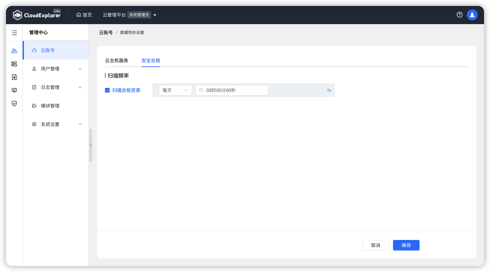{ width="1235px" }

### 1.3 云账单同步设置

!!! Abstract ""

    对于公有云云账号，除同步云资源数据外，还涉及到相关公有云账单费用同步。云账单模块所使用的账单数据均需要在云账号中进行同步，所以公有云云账号还需进行同步云账单操作。

    用户设置云账单获取方式有 通过 API 和通过存储桶两种。当云账号的资源数量过多时（超过200）建议使用存储桶的方式，当云账号下的资源数量不多（少于200）且没有开启存储桶时，建议使用API的方式。

    建议将云账号同步时间设置在业务低峰时段。

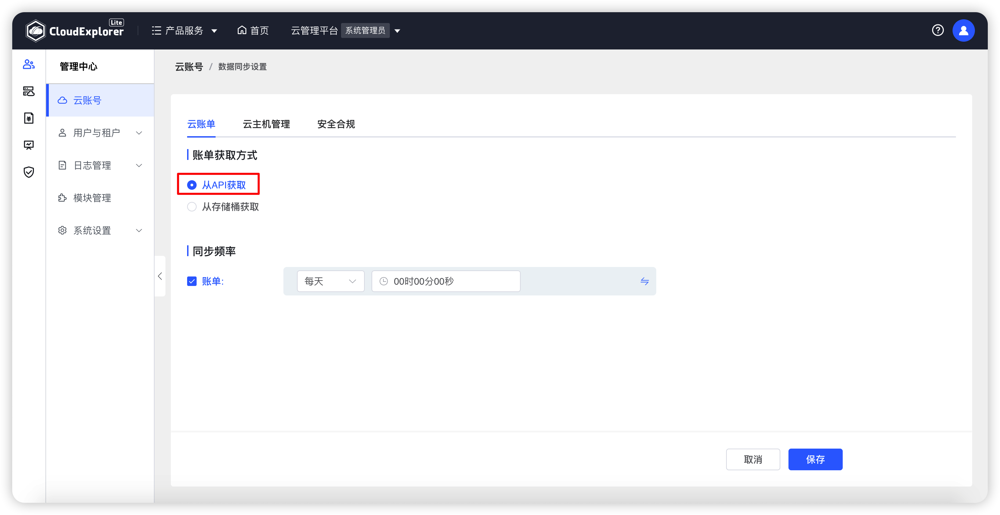{ width="1235px" }

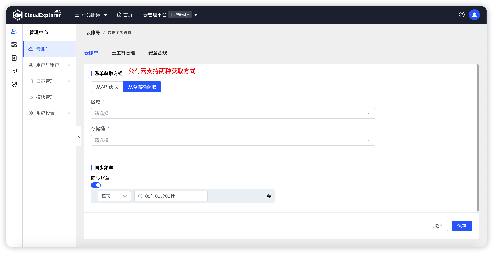{ width="1235px" }

## 2 手动同步资源

!!! Abstract ""

    云账号纳管以后，会根据设置好的云账号数据同步设置对资源进行定时同步，但是如果用户未通过云管平台，而是直接在所纳管云账号的控制台上操作云资源数据，就会造成云管平台上的数据滞后于各云平台上的数据。若用户急需在云管平台上看到最新数据时，用户可以在云账号列表中进行手动同步数据操作。

### 2.1 同步资源

!!! Abstract ""

    手动同步云账号资源信息有两个方式： 
    - 方式一：在云账号列表中，勾选所需要同步的云账号，点击页面上方“同步”按钮，可对选中的云账号批量进行资源同步。 
    - 方式二：在云账号列表中，选择需要同步的云账号，点击列表右侧“操作”列中的“同步”图标，页面会弹出选择框，用户可以选择本地同步资源数据的区域范围和资源类型，点击“同步”即可开始同步任务。

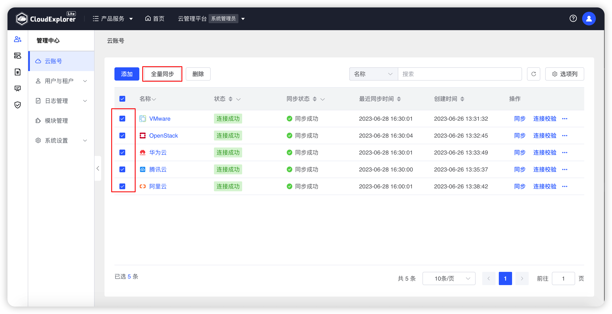{ width="1235px" }

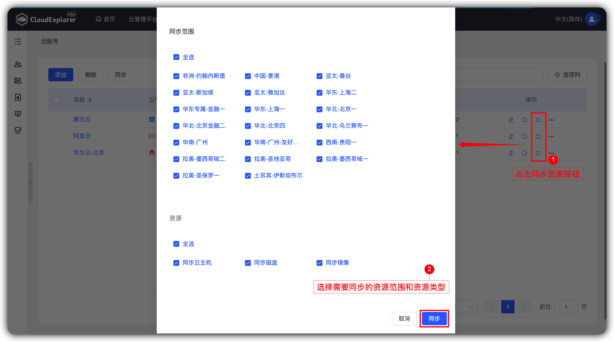{ width="1235px" }

!!! Abstract ""

    用户点击确定后，该云账号的同步状态显示为同步中，鼠标悬浮在【同步状态】上，弹出悬浮框展示最近一次所同步资源的同步状态和同步时间。

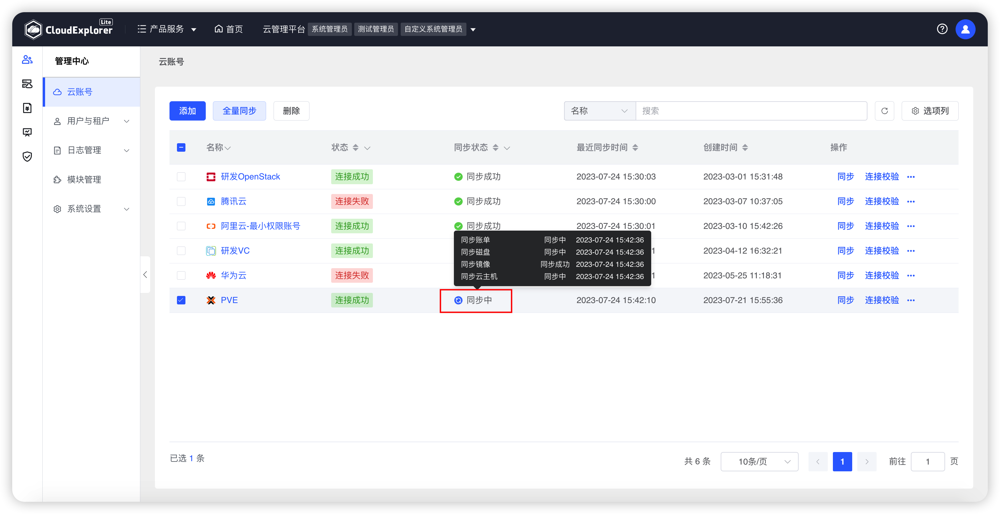{ width="1235px" }

!!! Abstract ""

    同步完成后若无同步失败资源则状态更新为成功，若有同步失败资源则状态更新为失败。

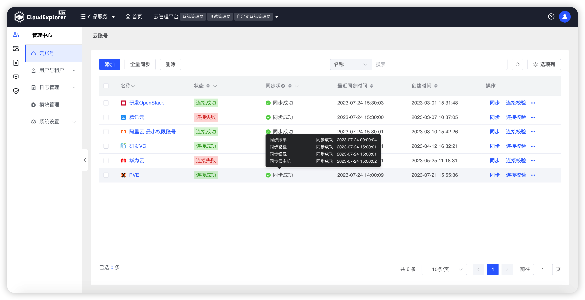{ width="1235px" }

!!! Abstract ""

    资源同步完成后可以到【云主机管理】模块看同步到的资源数据。

### 2.2 同步云账单

!!! Abstract ""

    对于公有云云账号，用户可点击云账号列表右侧“操作”列中的“同步账单”选项，页面会弹出选择框，用户可以选择需要同步的账单周期（最多可按月同步过去一年的账单）。 
    云账单同步完成后需要到【云账单】模块查看相关数据。

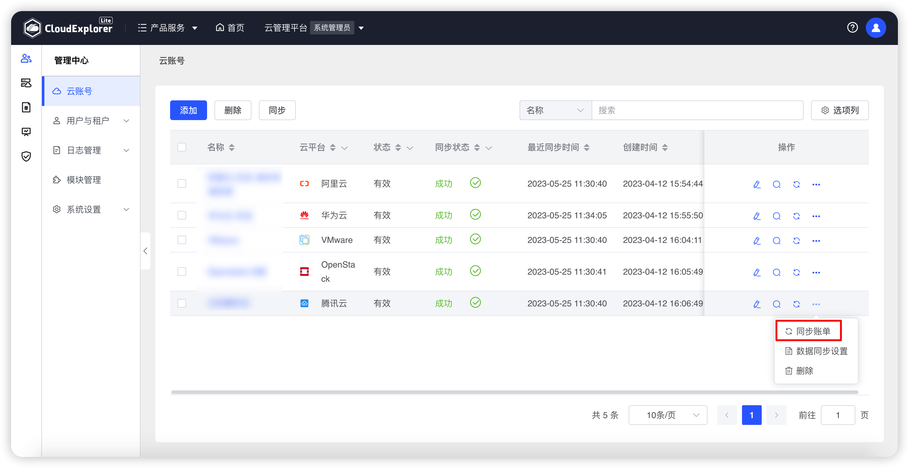{ width="1235px" }

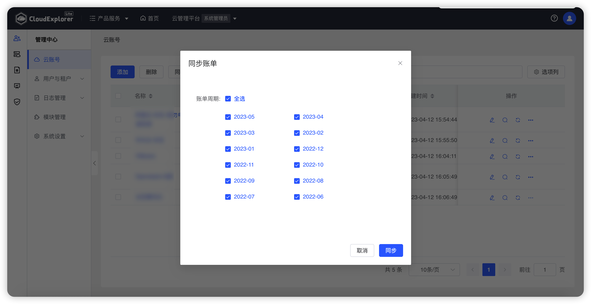{ width="1235px" }