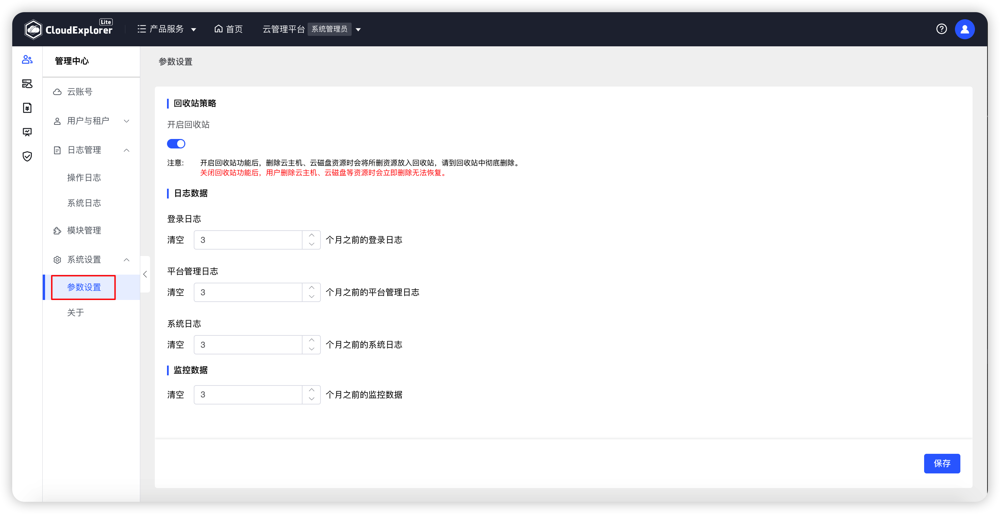
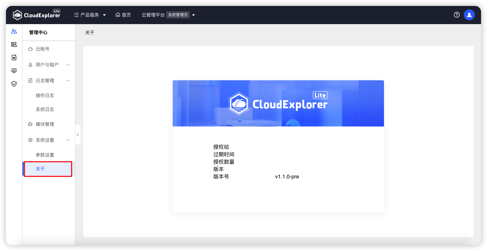

!!! Abstract ""

    系统设置是云管平台中全局控制的系统参数设置。

## 1 参数设置

!!! Abstract ""

    参数设置中当前可设置回收站策略、日志数据清空策略、监控数据清空策略。

!!! Abstract ""

    为避免用户误删除资源，云管平台提供了回收站功能作为缓冲区。 
    回收站状态开启时，删除云主机和云磁盘，会将所删除的资源放入回收中，不会在各云平台上删除，在回收站中执行“彻底删除”操作才会将所删除的资源在云平台上删除。 
    回收站状态关闭时，删除云主机和云磁盘，会将所删除的资源直接在云平台上彻底删除。

{ width="1235px" }

## 2  关于

!!! Abstract ""

    关于页面中，可查看云管平台的授权信息，具体包括授权单位、过期时间、授权数量、版本、版本号。

{ width="1235px" }