## 1 组织

!!! Abstract ""
    组织为云管平台下面的一级租户，可以是企业的一个部门，或者是企业下面的二级法人，也可以是企业的一个虚拟组织。云管平台支持多级组织创建，列表页面按组织级别展示组织信息。<br />
    组织对应的组织管理员角色的权限范围限定在该组织当中, 可管理整个组织内的成员、下级组织、下属工作空间及成员等。可操作的资源也在本组织内。<br />
    用户可以先将企业本身的组织结构划为好级别，然后到云管平台中根据级别创建组织。

- 创建组织

!!! Abstract ""

    操作方式:【管理中心】-【组织】-【创建】。

{ width="1235px" }

!!! Abstract ""

    创建组织时，要填写组织基本信息并选择所属组织信息（选填），如选择了所属组织，则是在所选组织下创建子组织。保存时系统会校验组织名称的唯一性。<br />
    点击基本信息下方添加图标可以同时创建多个组织。在创建多个组织时点击描述后面的删除图标可以删除一条组织数据。

{ width="1235px" }

!!! Abstract ""

    __字段说明：__ <br />
    - 名称：云管平台的标识，名称唯一。<br />
    - 描述：对组织的说明描述。<br />
    - 所属组织：当前新增组织的父级组织，若当组织为一级组织则不必选择所属组织。

- 编辑组织

!!! Abstract ""

    当组织的名称变更或者组织级别调整时，可以编辑组织，对组织基本信息和所属组织进行修改调整。

    操作：在组织列表中，选择需要编辑的组织，点击列表右侧“操作”列中的“编辑”图标，可以修改组织所有属性。

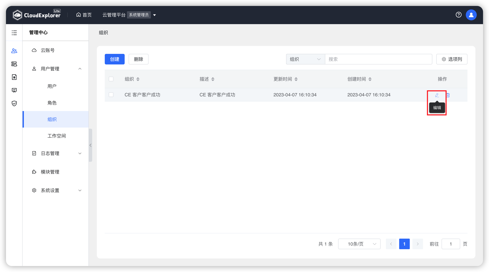{ width="1235px" }
{ width="1235px" }

- 删除组织

!!! Abstract ""

    操作：在组织列表中，选择需要删除的组织，点击列表右侧“操作”列中的“删除”选项，或者勾选组织后，点击页面上方“删除”按钮，页面会出现点再次确认弹窗，再次点击“删除”即可删除该组织。

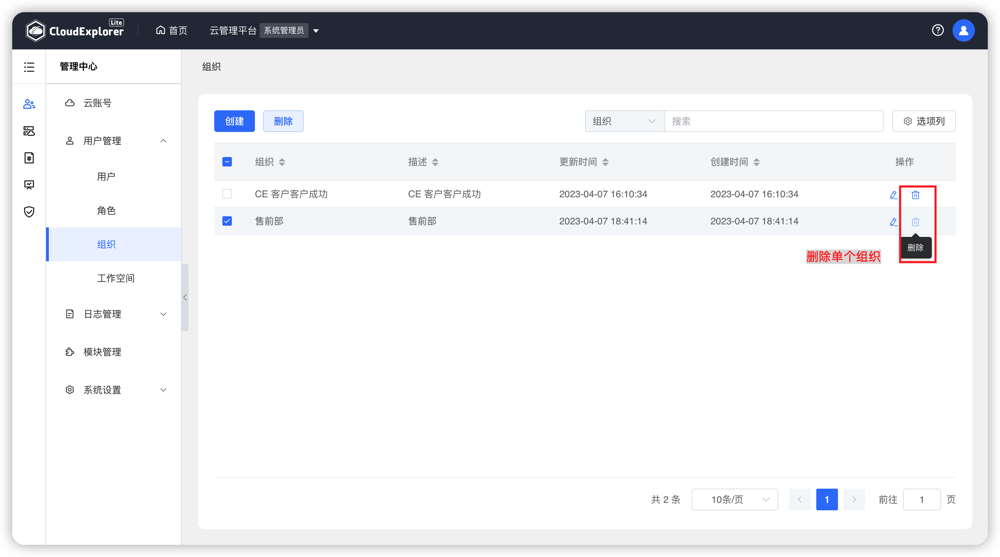{ width="1235px" }  
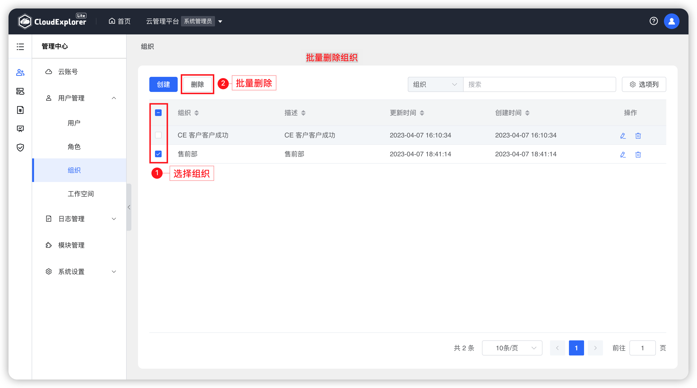{ width="1235px" }  
{ width="1235px" }  

!!! Abstract ""

    __注意：__ <br />
    当云管平台上的组织下没有子组织和工作空间时，才可以删除此组织。若组织下存在子组织或工作空间则无法被删除。

## 2 工作空间

!!! Abstract ""

    工作空间为云管平台中组织下的级别划分，可以是部门中的一个小组，也可以是项目。<br />
    工作空间对应的工作空间用户角色的权限范围限定在该工作空间内，可操作资源也在本工作空间范围内。

- 创建工作空间

!!! Abstract ""

    创建工作空间有两种方式：<br />
    - 方式一：【首页】-【快捷入口】-【创建工作空间】。<br />
    - 方式二：【管理中心】-【工作空间】-【创建】。

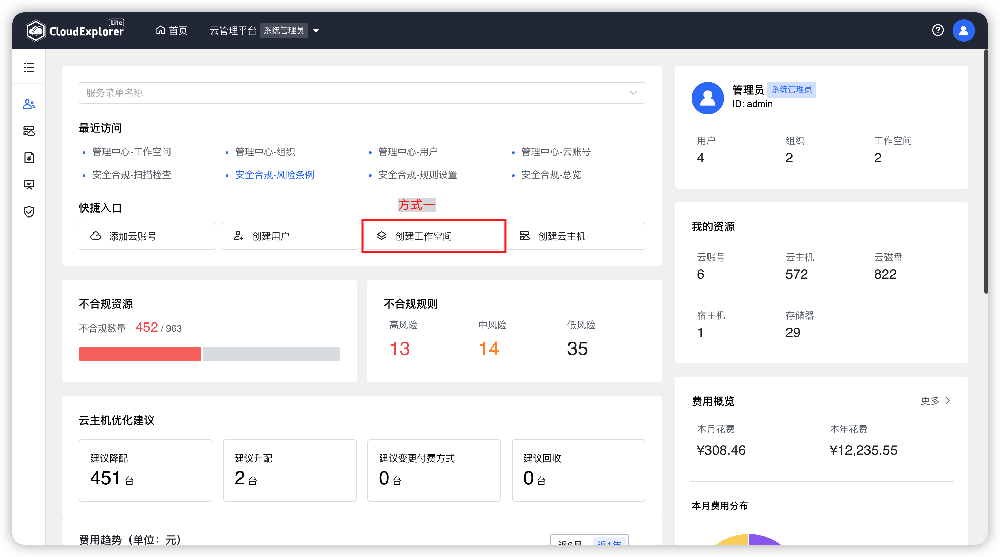{ width="1235px" }
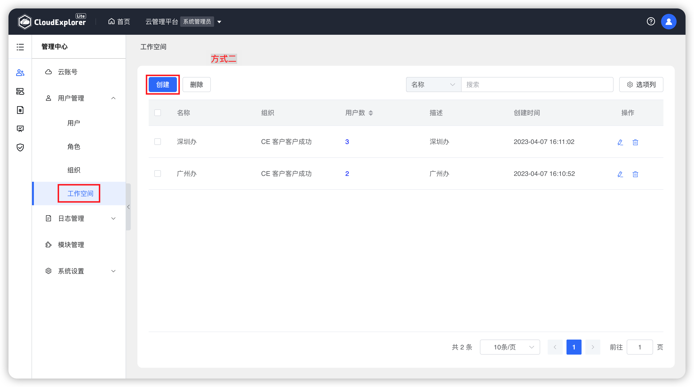{ width="1235px" }

!!! Abstract ""

    创建工作空间时，要填写工作空间基本信息并选择父级组织（必填），保存时系统会校验工作空间名称的唯一性。<br />
    点击基本信息下方添加图标可以同时创建多个工作空间。在创建多个工作空间时点击描述后面的删除图标可以删除一条工作空间数据。

{ width="1235px" }

!!! Abstract ""

    __字段说明：__ <br />
    - 名称：云管平台的标识，名称唯一。<br />
    - 描述：对工作空间的说明描述。<br />
    - 父级组织：当前新增工作空间的父级组织，一个工作空间仅能属于一个组织。

- 编辑工作空间

!!! Abstract ""

    当工作空间的名称变更或者变更到其他组织下时，可以编辑工作空间，对工作空间的基本信息和父级组织进行调整。

    操作：在工作空间列表中，选择需要编辑的工作空间，点击列表右侧“操作”列中的“编辑”图标，可以修改工作空间所有属性。

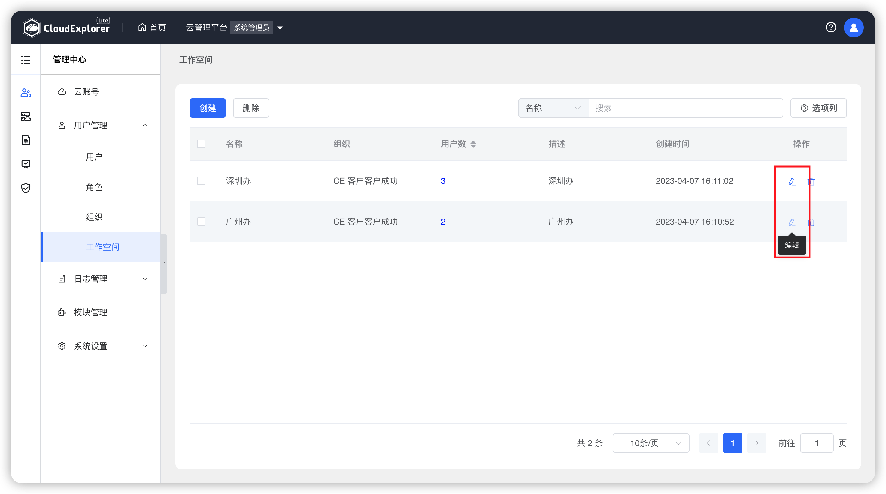{ width="1235px" }
{ width="1235px" }

- 删除工作空间

!!! Abstract ""

    当工作空间已经不再使用时，可以删除该工作空间。工作空间删除，当前工作空间下的用户和资源授权均会被取消。

    操作：在工作空间列表中，选择需要删除的工作空间，点击列表右侧“操作”列中的“删除”选项，或者勾选工作空间后，点击页面上方“删除”按钮，页面会出现点再次确认弹窗，再次点击“删除”即可删除该工作空间。

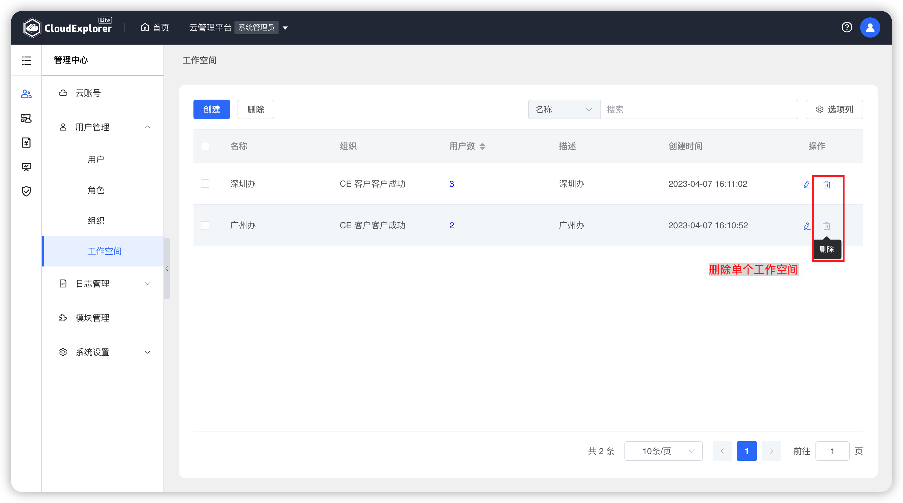{ width="1235px" }  
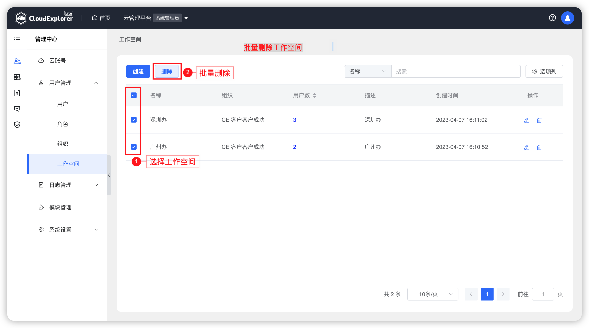{ width="1235px" }  
{ width="1235px" }  

## 3 角色

!!! Abstract ""

    云管平台默认支持三种角色，系统管理员、组织管理员和工作空间用户。系统内置的3种角色仅可以使用，不能编辑和删除。但系统管理员可以根据业务需要自定义角色，设置自定义角色对各模块各功能的操作权限。

- 创建角色

!!! Abstract ""

    操作：【管理中心】-【角色】-【创建】。

{ width="1235px" }

!!! Abstract ""

    创建角色时，要填写角色基本信息并选择角色权限。保存时系统会校验角色名称的唯一性。<br />
    新建角色必须继承云管平台默认的三种角色的其中一个角色，选择好所继承角色后，新建角色的权限也是在所继承角色的权限范围下进行选择，无法添加所继承角色权限范围之外的新权限。

{ width="1235px" }
{ width="1235px" }
{ width="1235px" }

!!! Abstract ""

    __字段说明：__ <br />
    - 名称：云管平台的标识，名称唯一。<br />
    - 描述：对角色的说明描述。<br />
    - 继承角色：继承系统内置的3种角色（系统管理员、组织管理员、普通用户）。<br />
    - 角色权限：根据所继承角色不同，可设置权限的模块和功能不同。

- 编辑角色

!!! Abstract ""

    当需要对角色权限进行调整时，可以编辑角色，修改相关权限，但编辑角色不能修改继承角色。

    操作：在角色列表中，选择需要编辑的角色，点击列表右侧“操作”列中的“编辑”图标，可以修改角色所有属性。

{ width="1235px" }
{ width="1235px" }

!!! Abstract ""

    __注意：__ <br />
    系统内置角色（系统管理员、组织管理员、普通用户）无法编辑。

- 删除角色

!!! Abstract ""

    当角色已经不再使用时，可以删除该角色。若删除正在使用的角色，关联了该角色全部用户将会被取消关联。

    操作：在角色列表中，选择需要删除的角色，点击列表右侧“操作”列中的“删除”选项，或者勾选角色后，点击页面上方“删除”按钮，页面会出现点再次确认弹窗，再次点击“删除”即可删除该角色。

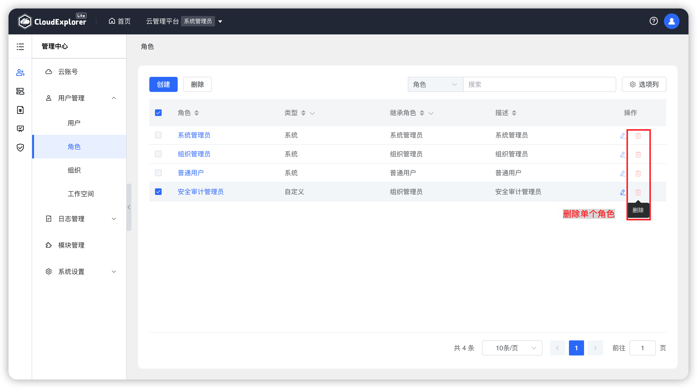{ width="1235px" }  
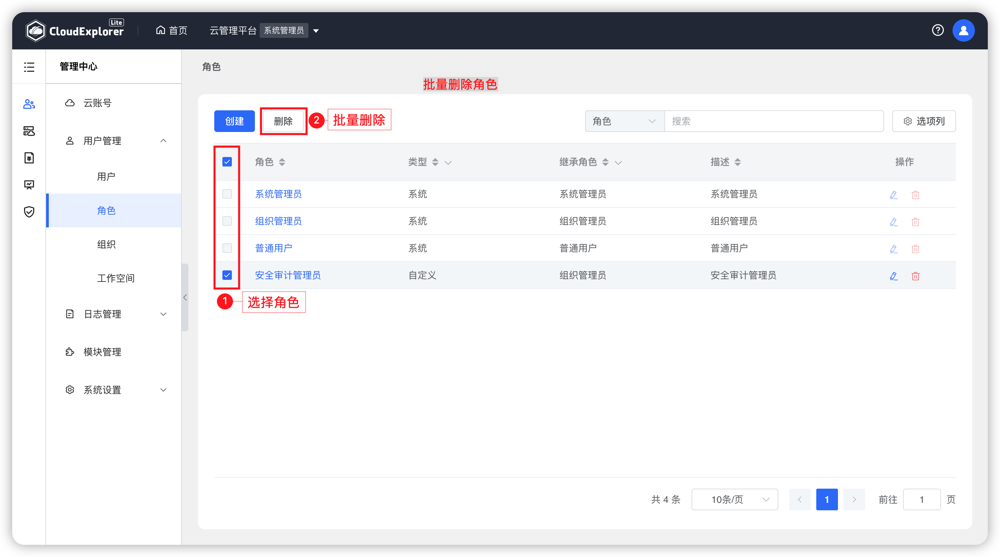{ width="1235px" }  
{ width="1235px" }  

!!! Abstract ""

    __注意：__ <br />
    系统内置角色（系统管理员、组织管理员、普通用户）无法删除。
    
## 4 用户

!!! Abstract ""

    用户可以拥有多个角色，比如既可以是系统管理员，也可以是组织 A 和组织 B 的组织管理员，也可以是组织 C 下面某个工作空间的用户。

- 创建用户

!!! Abstract ""

    创建用户有两种方式：<br />
    - 方式一：【首页】-【快捷入口】-【创建用户】。<br />
    - 方式二：【【管理中心】-【用户】-【创建】。

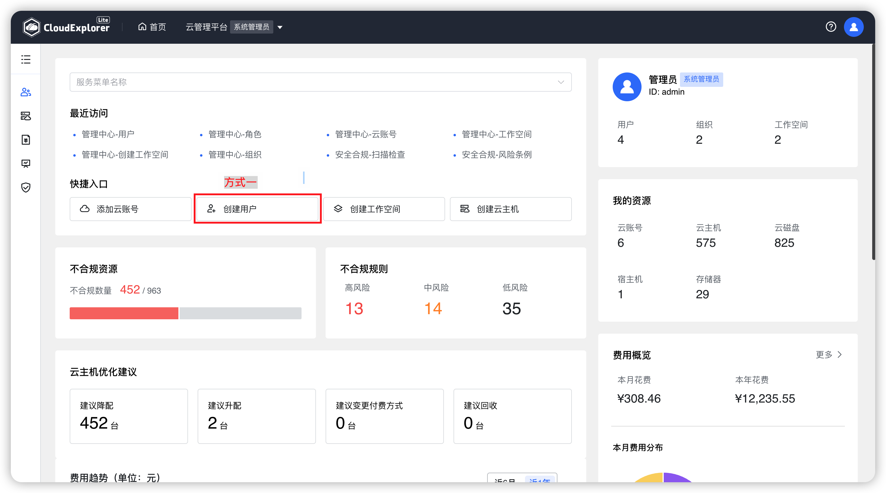{ width="1235px" }
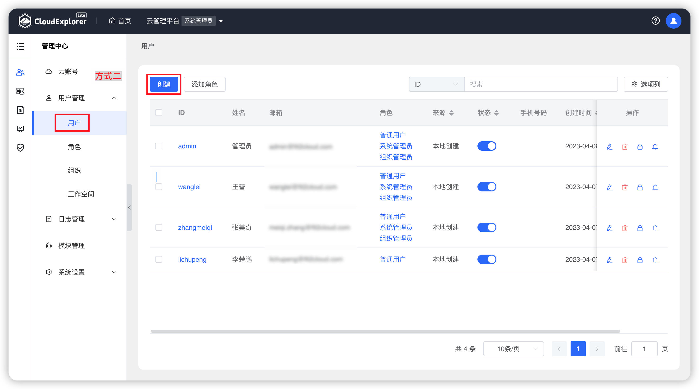{ width="1235px" }

!!! Abstract ""

    创建用户时，要填写工作空间基本信息并设置角色，保存时系统会校验工作空间名称的唯一性。<br />
    点击基本信息下方添加图标可以同时设置多个角色。在设置多个角色时点击角色后面的删除图标可以删除一个角色。

{ width="1235px" }

!!! Abstract ""

    __字段说明：__ <br />
    · 基本信息<br />
    - ID：登录云管平台的用户名，用户 ID 必须唯一。<br />
    - 名称：用户真实姓名，云管平台中用户相关操作显示该名称。<br />
    - Email: 用户接收通知的邮箱，Email 必须唯一且必填。<br />
    - 手机号码：接受短信通知的手机号，非必填。<br />
    - 密码：登录云管平台的密码。<br />
    - 确认密码：登录云管平台的密码。<br />

    · 设置角色<br />
    - 用户类型：分配给用户的角色类型。<br />
        ```
        若类型选择为系统管理员，则生效范围是整个云管平台。
        若类型选择组织管理员或继承组织管理员的角色，则需要设置当前角色在哪些组织下生效。
        若类型选择为普通用户，则需要设置当前角色在哪些工作空间下生效。
        ```

- 编辑用户

!!! Abstract ""

    当需要对用户信息或用户角色进行调整时，可以编辑用户信息进行修改。除 ID 外其他用户信息均可以编辑。

    操作：在用户列表中，选择需要编辑的用户，点击列表右侧“操作”列中的“编辑”图标，可以修改用户属性。

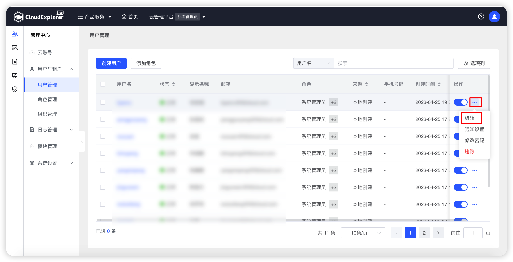{ width="1235px" }
{ width="1235px" }

- 修改密码

!!! Abstract ""

    当用户忘记密码时，管理员可以修改用户的密码。

    操作：在用户列表中，选择需要修改密码的用户，点击列表右侧“操作”列中的“修改密码”图标，可以修改用户登录密码。

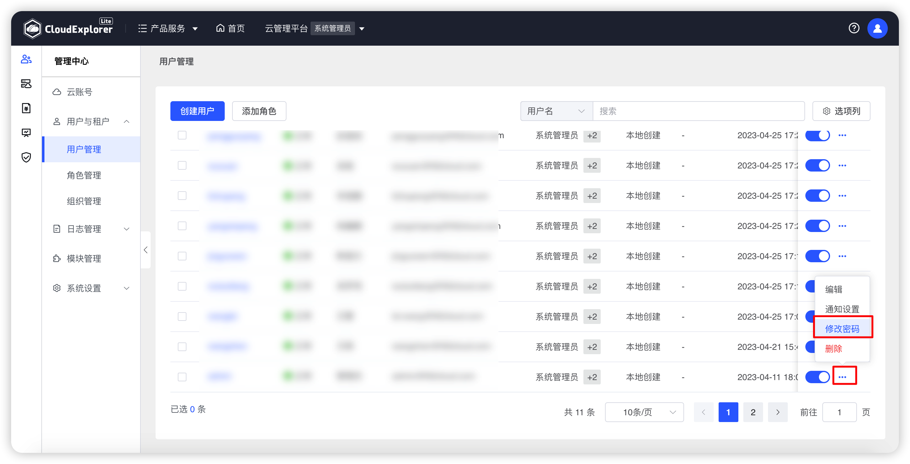{ width="1235px" }
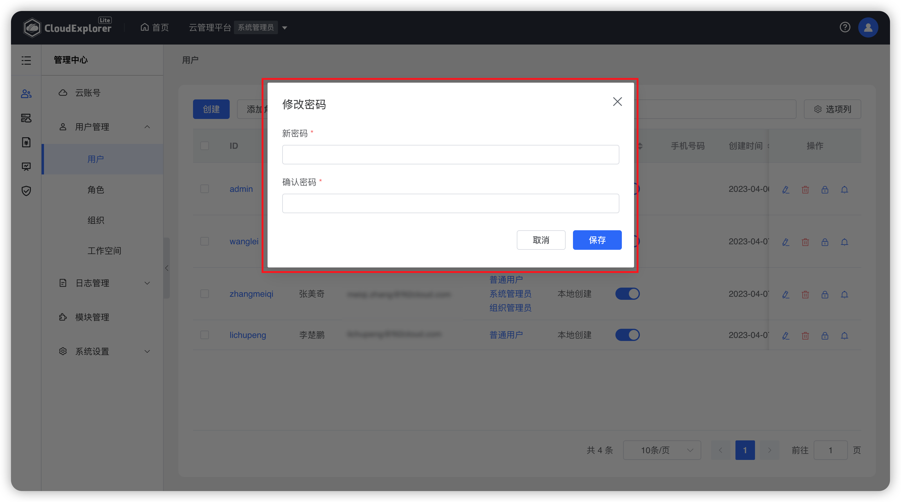{ width="1235px" }

- 通知设置

!!! Abstract ""

    可对用户进行通知设置，配置用户接收系统通知的邮箱、手机号和企业微信账号。邮箱、手机号设置后将与用户基本信息关联。手机号将做为钉钉平台推送标识。

    操作：在用户列表中，选择需要进行通知设置的用户，点击列表右侧“操作”列中的“通知设置”图标，可以设置用户通知账号。

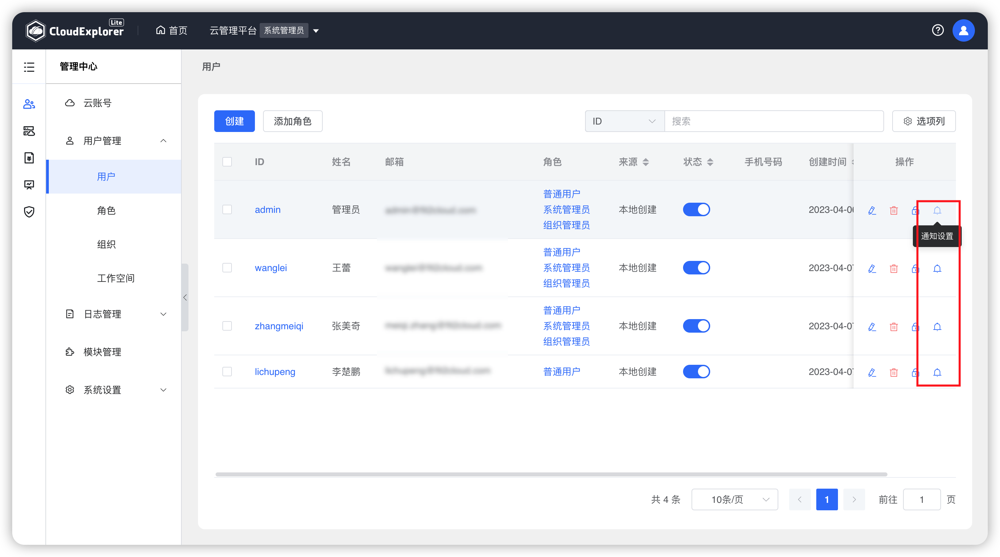{ width="1235px" }
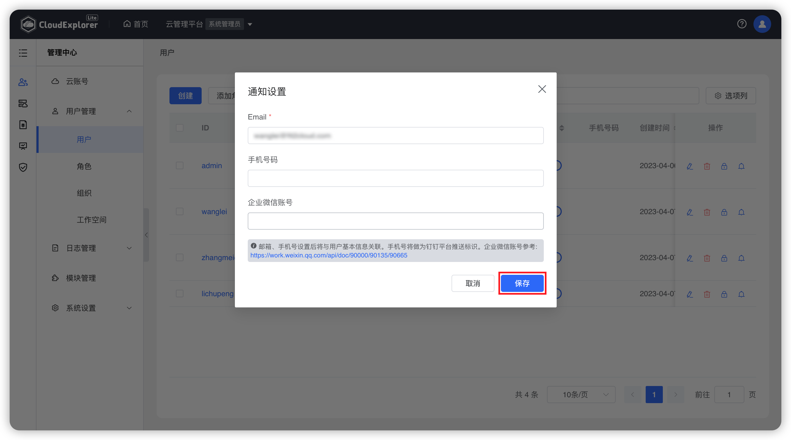{ width="1235px" }

- 删除用户

!!! Abstract ""

    当角色已经不再使用时，可以删除该角色。若删除正在使用的角色，关联了该角色全部用户将会被取消关联。

    操作：在角色列表中，选择需要删除的角色，点击列表右侧“操作”列中的“删除”选项，页面会出现点再次确认弹窗，再次点击“删除”即可删除该角色。

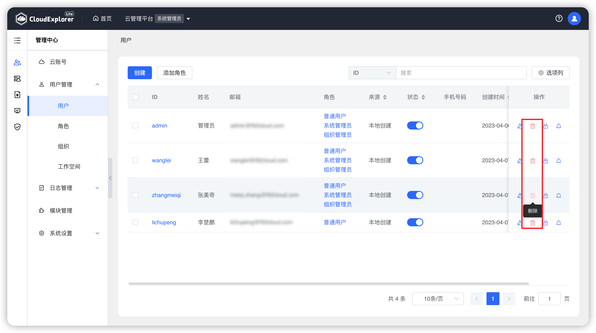{ width="1235px" }
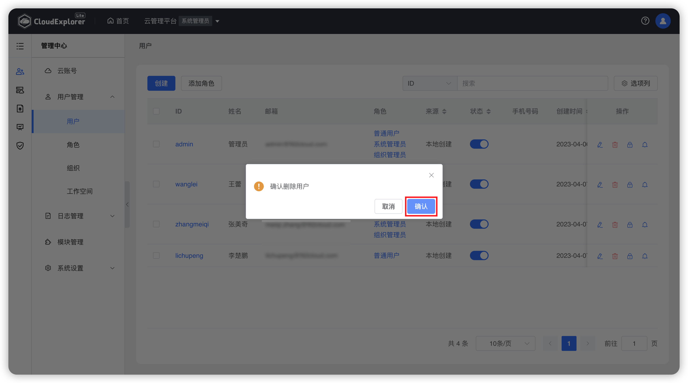{ width="1235px" }