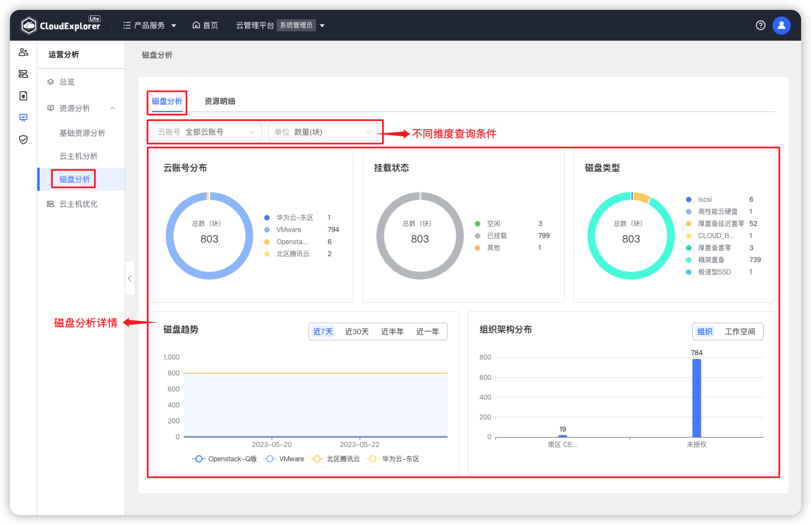
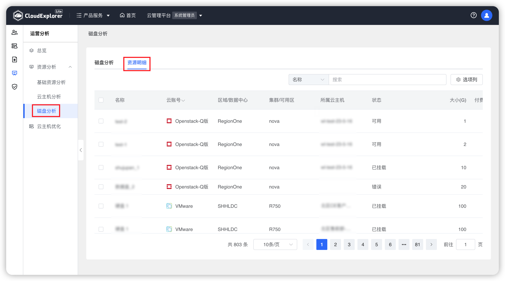

!!! Abstract ""
    磁盘分析是针对云管平台上所有云账号下的磁盘从不同维度进行可视化分析，主要包括磁盘分析和资源明细。

## 1 磁盘分析

!!! Abstract ""

    查询条件：支持按云账号、单位进行过滤查询。

!!! Abstract ""

    __页面内容说明：__ 
    - 云账号分布：统计不同云账号下磁盘的数量。 
    - 挂载状态：统计所有云账号下全部磁盘挂载和未挂载状态的数量； 
    - 磁盘类型：统计所有云账号下每个类型的磁盘的数量； 
    - 磁盘趋势：统计所有云账号下磁盘总数量趋势，支持按近 7 天、近 30 天、近半年、近一年展示； 
    - 组织架构分布：统计所有云账号下磁盘在不同组织和不同工作空间的分布数量。 

{ width="1235px" } 

## 2 资源明细

!!! Abstract ""

    明细数据列表展示全部云账号下磁盘相关监控信息，包括：磁盘名称、云账号、区域/数据中心、集群/可用区、所属云主机、大小（GB）、付费方式。 

{ width="1235px" } 