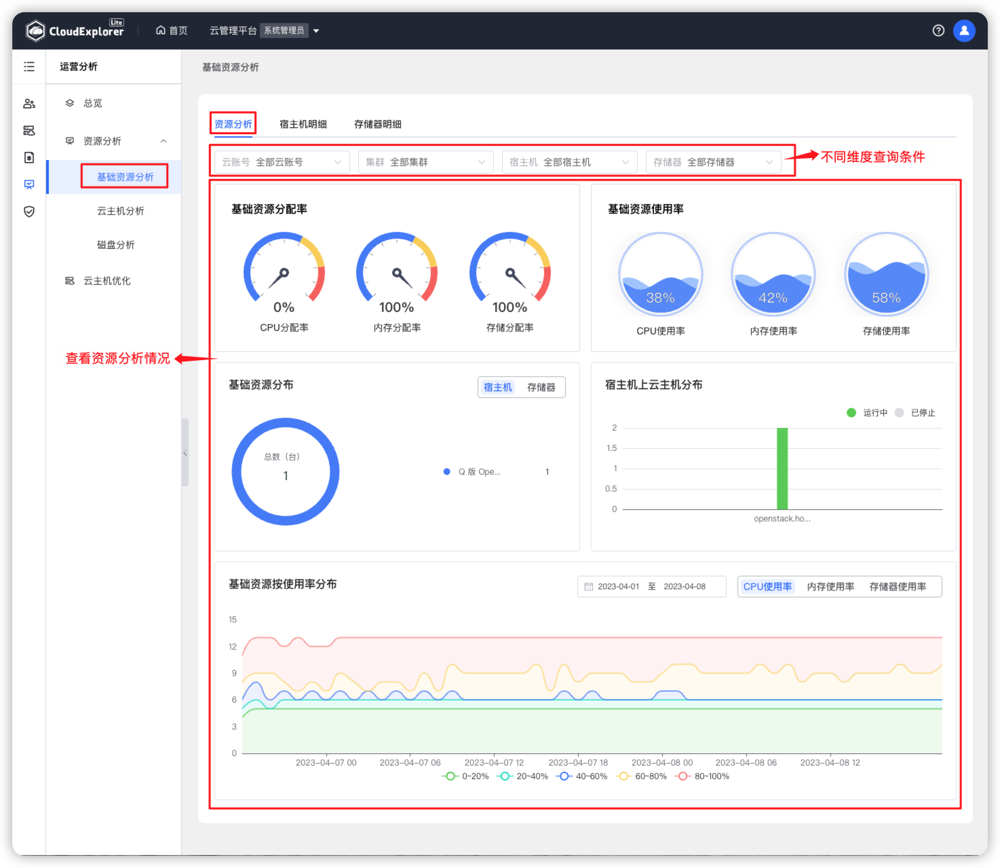
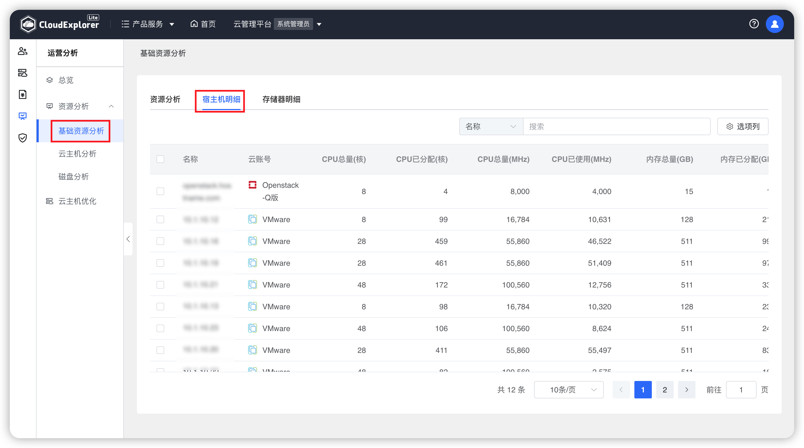
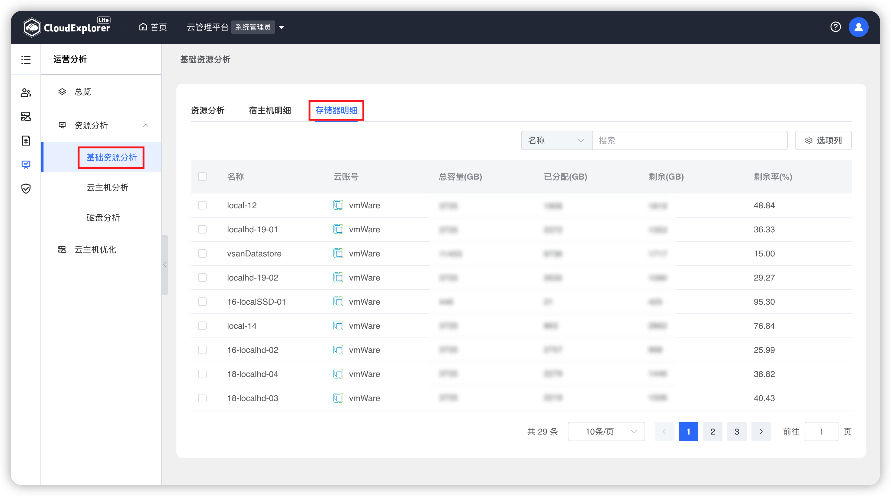

!!! Abstract ""
    基础资源分析展示私有云账号整体资源分析、宿主机明细和存储器明细。 
    该功能只有系统管理员角色可查看。

## 1 资源分析

!!! Abstract ""

    查询条件：支持按云账号、集群、宿主机、存储器进行过滤查询。

!!! Abstract ""

    __页面内容说明：__ 
    - 基础资源分配率：统计私有云账号下宿主机的 CPU 分配率、内存分配率、存储器分配率； 
    - 基础资源使用率：统计私有云账号下宿主机的 CPU 使用率、内存使用率、存储器使用率； 
    - 基础资源分布：统计不同私有云账号下的宿主机数量和存储器数量； 
    - 宿主机上云主机分布：统计每个宿主机上的云主机数量，支持按状态查看； 
    - 计基础资源按使用率分布：统计全部宿主机的 CPU 使用率、内存使用率、存储器使用率数据，可切换不同时间查看。 

{ width="1235px" }  

## 2 宿主机明细

!!! Abstract ""

    宿主机明细列表展示私有云宿主机相关监控数据，包括：宿主机名称、云账号、数据中心、集群、IP地址、CPU总量（核）、CPU已分配（核）、内存总量（GB）、内存已分配（GB）、云主机总数、运行中云主机。 

{ width="1235px" } 

## 3 存储器明细

!!! Abstract ""

    存储器明细列表展示私有云存储器相关监控数据，包括：存储器名称、云账号、数据中心、集群、总容量（GB）、已分配（GB）、剩余（GB）、使用率（%）、类型。 

{ width="1235px" } 