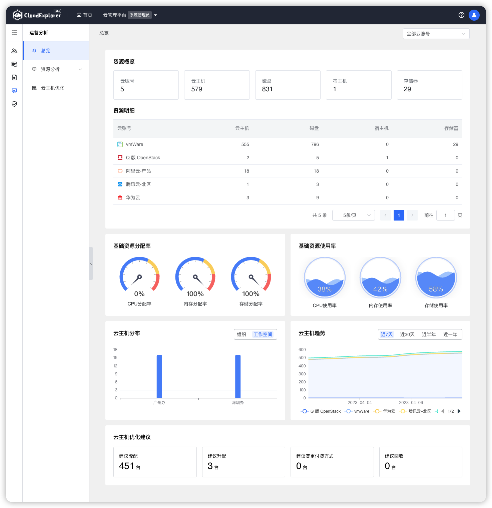

!!! Abstract " "

    运营分析模块将云管平台所纳管的 IT 资源从不同维度进行可视化展示分析。

!!! Abstract " "
    
    在【运营分析】-【总览】中，可查看当前云管平台所纳管资源概况，各云账号资源明细情况、基础资源分配率、基础资源使用率、资源分布情况、资源趋势分析及资源优化建议，方便管理员及时增加资源和回收闲置资源。还可按照云账号过滤显示每个云账号下的资源统计情况。

{ width="1235px" }

!!! Abstract " "

    __页面内容说明：__ 
    - 云账号：统计云管平台所纳管的全部云账号数量； 
    - 云主机：统计所有云账号下云主机的数量； 
    - 磁盘：统计所有云账号下云磁盘的数量； 
    - 宿主机：统计所有私有云账号下宿主机的数量； 
    - 存储器：统计所有私有云账号下存储器的数量； 
    - 资源明细：统计各个云账号下云主机、磁盘、宿主机、存储器的数量； 
    - 基础资源分配率：统计私有云账号下宿主机的 CPU 分配率、内存分配率、存储器分配率； 
    - 基础资源使用率：统计私有云账号下宿主机的 CPU 使用率、内存使用率、存储器使用率； 
    - 云主机分布：统计所有云账号下云主机在不同组织和不同工作空间的分布数量； 
    - 云主机趋势：汇总所有云账号下云主机总数量趋势，支持按近 7 天、近 30 天、近半年、近一年展示； 
    - 云主机优化建议：根据设置的各维度优化策略统计需要优化的资源数量。 