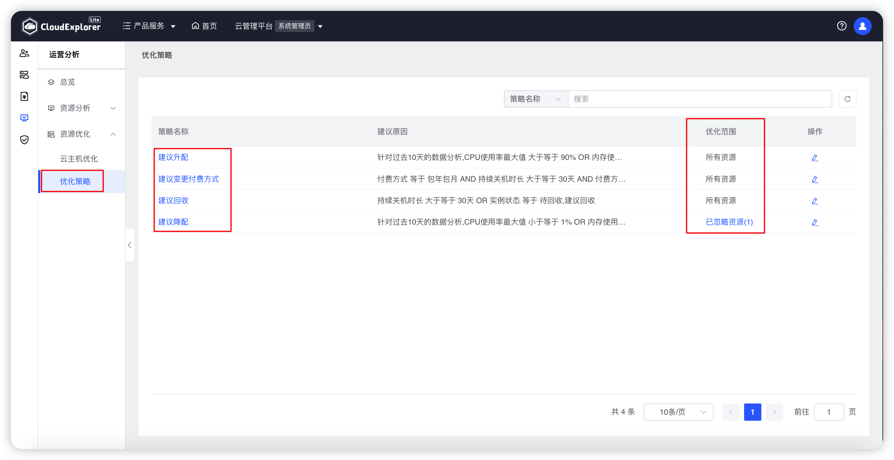
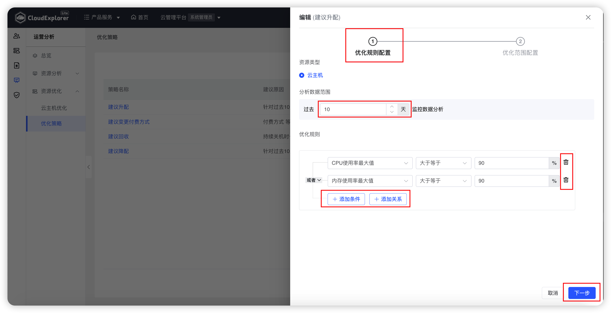
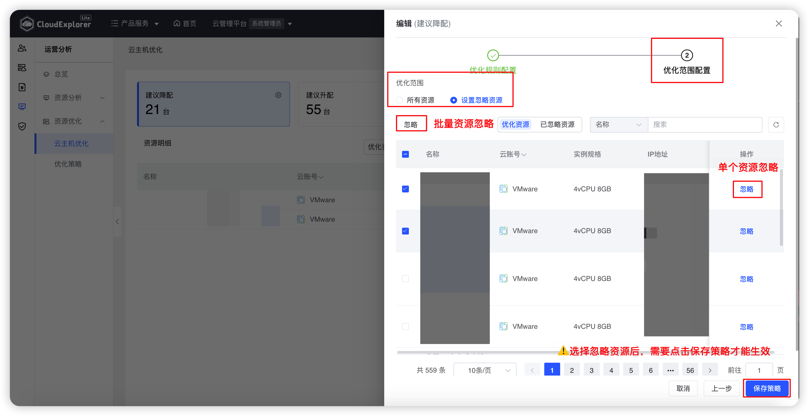
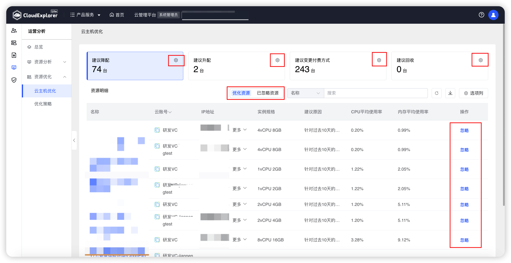
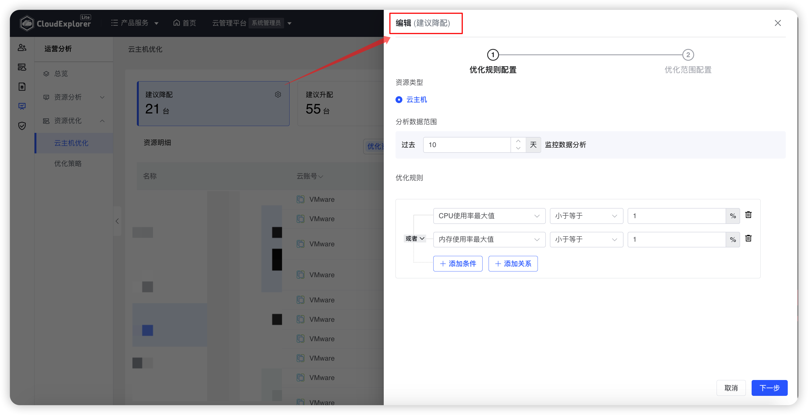

## 1 优化策略

!!! Abstract ""
    云管平台内置了 4 种优化策略，分别为：建议降配策略、建议升配策略、建议变更付费方式策略、建议回收策略。 
    优化策略支持灵活设置忽略资源，方便用户设置某些特殊不参与优化的资源，支持不同策略设置不同的忽略资源；且支持导出优化资源列表功能。 
    通过优化策略，云管平台可根据云主机资源使用情况分析出资源的优化方案，点击每个优化策略，页面下方列表都会展示所选优化策略相关云主机资源，方便管理员找到资源浪费的云主机进行资源回收，找到资源不足的云主机进行升配。

{ width="1235px" } 
{ width="1235px" } 
{ width="1235px" } 

## 2 云主机优化

!!! Abstract ""

    点击每个优化策略右上“小齿轮”图标，进入优化策略页面，即可修改原有策略设置，保存后再次进入会按照最新的策略条件进行资源筛选。

{ width="1235px" }  
{ width="1235px" } 
{ width="1235px" } 

!!! Abstract ""

    __优化策略说明：__ 
    - 建议降配云主机：过去 N 天 CPU 平均使用率/CPU最大使用率 小于等于 N% and/or  内存平均使用率/内存最大使用率 小于等于 N%。 
    - 建议升配云主机：过去 N 天 CPU 平均使用率/CPU最大使用率 大于等于 N% and/or  内存平均使用率/内存最大使用率 大于等于 N%。 
    - 建议变更付费方式云主机：包年包月云主机持续关机大于 N 天建议转按需按量；按需按量资源持续开机大于 N 天建议转包年包月。 
    - 建议回收云主机：持续关机大于 N 天的闲置资源建议回收。
