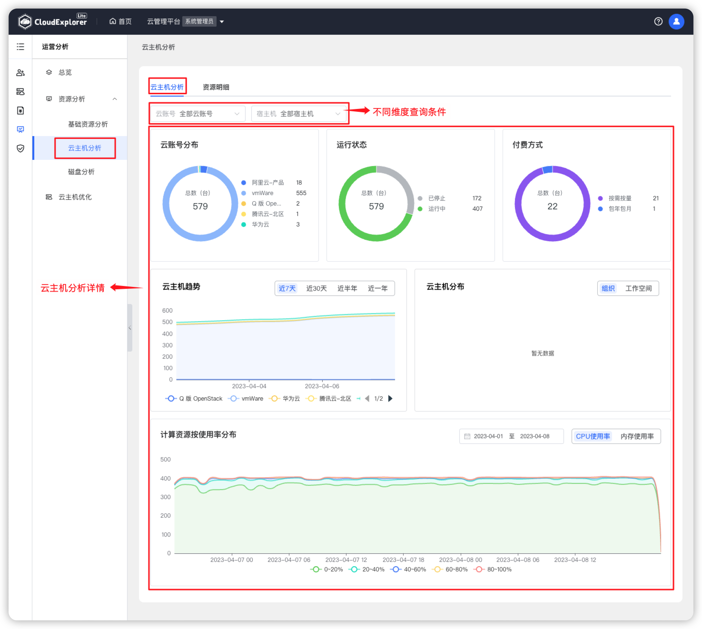
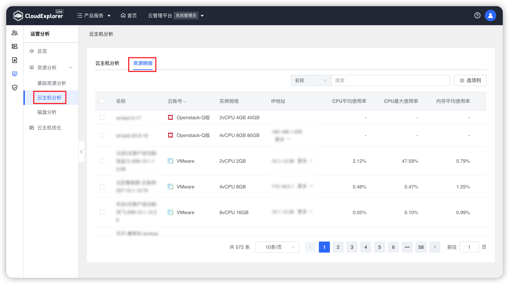

!!! Abstract " "
    云主机分析是针对云管平台上所有云账号下的云主机从不同维度进行可视化分析，主要包括云主机分析和资源明细。

## 1 云主机分析

!!! Abstract " "

    查询条件：支持按云账号、宿主机进行过滤查询。

!!! Abstract " "

    __页面内容说明：__ 
    - 云账号分布：统计所有云账号下云主机的数量； 
    - 运行状态：统计所有云账号运行中和已停止两个状态的云主机数量； 
    - 付费方式：统计公有云账号按需按量和包年包月两种付费方式的云主机数量； 
    - 云主机趋势：统计所有云账号下云主机总数量趋势，支持按近 7 天、近 30 天、近半年、近一年展示； 
    - 云主机分布：统计所有云账号下云主机在不同组织和不同工作空间的分布数量； 
    - 计算资源按使用率分布：统计全部私有云账号下的云主机 CPU 使用率、内存使用率、存储器使用率数据，可切换不同时间查看。 

{ width="1235px" }  

## 2 资源明细

!!! Abstract " "
    资源明细列表展示全部云账号下云主机相关监控数据，包括：云主机名称名称、云账号、实例规格、IP 地址、CPU平均使用率（%）、CPU最大使用率（%）、内存平均使用率（%）、内存最大使用率（%）。 

{ width="1235px" } 