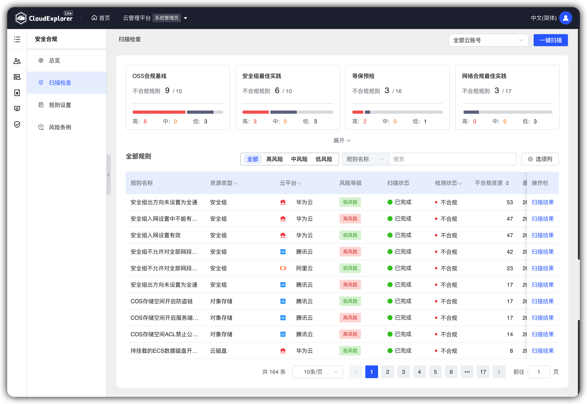
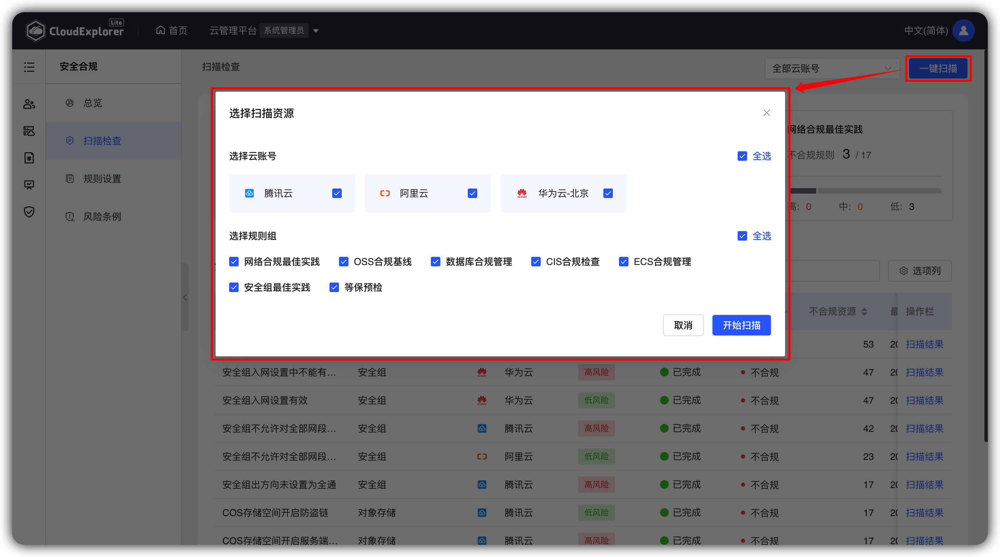
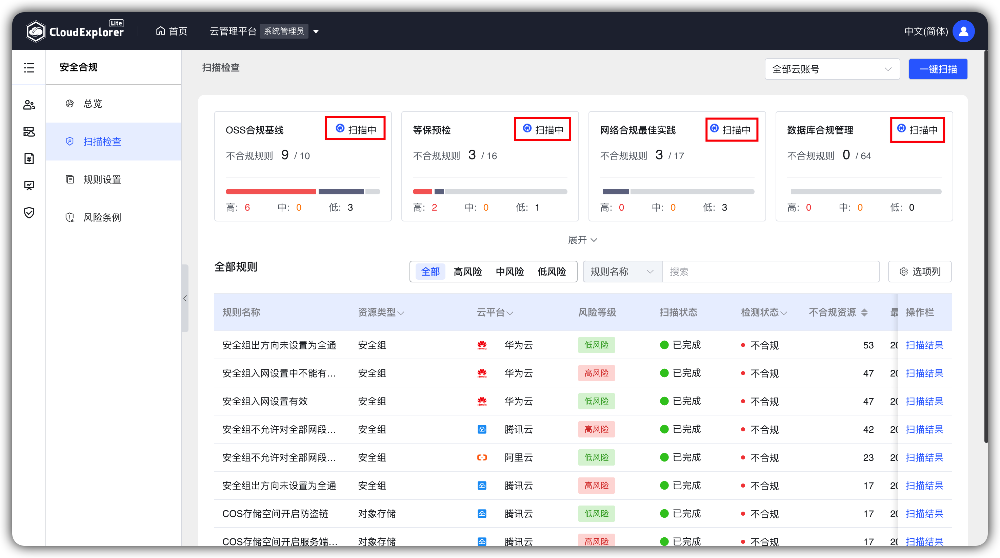

!!! Abstract " "

    -   前置条件：定义合规扫描规则
    -   支持一键扫描、查看扫描结果；
    -   查看维度：规则组、资源类型、云账号。

## 1 一键扫描

!!! Abstract " "
    -   支持根据云账号、资源类型进行一键扫描；
    -   点击【一键扫描】，选择要扫描的云账号和资源类型；
    -   点击【提交】，云管平台会按照云账号、资源类型进行扫描。

{ width="1235px" }
{ width="1235px" }
{ width="1235px" }

## 2 规则组维度说明

!!! Abstract " "
    -   统计每个规则组中不合规/合规规则：统计不合规规则高风险、中风险、低风险的数量；
    -   点击规则组面板规则列表仅展示当前规则组下的规则及扫描结果。
{ width="1235px" }

## 3 资源类型维度说明

!!! Abstract " "
    -   展示支持检测的所有资源类型，选择某个资源类型后右侧的规则列表仅展示当前资源类型的规则。
{ width="1235px" }

## 4 云账号维度说明

!!! Abstract " "
    -   选中某个云账号，资源类型仅展示选择的云账号支持的资源类型；
    -   规则列表仅展示所选云账号支持的规则，规则列表中【不合规/合规资源】仅统计所选云账号的资源数据。
{ width="1235px" }

## 5 扫描检测详情

### 1 操作入口

!!! Abstract " "
    -   【扫描检查】- 【不合规/合规资源】
    -   点击规则列表中【不合规/合规资源】字段，打开当前规则的扫描结果详情
{ width="1235px" }

### 2 扫描检测详情说明

!!! Abstract " "
    -   规则信息：显示规则的名称、描述、风险等级、规则组；
    -   改进建议：显示当前规则所关联风险条例的改进建议，若未关联风险条例，则不显示改进建议；
    -   资源检测结果：显示当前规则所有检测资源，支持按检测状态、云账号、过滤；
    -   点击【资源ID】“下拉”图标，可以显示当前资源的属性信息。
{ width="1235px" }