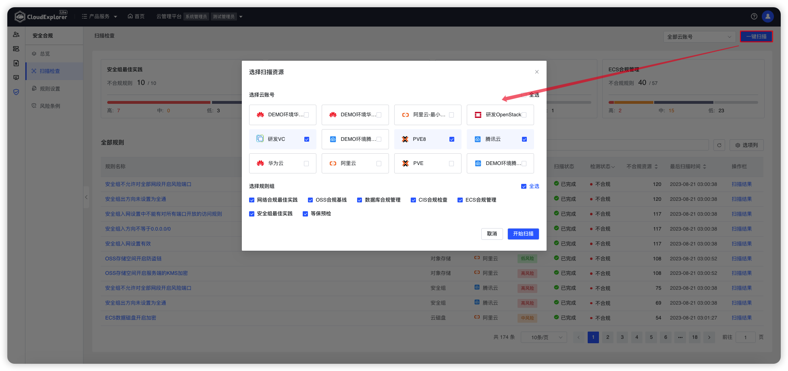
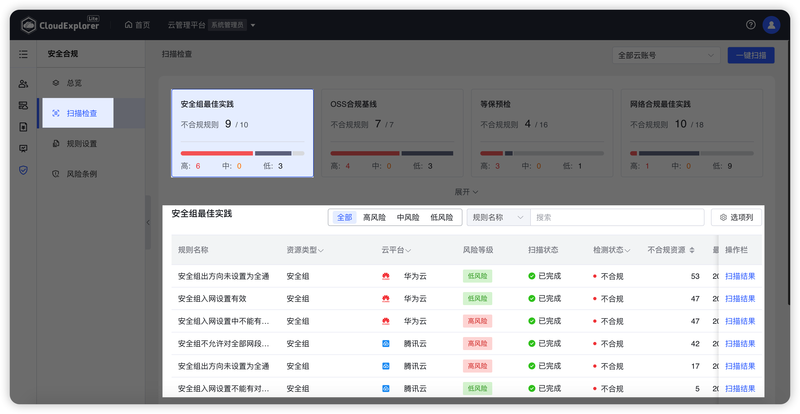
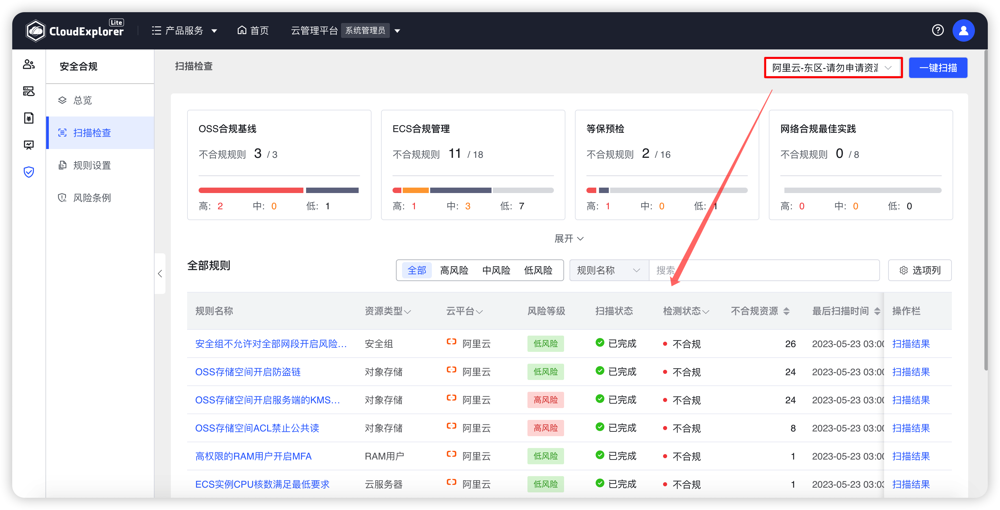
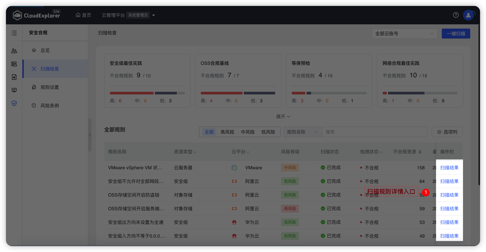
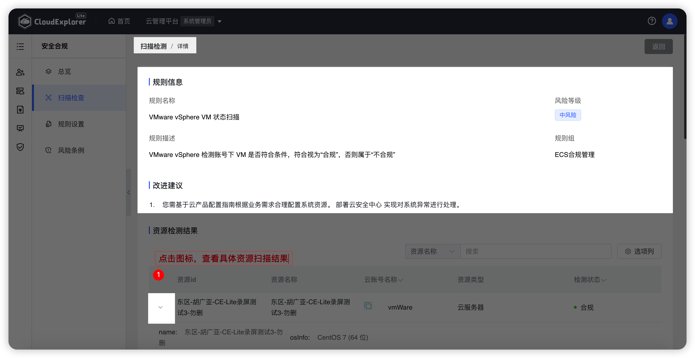

!!! Abstract ""

    当合规扫描规则定义好后，需要在【安全合规】-【扫描检查】中进行扫描，并查看扫描结果。

## 1 一键扫描

!!! Abstract ""
    支持按云账号、资源类型进行一键扫描。 
    点击页面右上角【一键扫描】按钮，选择要扫描的云账号和资源类型，确认后点击【开始扫描】即可。 
    扫描提交后，云管平台会按照云账号、资源类型进行扫描。

{ width="1235px" }

## 2 规则组维度说明

!!! Abstract ""

    -   统计每个规则组中不合规/合规规则：统计不合规规则高风险、中风险、低风险的数量；
    -   点击规则组面板，仅展示当前规则组下的扫描结果。

{ width="1235px" }

## 3 云账号维度说明

!!! Abstract ""

    -   选中某个云账号，仅展示选中云账号的规则组及扫描结果列表。

{ width="1235px" }

## 4 扫描检测详情

### 4.1 操作入口

!!! Abstract ""

    -   【扫描检查】- 扫描结果列表。
    -   点击扫描结果列表中【扫描结果】字段，打开当前规则的扫描结果详情。

{ width="1235px" }

### 4.2 扫描检测详情说明

!!! Abstract ""

    -   规则信息：显示规则名称、规则描述、风险等级、规则组、资源检测结果列表；
    -   改进建议：显示当前规则所关联风险条例的改进建议，若未关联风险条例，则不显示改进建议；
    -   资源检测结果：显示当前规则所有检测资源，支持按资源名称模糊搜索；
    -   点击【资源ID】“下拉”图标，可以显示当前资源的属性信息。

{ width="1235px" }