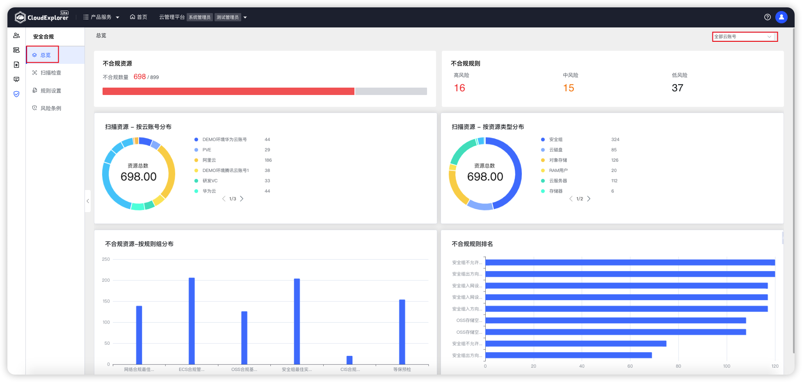

!!! abstract ""
      
      云管平台支持从安全审计、访问控制、入侵防范、网络架构等维度对资源进行检查和规则设置，并进行安全合规扫描。系统管理员可根据扫描结果确认云平台的云资源是否符合等保条款或企业配置规范。 
      【安全合规】-【总览】从多维度展示最近一次安全扫描检测结果的统计分析情况。

{ width="1235px" }

!!! Abstract ""

      __页面内容说明：__ 
      - 不合规资源：最近一次扫描检测资源中不合规资源数量； 
      - 不合规规则：按高风险、中风险、低风险展示不合规规则数； 
      - 扫描资源-按云账号分布：云账号维度展示不合规资源分布； 
      - 扫描资源-按资源类型分布：资源类型维度展示不合规资源分布； 
      - 不合规资源-按规则组分布：规则组维度展示不合规资源分布； 
      - 不合规规则排名 ：从高到低展示不合规规则排名。
