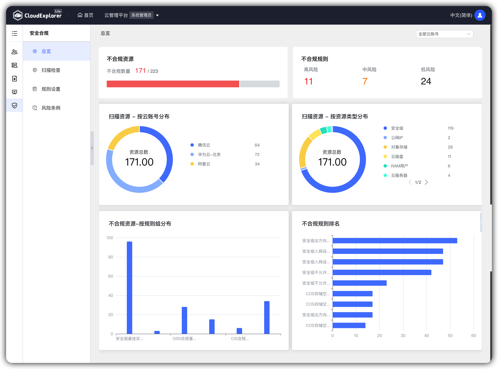

!!! abstract " "

      支持管理员权限查看云平台的云资源是否符合等保条款或企业配置规范。当前云管平台对云资源支持安全审计、访问控制、入侵防范、网络架构等方面进行检查和规则设置。

## 1 总览概述

!!! abstract " "

      从不同维度展示最近一次扫描检测结果的统计信息； 
      操作入口：由【服务列表】进入【安全合规】模块，进入【总览】页面。
      

## 2 总览页面展示

!!! abstract " "
      支持按云平台维度查看扫描统计结果

{ width="1235px" }

## 3 总览页面详细说明

!!! Abstract " "

      -  资源总数：最近一次扫描检测资源的总数量；
      -  合规资源：最近一次扫描检测资源中合规资源数量；
      -  不合规资源：最近一次扫描检测资源中不合规资源数量；
      -  不合规占比：不合规资源/资源总数；
      -  不合规则资源按云账号分布：云账号维度展示不合规的资源数分布；
      -  不合规资源按资源类型分布：资源类型维度展示不合规资源分布；
      -  不合规资源按规则组分布：规则组维度展示不合规资源分布；
      -  不合规规则TOP5 ：展示不合规资源数据数量最多的前5个规则。
