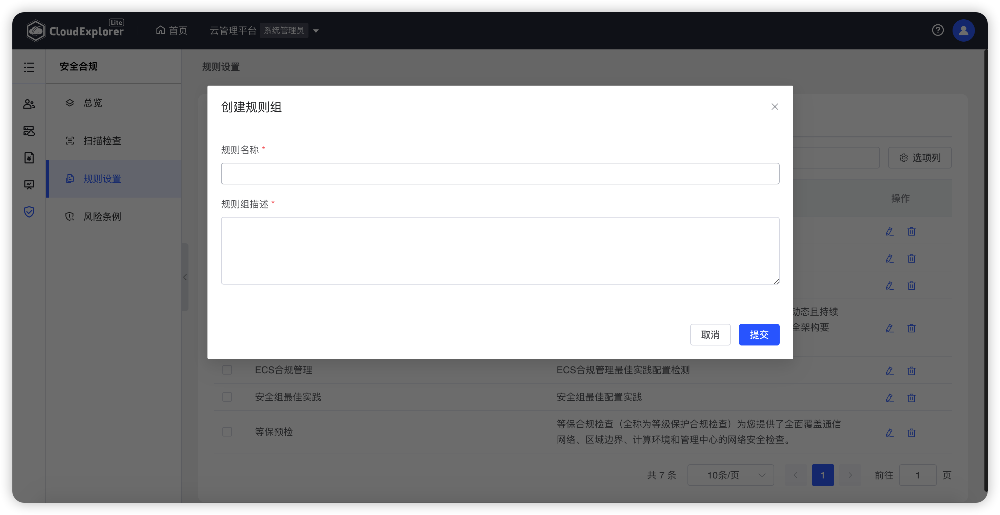
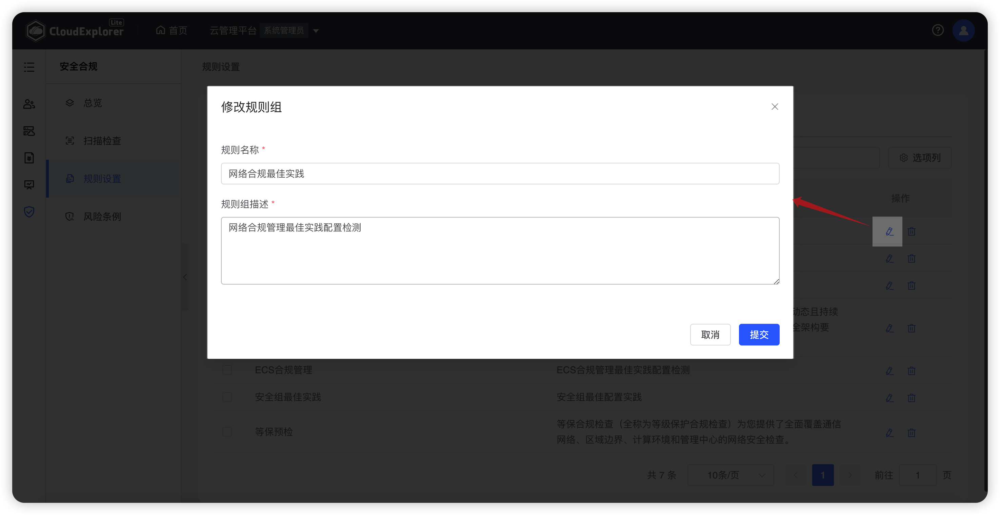
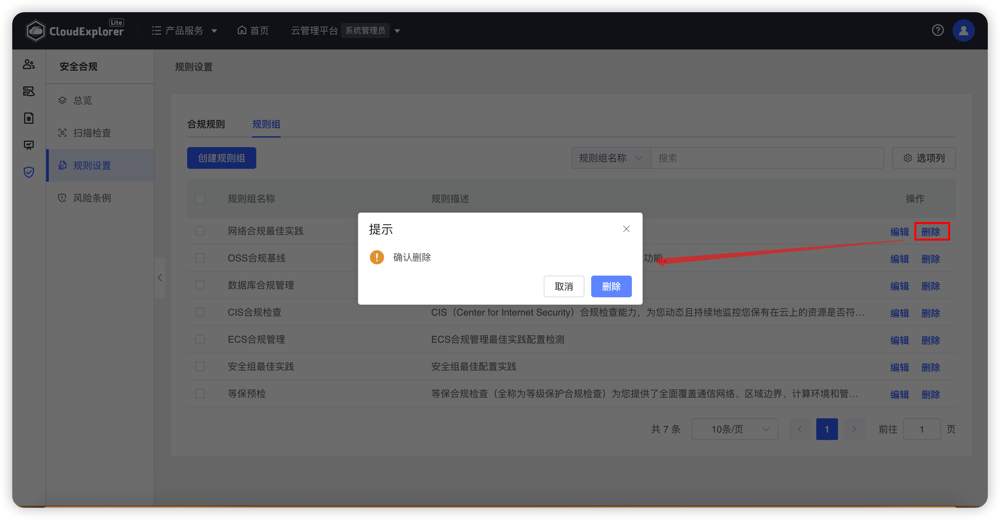

!!! Abstract ""

    根据企业要求可以将规则分类分组，如按云平台分组或者按合规模板分组。

## 1 规则组创建

!!! Abstract ""

    操作方式：在【安全合规】-【规则设置】-【合规规则】页面，点击【创建】，规则组名称、规则组描述，确认后点击【提交】即可。

{ width="1235px" }

## 2 规则组编辑

!!! Abstract ""

    操作方式：在【安全合规】-【规则设置】-【合规规则】页面规则列表中，对需要编辑的规则组点击【操作】列【修改】图标，修改规则组详情，确认后点击【提交】即可。

{ width="1235px" }

## 3 规则组删除

!!! Abstract ""

    操作方式：在【安全合规】-【规则设置】-【合规规则】页面规则列表中，对需要编辑的规则组点击【操作】列【删除】图标，在再次确认弹窗中点击【删除】即可。

{ width="1235px" }