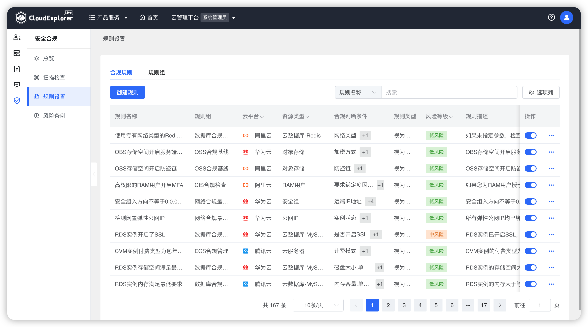
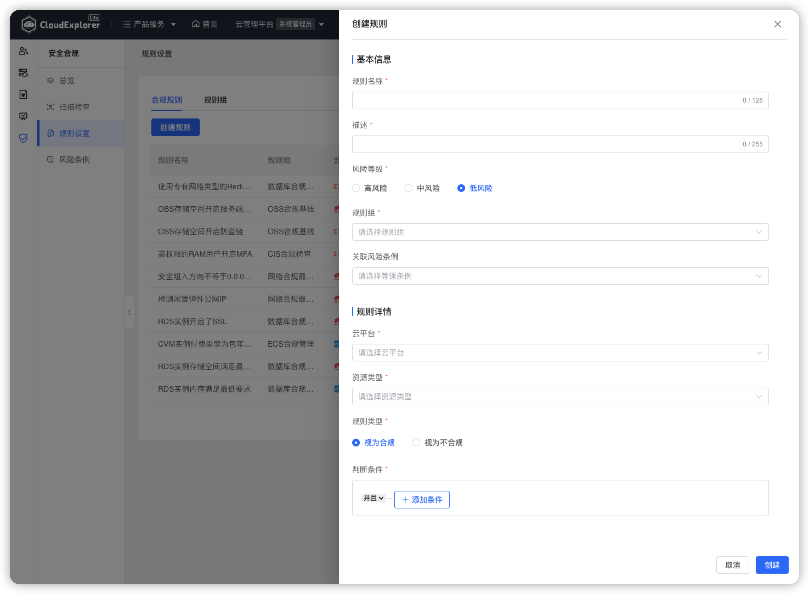
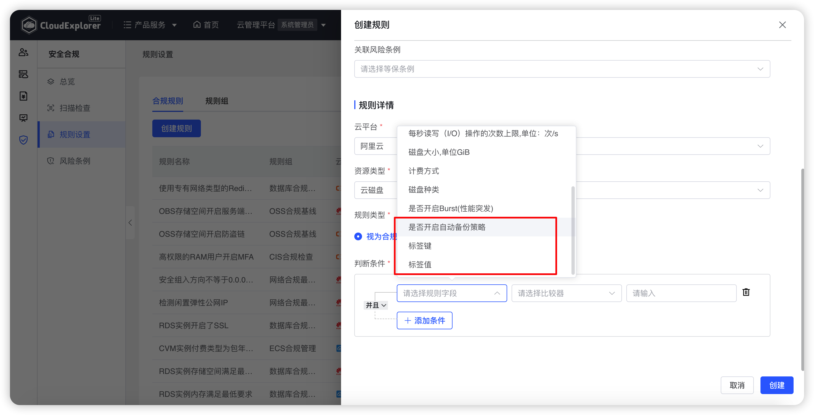
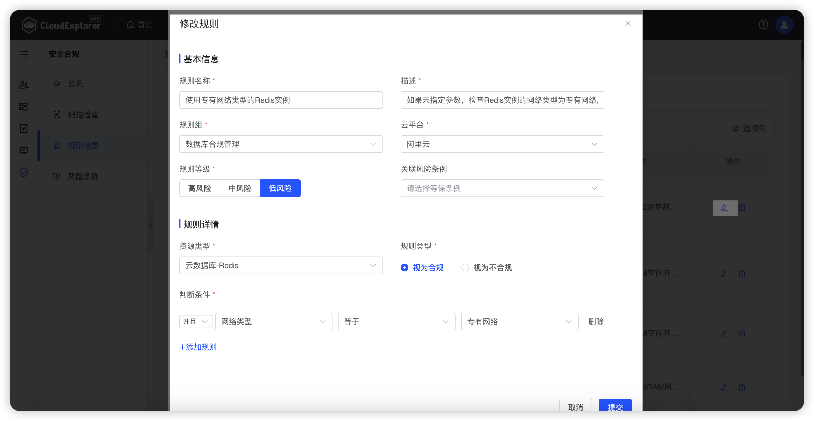

!!! Abstract ""

    当前云管平台对各种资源内置了多条扫描规则，管理员可以一一查看是否满足企业要求，并可以根据企业要求自定义合规规则。 
    用户可选择开启和关闭规则，关闭的规则不会在【合规扫描】中显示该规则，一键扫描时也不会扫描该规则。

!!! Abstract ""
 
    自定义规则支持云平台：阿里云、华为云、腾讯云、VMware和OpenStack。 
    自定义规则支持资源类型：云服务器、云磁盘、弹性IP、对象存储、安全组、VPC、负载均衡、云数据库、宿主机、存储器、资源池、RAM用户。

{ width="1235px" }

## 1 规则创建

!!! Abstract ""

    操作方式：在【安全合规】-【规则设置】-【合规规则】页面，点击【创建】，输入基本信息和规则详情，确认后点击【提交】即可。 

{ width="1235px" }
 
    __注意：__  
    对云主机、磁盘、EIP、云数据库、VPC等资源支持配置标签键和标签值的属性判断条件。 
    支持对云磁盘判断是否开启备份策略的可配置属性。
{ width="1235px" }

                                      

## 2 规则编辑

!!! Abstract ""

    操作方式：在【安全合规】-【规则设置】-【合规规则】页面规则列表中，对需要编辑的合规规则点击【操作】列【修改】图标，修改规则详情，确认后点击【提交】即可。

{ width="1235px" }

## 3 规则删除

!!! Abstract ""

    操作方式：在【安全合规】-【规则设置】-【合规规则】页面规则列表中，对需要编辑的合规规则点击【操作】列【删除】图标，在再次确认弹窗中点击【删除】即可。

{ width="1235px" }